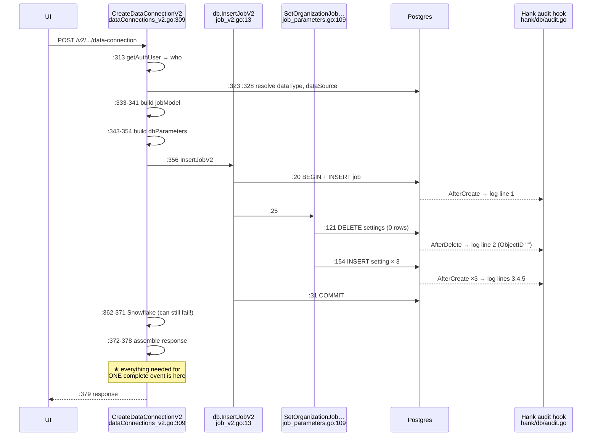
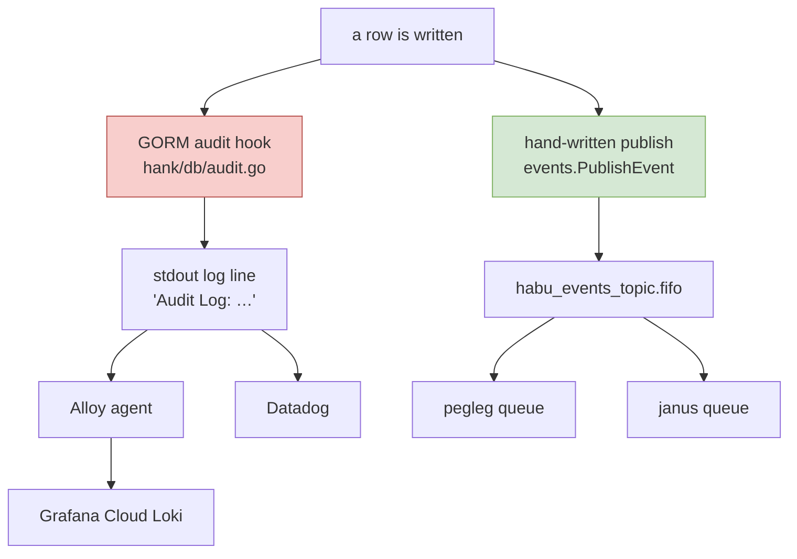

# 02 — The Current Design, Traced End to End

Everything here is **[VERIFIED]** — read in source on 2026-07-28/29/30.

## The example we will follow

> A user at Adidas creates a data connection called *"Adidas EMEA CRM Data"*,
> on data source `CLIENT_AWS` ("Client AWS S3") for dataset type `CRM`, with three
> settings:
> `DataLocation = s3://adidas-emea-cleanroom/crm/customers/`,
> `SampleFilePath = s3://adidas-emea-cleanroom/crm/schema/sample_2026_06.csv`,
> `FieldDelimiter = ,`
>
> These are the real parameter names — a `CLIENT_AWS` connection declares
> `DataLocation`, `SampleFilePath`, `FileFormat`, `FieldDelimiter`, `FileHeader`,
> `QuoteCharacter`, `JobFrequency`, `IdentifierType`, `RefreshType`,
> `GPGEncryption`, `ModelType`, `MappingField`, `UsesPartitions`,
> `MATERIALIZATION_ENABLED`, `MATERIALIZATION_TTL`
> (**[VERIFIED]** `forebitt/data/datasource_parameters.csv`).

We will follow this one request all the way down, then ask "where could an event
come from?"

---

## 1. Where the request lands

There are **three** live HTTP routes that all end up writing the same two tables.

| Door | Route | Handler | File:line |
|---|---|---|---|
| **A** | `POST /v2/organization/{orgId}/data-connection` | `CreateDataConnectionV2` | `forebitt/api/server/dataConnections_v2.go:309` |
| **B** | `POST /forebitt/v1/organization/{orgId}/dataConnection` | `CreateDataConnection` | `forebitt/api/server/job_service.go:1396` |
| **C** | the import-job route | `CreateImportJobV2` | `forebitt/api/server/job_service.go:1293` |

Route registration confirmed in the generated gateway files
(`forebitt/proto/job_service.pb.gw.go:7573` for Door B,
`ignoramus/dataconnections/dataconnections_service.pb.gw.go:942` for Door A).

We will trace **Door A** because it is the simplest, then show what Door B does
differently, because the difference is the crux of the whole argument.

---

## 2. Door A traced, step by step

### Step 1 — Identify the caller

**File:** `forebitt/api/server/dataConnections_v2.go` **Line:** 313
**Function:** `CreateDataConnectionV2`

```go
authUser := getAuthUser(ctx)
```

- **Input:** the gRPC context
- **Output:** `*hauth.UserDetails` — **[VERIFIED]** `hank/token/authorization.go:25`
  gives `{ID, Name, Email, Type}`
- **How:** reads the `user-identity` metadata header and JSON-unmarshals it
  (**[VERIFIED]** `forebitt/api/server/security.go:380-392`)
- **Why this step exists:** authorisation, and to stamp `CreatedByUserID`
- **Why it matters to us:** this is where `performedBy` in our event comes from.
  **No other mechanism in this document has access to it.**

### Step 2 — Validate and resolve references

**Lines:** 318, 323, 328

```go
err := validateDataConnection(in.DataConnection)                              // :318
dataType, notFound   := db.FetchImportDataTypeByID(s.DB, ...DatasetTypeID)    // :323
dataSource, notFound := db.FetchImportDataSourceByID(s.DB, ...DataSourceID)   // :328
```

- **State change:** none — three reads
- **Why:** fail fast before writing anything
- **Why it matters to us:** after line 328 we hold the human-readable names
  (`"S3"`, `"GENERIC"`) rather than only UUIDs. Our event can say `dataSource: "S3"`
  instead of `dataSourceId: "8f2c..."`, at no cost.

### Step 3 — Build the in-memory object

**Lines:** 333-341

```go
jobModel := models.NewImportJobFromProtoV2(in.DataConnection)   // :333
jobModel.CreatedByUserID = authUser.ID                         // :334
jobModel.Status = istatus.Status_ACTIVE.String()               // :335
stage, notFound := db.FetchInitialJobStage(s.DB, dataSource.ID, dataType.ID, 1) // :337
if notFound {
    jobModel.Stage = istatus.Stage_CONFIGURATION_COMPLETE.String()             // :339
}
jobModel.Stage = stage.Stage                                                   // :341
```

- **Output:** `models.DataImportJob` — not yet persisted, no ID yet
- **[VERIFIED] worth knowing:** `NewImportJobFromProtoV2`
  (`forebitt/models/data_import_job.go:76-85`) maps only **six** fields — Name,
  Category, OrganizationID, ImportDataTypeID, ImportDataSourceID, CredentialID.
  Status and Stage are set separately at :335 and :341. This becomes important on
  the update path (see §5).
- **Defect noted, not ours to fix:** line 339's fallback is immediately overwritten
  by line 341. If no stage row is found, `stage` is a zero-value struct, so
  `Stage` becomes `""` rather than `CONFIGURATION_COMPLETE`. Flagged because
  `Stage` is what XMI keys off.

### Step 4 — Build the settings list

**Lines:** 343-354

```go
dbParameters := make([]*models.OrganizationJobParameter, len(in.DataConnection.JobParameters))
for i, protoParam := range in.DataConnection.JobParameters {
    jobParam := models.NewOrganizationJobParameterFromProtoV2(protoParam)
    jobParam.OrganizationID     = in.DataConnection.OrganizationID
    jobParam.ImportDataSourceID = in.DataConnection.DataSourceID
    dbParameters[i] = jobParam
}
```

- **Output:** three `*OrganizationJobParameter` objects, in memory
- **Why it matters:** the complete set of settings is in one slice, in one
  variable. Every alternative mechanism has to rebuild this from fragments.

### Step 5 — The write. This is the important one.

**Line:** 356

```go
err = db.InsertJobV2(ctx, s.DB, &jobModel, dbParameters)
```

**[VERIFIED]** `forebitt/db/job_v2.go:13-36`:

```go
func InsertJobV2(ctx, db, job, parameters) error {
    tx := hdb.BeginTxDB(ctx, db, &sql.TxOptions{})              // :19  ONE transaction
    err := tx.Create(&job).Error                                // :20  write 1
    err = SetOrganizationJobParametersInTransaction(tx, ...)     // :25  writes 2..5
    err = tx.Commit().Error                                     // :31
}
```

and **[VERIFIED]** `forebitt/db/job_parameters.go:109-167`:

```go
FetchJobByID(tx, importJobID)                    // :111  read
ClearOrganizationJobParameters(tx, ...)          // :121  write 2 — DELETE
for _, inParamObj := range inParamObjs {
    inParamObj.ID = uuid.New().String()          // :150
    tx.Create(inParamObj)                        // :154  writes 3,4,5 — INSERTs
}
```

**So one user action = five database writes, inside one transaction:**

| # | Table | Operation | Note |
|---|---|---|---|
| 1 | `data_import_jobs` | INSERT | the connection |
| 2 | `organization_job_parameters` | DELETE | **matches zero rows** on a brand-new connection — the code runs it unconditionally |
| 3-5 | `organization_job_parameters` | INSERT × 3 | one per setting, each with a fresh UUID |

- **State after:** `jobModel.ID` is now populated (GORM writes it back)
- **Why five and not one:** the settings are a child table, and the save path is
  "clear then re-add" so that create and update can share one function

### Step 6 — Optional Snowflake setup

**Lines:** 362-371

```go
if in.DataConnection.DataSourceName == "Snowflake" && len(snowflakeImportJob) > 0 {
    err = s.setupSnowflakeImportJob(ctx, ...)
    if err != nil {
        return nil, status.Error(codes.Internal, "failed to create dataconnection")   // :369
    }
}
```

- **Critical for us:** this can return an error **after the transaction has already
  committed**. The rows exist; the caller is told the create failed.
- **Consequence:** if we emitted our event at line 358, we would tell XMI the
  connection was created while telling the user it failed. So the event must be
  emitted **after** this block.

### Step 7 — Build the response

**Lines:** 372-378

```go
protoDataConnection := convertDataConnectionToProto(ctx, s.DB, &jobModel, dataSource, dataType) // :372
jobParameters := make([]*dataconnections.DataSourceJobParameter, len(dbParameters))             // :373
for i, dbParameter := range dbParameters {
    jobParameters[i] = dbParameter.ToProtoV2()                                                  // :375
}
protoDataConnection.JobParameters = jobParameters                                               // :378
```

- **This is the punchline of the whole trace.** At line 378 the function is holding
  a complete, assembled, business-shaped representation of the thing that was just
  created — because it needs one anyway, to return to the caller.
- **The information we want for the event is free at line 378.** Not "cheap." Free.
  It has already been computed for another purpose.

### Step 8 — Return

**Line:** 379

---

## 3. The trace as a diagram



---

## 4. What Door B does differently — and why it is the key slide

**[VERIFIED]** `forebitt/api/server/job_service.go:1396-1506`, `CreateDataConnection`:

```go
orgJobParams, err := buildOrganizationJobParameters(ctx, in, s, "CreateDataConnection") // :1401
importJobV2 := proto.CreateImportJobV2_Request{ ..., IsDraft: true }                    // :1409
dataConnection, err := s.CreateImportJobV2(ctx, &importJobV2)                           // :1418  PASS 1
importJobV2.IsDraft = false                                                             // :1423
in.Job.Id = dataConnection.Job.Id                                                       // :1424
dataConnection, err = s.CreateImportJobV2(ctx, &importJobV2)                            // :1425  PASS 2
```

It **saves the connection twice** — once as a draft, then immediately again as
final. And `CreateImportJobV2` (**[VERIFIED]** `:1293-1392`) branches:

- pass 1 (`IsDraft=true`, no ID) → `CreateImportJob` → **INSERT** the job
- pass 2 (`IsDraft=false`, ID set) → `UpdateImportJob` → **UPDATE** the job

and **both** passes then call `SetOrganizationJobParameters` (`:1375`), which is
delete-all-plus-reinsert each time.

### The number

| Path | Hook firings for one "create with 3 settings" |
|---|---|
| Door A | 1 job INSERT + 1 phantom DELETE + 3 setting INSERTs = **5** |
| Door B | pass 1: 1+1+3, pass 2: 1 UPDATE +1+3 = **10** |

Same user, same button, same final database state. **The row-level event count
doubles depending on which route was used.** In Door B the same three settings are
created, deleted, and created again — six "setting created" records with six
different UUIDs, for three settings.

---

## 5. The update path, and one trap

**[VERIFIED]** `UpdateDataConnectionV2`, `dataConnections_v2.go:384`:

| Line | What |
|---|---|
| 393 | `dbJob, notFound := db.FetchJobByID(...)` — **the before-image, already read** |
| 417 | `jobModel := models.NewImportJobFromProtoV2(...)` — a **six-field patch**, not the after-state |
| 420-431 | `dbParameters` built **entirely from the request** — the new values |
| 432 | `db.UpdateJobV2(...)` — UPDATE job, then DELETE-all + re-INSERT settings |

**Two gaps for `from`/`to`:**

1. **The old settings are never read.** Nothing in this handler loads the existing
   `organization_job_parameters` rows, and `ClearOrganizationJobParameters` only
   fetches parameter *IDs* (`job_parameters.go:72`), not values. Fix: one call to
   `db.FetchOrganizationJobParameters` (**[VERIFIED]** it already exists at
   `job_parameters.go:20`). **This is the only new query in the whole design.**

2. **The trap:** `jobModel` carries only six fields and **not** Status or Stage, and
   `UpdateJobV2` uses `Updates(*job)` (`job_v2.go:45`), which in GORM v1 drops
   zero-valued fields. So comparing `dbJob` against `jobModel` directly would emit
   on **every** update:

   ```json
   "status": { "from": "ACTIVE",           "to": "" }
   "stage":  { "from": "MAPPING_REQUIRED", "to": "" }
   ```

   Not noise — **wrong**, and XMI's stage consumer would act on it. Fix: start from
   `dbJob`, copy over only the non-blank patch fields, then compare. Six lines.

---

## 6. The delete path

**[VERIFIED]** `DeleteImportJob`, `job_service.go:1846`:

- `:1858` `dbJob` fetched — full before-image available
- `:1932` an existing thin event is already published here
- `forebitt/db/job.go:185` — the actual delete:

```go
tx.Scopes(IDScope(id)).Delete(&models.DataImportJob{})
```

**[VERIFIED]** `IDScope` (`forebitt/db/scopes.go:16`) puts the ID in the WHERE
clause. The struct handed to `Delete` is **empty**. And it is a *soft* delete —
`DeletedAt *time.Time` via `TimeAudit` (`forebitt/models/audit.go:22-26`).

---

## 7. What Hank's hook actually records

**[VERIFIED]** `hank/db/audit.go` — the complete record, no other fields exist:

```go
type AuditLog struct {
    ObjectID, ObjectName, ObjectType, Action  string
    ActionByID, ActionByEmail                 string
    ActionAt                                  time.Time
    Method, OrgID, RequestID                  interface{}
    ImpersonatedByID, ImpersonatedByEmail     string
}
```

and `getObjectDetails(scope.Value)` marshals the model and reads exactly two keys:
`"ID"`, and `"Name"` (falling back to `"DisplayName"`).

**There are no field values. Not the new ones, not the old ones. And no reference
to a parent object.**

Registered globally for every service that uses Hank —
**[VERIFIED]** `hank/db/service.go:83-91`, `applyEmbeddedHooks`.

### For our create, the five records would be:

| # | ObjectType | ObjectID | ObjectName | Action |
|---|---|---|---|---|
| 1 | DataImportJob | `d56ada74-…` | Adidas EMEA Customer File | CREATE |
| 2 | OrganizationJobParameter | `""` | `""` | DELETE |
| 3 | OrganizationJobParameter | *new uuid* | DataLocation | CREATE |
| 4 | OrganizationJobParameter | *new uuid* | SampleFilePath | CREATE |
| 5 | OrganizationJobParameter | *new uuid* | FieldDelimiter | CREATE |

Record 2's ID is empty for the same reason as the delete in §6 — an empty struct
is passed and the ID lives in the query condition (`job_parameters.go:81`).

### And the delete would be:

```json
{ "ObjectType": "DataImportJob", "ObjectID": "", "Action": "DELETE",
  "ActionByEmail": "aditya@..." }
```

*"Somebody deleted a data connection. We are not saying which one."*

This is a defect in the audit log we already ship, independent of orinix.

---

## 8. Two independent pipelines already exist

A common misconception worth clearing up early: Hank's audit hooks and Hank's
event publisher are **completely separate** and never call each other.



**[VERIFIED]** the hooks only ever call
`hlog.LogEntryCtx(ctx).Infof("Audit Log: %s", ...)`. No DB write, no publish.
**[VERIFIED]** the publisher is `hank/events/service.go:30`, called by hand from
~15 sites in forebitt alone.

So "Hank already gives us events on every change" is not true. Hank gives us
**log lines** on every change, and **SNS messages** only where a human wrote a
publish call.

---

**Next:** [03-design-options.md](03-design-options.md)
