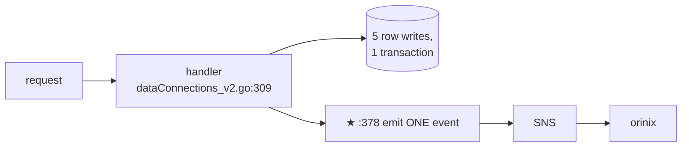
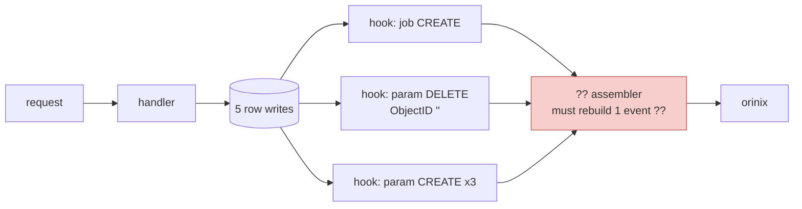
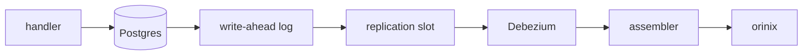
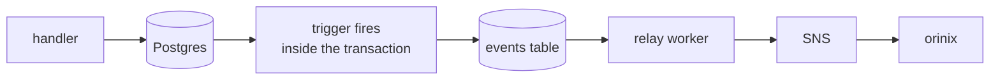
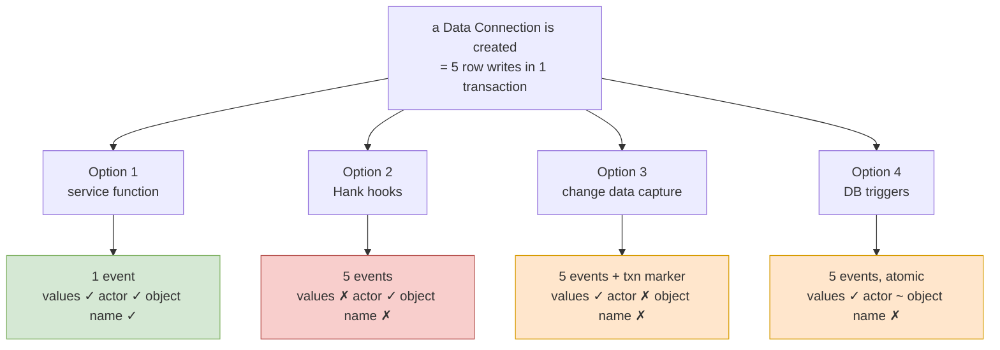

# 03 — Design Options

Two independent decisions, often confused with each other:

- **Decision 1: WHERE does the event come from?** (§1-§6, five options)
- **Decision 2: HOW MUCH goes in it?** (§7, three levels)

They are separable. You can pick Option 1 with a thin payload, or Option 2 with a
rich one. Keeping them apart is what makes the conversation tractable.

---

## 1. Option 1 — Emit from the service function *(recommended)*

### Execution flow



### Files and functions

| Where | File:line | What we add |
|---|---|---|
| Create, Door A | `dataConnections_v2.go:378` | emit block |
| Create, Door B | `job_service.go:1505` | emit block |
| Create, Door C | `job_service.go:1388` | emit block |
| Update, Door A | `dataConnections_v2.go:453` | emit block + read old settings after `:405` |
| Update, Door B | `job_service.go:1698` | emit block |
| Update, Door C | `job_service.go:1672` | emit block |
| Delete | `job_service.go:1932` | emit block beside the existing publish |
| New package | `forebitt/services/observability/` | event struct, diff helpers, publisher |

### The actual patch, create path

```go
	protoDataConnection.JobParameters = jobParameters              // :378 exists today
+
+	s.emitDataConnectionEvent(ctx, DataConnectionChange{
+		ChangeType:  "CREATED",
+		Actor:       authUser,        // :313
+		Before:      nil,
+		After:       &jobModel,       // ID filled in by :356
+		AfterParams: dbParameters,    // :343-354
+		DataSource:  dataSource,      // :328
+		DataType:    dataType,        // :323
+	})
+
	return &dataconnections.CreateDataConnectionV2_Response{...}   // :379 exists today
```

### Where execution diverges from today

Only at the added line. The transaction, the writes, the response — unchanged. The
emit is after every failure path has already returned, so it cannot fire for a
request that failed.

### Runtime behaviour

- **Create:** zero new queries. Every value is already in a local variable.
- **Update:** one extra indexed read (`FetchOrganizationJobParameters`, already
  exists at `job_parameters.go:20`).
- **Delete:** zero new queries, optionally one for the old settings.
- Publish is fire-and-forget; a failure logs and does not affect the response.

### Trade-offs

| Good | Bad |
|---|---|
| Exactly 1 event per user action, on every route | 7 places to touch, not 1 |
| Old and new values available for free | A future new write path could be forgotten |
| We choose the fields, so no secret can leak by accident | Needs a small "don't emit twice" guard, because Door B calls Door C twice |
| Business vocabulary (`DATA_CONNECTION`), not table names | One block per new object type |
| Change is contained to forebitt | |

### The double-emit guard

Because Door B calls Door C **twice** (`job_service.go:1418` and `:1425`), the
inner handler must stay quiet when called from an outer one:

```go
ctx = observability.WithSuppressed(ctx)   // set by the outer handler
...
func (s *Server) emitDataConnectionEvent(ctx, change) {
    if observability.IsSuppressed(ctx) { return }
    ...
}
```

Roughly ten lines, written once. **[UNVERIFIED]** whether Doors B and C are also
called directly by external clients — if they are, they need their own emit,
guarded by this flag. This decides whether we instrument 3 sites or 7.

---

## 2. Option 2 — Hank's automatic GORM hooks

### Execution flow



### Files and functions

Nothing changes in forebitt. The hooks live in `hank/db/audit.go`
(`AfterCreate` / `AfterUpdate` / `AfterDelete`) and are registered globally by
`applyEmbeddedHooks` (`hank/db/service.go:83-91`) for every service using Hank.
Today they only write a log line; to use them as an event source we would also
have to make them publish.

### Where execution diverges

At the ORM layer, per row. The handler is not involved and has no say.

### What the assembler must do

To rebuild the single Option-1 event from five records:

1. **Correlate them.** Only `RequestID` links them. **[UNVERIFIED]** whether it is
   populated on every path. And one request is not always one action — Door B
   performs two creates under one request ID.
2. **Identify the main object.** Records 1 and 3-5 are structurally identical.
   Nothing says the job is the root and the settings belong to it — that lives only
   in forebitt's code, so it would have to be duplicated and kept in sync.
3. **Know when all of them have arrived.** No count, no end-of-transaction marker.
   The assembler cannot tell "3 settings, all in" from "5 settings, 2 in flight."
   Only a timer-and-hope is implementable, so every event is delayed and a slow one
   produces a **wrong** event rather than a late one.
4. **Discard record 2**, the phantom delete.
5. **Find the values.** They do not exist in the record at all.
6. **Handle the empty ID** on deletes (§7 of `02`).
7. **Tolerate out-of-order arrival.**
8. **Maintain all of the above per object type, forever.**

### Trade-offs

| Good | Bad |
|---|---|
| No handler code; nothing can be forgotten | 5 events per action via Door A, 10 via Door B |
| Already deployed in 10+ repos | The count depends on internal code paths, not user actions |
| Carries the actor (unlike change data capture) | No field values at all |
| | Delete does not say which object |
| | Cannot know when the set is complete |
| | Any change lands in 5 services at once |

### 2b. The interesting variant: hooks + a thin payload + an ObjectType filter

This is worth taking seriously because it is much stronger than the naive version.

**The idea:** don't try to assemble anything. Forward only records whose
`ObjectType` is one we care about (`DataImportJob`, `Flow`, `FlowRun`,
`CleanRoomQuestion`) and drop the child-table records entirely. Then:

| Action | Records forwarded | Result |
|---|---|---|
| Create via Door A | 1 (`DataImportJob CREATE`) | **works** — the settings records are filtered out |
| Update via Door A | 1 (`DataImportJob UPDATE`) | **works** |
| Delete | 1, but `ObjectID` is `""` | **broken** until Hank is fixed |
| Create via Door B | 2 (`CREATE` then `UPDATE`) | XMI sees a create immediately followed by an update, for one create |

So filtering genuinely collapses 5 → 1 for create and update. The assembler
problem disappears because we stop assembling. **This is the honest strongest form
of the "just use Hank" proposal, and it should be acknowledged as such.**

**Where it still fails, and this is decisive:**

> The hook record carries `Action` (CREATE / UPDATE / DELETE). It does **not** carry
> `Status` or `Stage`.

So for the use case "tell XMI when the run completed," the hook can only say
**"FlowRun 123 was updated."** It cannot say *"FlowRun 123 is now COMPLETED."* XMI
would have to call our API after every update to find out whether this was the one
they cared about — which is the polling problem DV-15621 is trying to remove.

**And a second, sharper problem for that exact use case:** every hook begins

```go
tokenClaims, ctx, parsed := claims(scope)
if !parsed { return nil }
```

**[VERIFIED]** `hank/db/audit.go`. No parsed auth claims in the context → **no
record at all**. A flow run completing is almost certainly a background worker, not
a user request. **[UNVERIFIED]** but high-probability: the single most important
event may emit nothing. This must be checked before anyone commits to this option.

---

## 3. Option 3 — Change data capture (read the database's change log)

Read Postgres's write-ahead log with something like Debezium and turn row changes
into events.

### Execution flow



### What it genuinely solves that Option 2 does not

1. **It has the old and new values for free.** The change log physically contains
   the row before and after (with `REPLICA IDENTITY FULL`). The "no values" problem
   vanishes.
2. **It knows which changes shared a transaction.** The log carries transaction
   boundaries and can emit "that transaction is finished, it had 5 changes."
   So problem 3 above — *when is the set complete* — is genuinely solved, for
   Door A, which does all five writes in one transaction.
3. **Nothing can be forgotten.** Any new code path is captured.

**This is the strongest alternative, and stronger than Option 2. Do not dismiss it
casually in the meeting.**

### Why it still is not the answer

1. **It does not know who did it.** The change log has no user, no email, no
   request. It sees "row changed," not "Aditya changed it." Both the observability
   product and the audit log must say who performed the action. The standard
   workaround is to write the user ID into a column on every table first — which is
   application work everywhere, so the "no code changes" advantage evaporates.
2. **It still cannot tell which of the five rows is the main object.** Grouping is
   not naming. That knowledge only exists in forebitt.
3. **Door B still breaks it.** Two separate transactions → two transaction
   markers → still have to decide they were one user action.
4. **Our column names become XMI's contract.** Renaming a column would break a
   partner integration. Today our schema is private.
5. **Real operational risk on production Postgres** — see §4 of `04-tradeoffs.md`.
6. **`REPLICA IDENTITY FULL` increases write volume**, because Postgres must log the
   whole old row on every update.
7. **The secrets problem is worse**, not better: credential values flow into the
   pipeline, and per-field filtering is harder at the infrastructure layer.
8. **It spans several databases.** The connection is in forebitt's DB, the credential
   in primage's, flows in unhygienix's — one pipeline per database, and
   cross-service objects cannot be assembled at all.

**Summary line for the meeting:** change data capture fixes the *mechanical*
problems (values, grouping) but not the *meaning* problems (who did it, what
business object this is) — and it buys those fixes with a permanent coupling
between our schema and a partner's integration.

---

## 4. Option 4 — Database triggers writing to an events table

### Is this different from change data capture? Yes, fundamentally.

They are often lumped together, so it is worth being precise:

| | **Database trigger** | **Change data capture** |
|---|---|---|
| When it runs | **Inside** your transaction, synchronously, as part of the write | **After** the transaction commits, asynchronously |
| Where it runs | In the Postgres backend handling your query | A separate process reading the log |
| Can it break your write? | **Yes** — an error in the trigger aborts the transaction | **No** — it is downstream, it cannot touch you |
| Cost to the writer | Adds latency to **every** write | None on the write path |
| Atomicity with the change | **Guaranteed** — same transaction | Eventual — commits first, event later |
| Sees old and new values | Yes (`OLD` / `NEW` in PL/pgSQL) | Yes, with `REPLICA IDENTITY FULL` |
| Knows the app user | **Yes, if we pass it** via a session setting (`SET LOCAL app.user_id`) | **No** |
| Failure mode | Writes start failing | Events fall behind; log files accumulate |
| Sees changes made by hand/migrations | Yes | Yes |
| Where the logic lives | SQL, in the database | A config file and a service |

So: a trigger is **part of the write**; change data capture is **an observer of the
write**. That difference drives everything else — a broken trigger takes down
writes, a broken capture pipeline takes down (eventually) the disk.

### Execution flow



### Trade-offs

| Good | Bad |
|---|---|
| Has old and new values | Still **one event per row** — the same combining problem |
| Atomic with the change, so it **cannot be lost** | Logic in PL/pgSQL that nobody on the team maintains |
| Can capture the app user via a session variable | Would need writing per table, across ~91 tables |
| No application code in the handlers | Hard to unit test |
| | Adds latency to every write |
| | Same secrets exposure |
| | A bug in a trigger breaks production writes |

Genuinely stronger than Option 2 on reliability and values. Not better than
Option 1, and much harder to test.

---

## 5. Option 5 — Collect events during the request, flush at the end

A nicer shape of Option 1 that a good architect may well suggest.

Handlers append to a per-request list; one shared piece of middleware publishes
everything once the request has succeeded.

| Good | Bad |
|---|---|
| Only one place actually publishes → double-emit becomes structurally impossible, no suppression flag needed | More indirect; harder to follow when debugging |
| Naturally gives "only publish if the request succeeded" | The middleware must be certain the DB transaction committed |
| Central place to add retry, batching, an outbox later | Extra machinery for 7 call sites |

**Reasonable to adopt later.** Worth naming so it is clear we considered it. Not
worth the indirection today.

---

## 6. Not an option, but frequently confused with one — the transactional outbox

Today the publish happens after commit, and a failure is logged and ignored
(**[VERIFIED]** `job_service.go:1602-1605`). So a message can be lost.

An outbox means: write the event row **in the same transaction** as the change, and
a worker sends it afterwards and marks it done. Nothing can be lost.

This is **not a competitor** to Option 1 — it is an upgrade to it, at the same
lines. We have chosen the simpler fire-and-forget for M1 and will state that
limitation to XMI honestly. If a guarantee is needed later, the outbox write goes
exactly where the publish call is now.

Note the failure mode is **loss only, never a phantom event**, because the publish
is strictly after the commit. We can fail to announce something that happened; we
cannot announce something that did not.

---

## 7. Decision 2 — how much detail? Three levels

| Level | Example message | Enough for XMI? |
|---|---|---|
| **0** | "data connection X was updated" | **No** — they must call back to find out what, which is polling with extra steps. They also cannot tell a rename from a stage change. |
| **1** | "data connection X is now at stage CONFIGURATION_COMPLETE" | **Yes, for all four M1 use cases** |
| **2** | "stage went from MAPPING_REQUIRED to CONFIGURATION_COMPLETE" | Yes, and also serves audit and the product UI |

### The finding that matters

All four of XMI's confirmed M1 use cases only need the **new** state:

1. Data connection stage change → needs the new stage → **Level 1**
2. Flow run state STARTED/COMPLETED/FAILED → new state → **Level 1**
3. Flow 1 completes → trigger Flow 2 → "it completed" → **Level 1**
4. All datasets assigned → trigger a run → new state → **Level 1**

**None of them asks what it was before.** So Level 1 satisfies M1.

Note this also shows why Option 2b fails: the hook record has `Action`, not
`Status`. It cannot even reach Level 1.

### What Level 1 saves

- Roughly a third of the code — no before-read on update, no comparison logic, no
  six-field overlay, no matching settings by name
- **The security review disappears** — no field values means no possibility of
  leaking a credential or a customer's `DataLocation`
- Tiny fixed message size
- The pattern already runs in production
- **Adding `changedFields` later is additive and safe**, so Level 1 first is a real
  phase, not a dead end

### What Level 1 costs

- The product is called *observability*. A history of "updated, updated, updated"
  cannot produce a screen showing "Aditya changed the DataLocation on 12 June."
- Josh's audit work needs Level 2 regardless — so this is postponement, not saving
- A read-back race: XMI sees "X updated," calls our API, and by then it changed
  again. Fine for act-on-current-state, broken for anyone needing every step

### Recommendation

**Level 1** for the state-change events XMI is blocked on. **Level 2** for
create/update/delete of the objects themselves. Same 7 code locations either way;
the extra cost is one database read on the update path. This matches detail to what
each consumer actually does with it, rather than splitting the difference.

---

## 8. Where the options diverge, in one picture



Read the bottom row as the scorecard: only Option 1 gets all three, and it is the
only one where the count is 1.

---

**Next:** [04-tradeoffs.md](04-tradeoffs.md)
