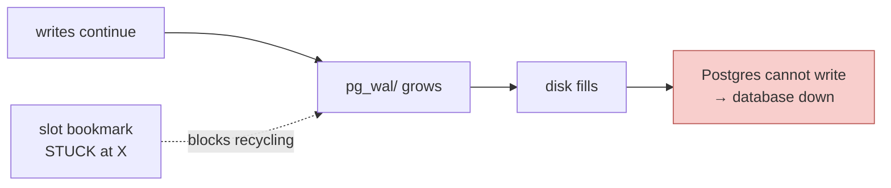

# 04 — Trade-offs, Failure Modes and Rationale

## 1. Scored against the seven requirements from `01-problem.md §6`

| Requirement | 1. Service fn | 2. Hank hooks | 2b. Hooks + filter | 3. Change data capture | 4. DB triggers |
|---|---|---|---|---|---|
| One message per user action | ✅ always | ❌ 5 or 10 | ⚠️ 1 via Door A, 2 via Door B | ❌ 5 + marker | ❌ 5 |
| Names the business object | ✅ `DATA_CONNECTION` | ❌ table names | ❌ table names | ❌ table names | ❌ table names |
| Enough state to act without calling back | ✅ | ❌ no values | ❌ `Action` only, no `Status` | ✅ full rows | ✅ full rows |
| Says who did it | ✅ `authUser.Email` | ✅ from auth claims | ✅ | ❌ **not available** | ⚠️ only if we pass it via a session variable |
| Stable ID for de-duplication | ✅ we mint it | ⚠️ empty on deletes | ⚠️ empty on deletes | ✅ transaction + LSN | ✅ we choose |
| Replayable | ✅ via `object_events` | ✅ | ✅ | ✅ | ✅ |
| No schema or secret exposure | ✅ we pick the fields | ✅ no values to leak | ✅ | ❌ credential values flow through | ❌ same |

**Only Option 1 scores clean on all seven.** Option 3 is second, losing on the two
that cannot be bought back cheaply: **who did it**, and **schema privacy**.

---

## 2. Cost of change

| | Option 1 | Option 2 / 2b | Option 3 | Option 4 |
|---|---|---|---|---|
| Repos touched | 1 (forebitt) | 1 (hank) — but **lands in 5 services** | 0 code, + new infrastructure | 1 (migrations) |
| Code sites | 7 emit blocks + 1 helper package | 0 in handlers; a new assembler in orinix | 0; a new pipeline + assembler | ~91 triggers |
| New DB queries | 1, on the update path only | 1 per UPDATE **fleet-wide** if we add values | 0 | 0, but every write gets slower |
| Security review | **No** — fields chosen explicitly | Only if we add values → then yes, ~91 tables | **Yes** | **Yes** |
| New infrastructure | 1 SNS topic + 1 SQS queue | same | same **+** Debezium/Kafka Connect **+** replication slots **+** monitoring | same + a relay worker |
| Testable in unit tests | ✅ the diff functions are pure | ⚠️ assembler needs integration tests | ❌ needs a real database and pipeline | ❌ PL/pgSQL |
| Rollback | delete the blocks | version-pin hank across 5 services | drop the slot, but events already delivered | drop triggers |

---

## 3. Performance

**Option 1**
- Create: **zero** additional queries. Every value is already a local variable at
  `dataConnections_v2.go:378`.
- Update: **one** indexed read (`FetchOrganizationJobParameters`,
  `job_parameters.go:20`) on a path that already performs 3-4 reads.
- Publish: one SNS call, fire-and-forget, outside the transaction. Worth holding a
  single SNS client rather than copying today's pattern —
  **[VERIFIED]** `hank/events/service.go:18` constructs a new client on **every**
  publish, via `hevent.New(config)`.

**Option 2 with values added**
- One extra `SELECT` before **every** `UPDATE`, in every service using Hank
  (**[VERIFIED]** unhygienix, forebitt, primage, picanmix, pegleg). ~91 models embed
  the audit struct in unhygienix alone. Nobody outside this project asked for that
  cost, and some of those paths are hot.

**Option 3**
- No cost on the write path itself, but `REPLICA IDENTITY FULL` (required for
  before-images) makes Postgres write the **entire old row** into the log on every
  update, materially increasing log volume and therefore disk and replication I/O.

**Option 4**
- Adds latency inside every transaction, on every write, forever.

---

## 4. Failure modes

### 4.1 Option 1 — message loss, never a phantom

Publish happens after `COMMIT` and the error is swallowed
(**[VERIFIED]** `job_service.go:1602-1605`). So:

- **Can happen:** the row exists, no event was sent. Recoverable by backfilling
  from the source table.
- **Cannot happen:** an event for a row that does not exist — because the publish
  is strictly after the commit.

One placement caveat: **[VERIFIED]** `dataConnections_v2.go:362-371` can return an
error *after* the transaction committed. Emitting before that block would announce
a connection the caller was told failed. Emitting at `:378` removes this entirely,
at no cost.

*Mitigation if we ever need a guarantee:* the transactional outbox
(`03-design-options.md §6`), at the same line.

### 4.2 Option 2 — silent gaps and undecidable completeness

- **The claims gate.** **[VERIFIED]** every hook opens with
  `tokenClaims, ctx, parsed := claims(scope); if !parsed { return nil }`.
  No parsed auth claims → **no record at all**. Background workers are the likely
  victims, and a flow run completing is almost certainly a background worker.
  **[UNVERIFIED]** but this could mean the single most important event emits nothing.
- **Undecidable completeness.** No count and no end-of-transaction marker, so the
  assembler must use a timer. A slow message produces a **wrong** event rather than
  a late one — the worst possible failure shape, because it looks like success.
- **Route-dependent counts.** 5 via Door A, 10 via Door B. If someone later
  optimises Door B's double-save away, the event count changes and XMI's behaviour
  changes with it, with no code change on either side.

### 4.3 Option 3 — the replication-slot disk failure

This is the one to understand properly, because it is the most serious operational
risk in the whole comparison.

**How Postgres writes:** every change is first appended to the **write-ahead log**
(WAL) — a sequence of fixed-size files in `pg_wal/`. Once a change is safely
written to the data files and no one still needs the log, Postgres **recycles**
those files and reuses the disk space. That recycling is what keeps `pg_wal/` at a
roughly constant size in normal operation.

**What a replication slot does:** a change-capture pipeline registers a
*replication slot*, which is a bookmark saying *"I have consumed the log up to
position X."* Postgres now has a rule it must obey:

> **Do not recycle any WAL file that a slot has not yet confirmed.**

This is the correct behaviour — it is what guarantees the consumer never misses a
change, even across a restart.

**The failure:** if the consumer stalls — the Debezium task crashes, Kafka is
unreachable, the network partitions, someone pauses the connector, or it simply
cannot keep up — the bookmark stops advancing. Postgres keeps every WAL file from
the bookmark onwards. Writes continue normally, so the log keeps growing:

When the volume holding `pg_wal/` fills, Postgres cannot write its log, and if it
cannot write its log it cannot accept writes at all. The database stops.

**Why it is dangerous specifically for us:**

- The trigger is a **downstream consumer being unhealthy**, but the victim is the
  **production database** — a failure that travels backwards, which is not
  intuitive and easy to miss in review.
- It can build up overnight from a silent connector failure.
- Recovery under pressure means dropping the slot, which loses the change stream
  and forces a resync.
- Mitigations exist and are standard (`max_slot_wal_keep_size` to cap the retention
  and let Postgres invalidate a lagging slot, plus alerting on slot lag), **but they
  are configuration and monitoring we do not have today**, on databases owned by
  other teams.

Compare with Option 1's worst case: an SNS publish fails and one event is missing.
Nothing upstream is affected.

### 4.4 Option 4 — a bug in a trigger breaks production writes

Because the trigger runs **inside** the transaction, an error in it aborts the
user's write. A logic bug in PL/pgSQL that nobody on the team is fluent in becomes
an outage in the create-data-connection path.

---

## 5. Scalability

| | Option 1 | Option 2 | Option 3 |
|---|---|---|---|
| Messages per action | 1 | 5-10 | 5 + marker |
| Volume at audit scale | matches business actions | 5-10× business actions | 5-10× **plus** every internal table |
| SNS topic type | Standard — no meaningful ceiling | same | pipeline-dependent |
| Cost driver | events | events | events **+** log volume **+** pipeline compute |

On the transport, one relevant verified detail: the existing topic is **FIFO**
(`arn:…:habu_events_topic.fifo`, **[VERIFIED]**
`fiddley/control-plane/apps/prod/aws/forebitt/prod-overrides.yaml:78`), which caps
at 300 messages/second (3,000 batched). And its ordering guarantee is weaker than
people assume: **[VERIFIED]** `hank/aws/sns/service.go:48` sets
`MessageGroupId: aws.String(reqId)`, and FIFO only orders **within** a message
group — so two updates to the same object from different requests are already
unordered. That removes the main argument for staying on the FIFO topic and
supports a new **Standard** topic for orinix.

---

## 6. Maintainability

**Option 1's weak point, stated plainly:** if someone adds a new way to change a
data connection in six months and forgets the emit block, that path goes silent.
Options 2, 3 and 4 would have covered it automatically. **This is the one genuine
advantage the automatic approaches have, and it should be conceded before it is
raised.**

Why it is acceptable:

- All the write paths are in **two files** (`dataConnections_v2.go`,
  `job_service.go`), so a reviewer can see them together.
- We can add a test that fails when a handler writes without emitting.
- The failure is **silence**, which is detectable by monitoring event volume — far
  better than the wrong-event failure Option 2's timer produces.

**Option 2/3/4's weak point:** the knowledge "these five rows are one data
connection, and the job is the root" would live in **two** places — forebitt's code
and the assembler — and nothing keeps them in sync. When someone changes how
settings are saved, the assembler breaks silently.

---

## 7. Why an architect would prefer Option 1

Four reasons, in the order I would present them:

1. **The information is already there.** At `dataConnections_v2.go:378` the handler
   is holding a complete, business-shaped object, *because it needs one anyway for
   its response*. Every other option throws that away and rebuilds it — less
   accurately — somewhere else. Nobody should pay to reconstruct what they already
   had.

2. **The event count should depend on what the user did, not on how the code
   happens to be written.** Option 1 gives 1 event whether the request came through
   Door A or Door B. Option 2 gives 5 or 10. A partner integration must not change
   behaviour because we refactored an internal save path.

3. **Only Option 1 has both the values and the actor.** Hooks have the actor and no
   values; change capture has the values and no actor. The service layer is the only
   place both exist at the same time, which is not a coincidence — it is the only
   layer that knows both the request and the data.

4. **It keeps our schema private.** Options 3 and 4 make table and column names part
   of an external partner's integration. That is a one-way door, and it is the kind
   of coupling that is invisible on day one and expensive in year two.

### And where the alternatives genuinely win

Said explicitly, because a review that only lists wins is not a review:

- **Hank's hooks are the right tool for Josh's audit log.** "Who touched which row,
  when," across 91 tables, with no per-table work, is exactly their shape. Adding
  values to them would make that product materially better. Different question,
  different answer — the two efforts can proceed independently.
- **Change data capture is the right tool if the requirement were ever "capture
  everything that happens in the database, including manual SQL and migrations."**
  That is an audit/forensics requirement, not a partner-notification one.
- **The outbox pattern will be right for us eventually**, if we ever need to promise
  XMI that no event can be lost.

---

**Next:** [05-architect-review.md](05-architect-review.md)
