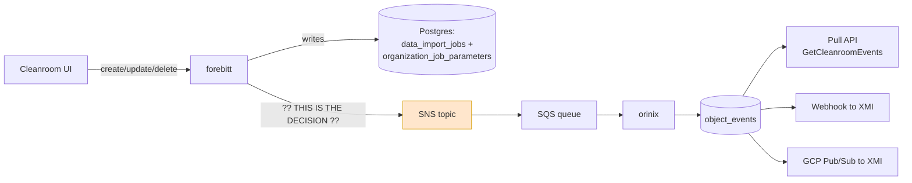

# orinix Event Production — Architect Follow-up

**Date:** 2026-07-30
**Prepared by:** Aditya Bhardwaj
**Audience:** Anil (Principal Architect), Josh Wo (Principal Architect)
**Tickets:** DV-13856 (platform), DV-15090 / DV-15091 (M1), DV-15496 (epic)

---

## The one-sentence version

XMI needs to be told when a Data Connection, Flow or Question changes. We can
produce that notification either by **writing a few lines in the function that
handles the request**, or by **reusing an automatic mechanism that fires on every
database row write**. This document argues for the first, shows what the second
actually produces, and treats three other alternatives (change data capture,
database triggers, request-scoped buffering) honestly.

## Why this needs a decision now

The receiving side (orinix, `object_events`, delivery to XMI) is approved and
scaffolded. The **producer** side is not decided, and it is the part that touches
other teams' code. Everything downstream depends on the shape of the message we
agree to emit.

## Documents in this folder

| File | What it covers |
|---|---|
| [01-problem.md](01-problem.md) | What problem, why it exists, what constrains us — from first principles |
| [02-current-design.md](02-current-design.md) | One real request traced end to end, with files, functions and line numbers |
| [03-design-options.md](03-design-options.md) | Five ways to produce the event, and the three levels of detail |
| [04-tradeoffs.md](04-tradeoffs.md) | Side-by-side comparison, failure modes, operational risk |
| [05-architect-review.md](05-architect-review.md) | The review I would give this design if I were Anil |
| [06-meeting-preparation.md](06-meeting-preparation.md) | Likely questions, answers, counter-arguments, terminology |
| [07-questions-to-ask.md](07-questions-to-ask.md) | What I should ask them |
| [08-next-steps.md](08-next-steps.md) | Decisions needed and open verification items |

## The shape of the system

Everything to the right of the SNS topic is agreed. The question is what forebitt
puts **into** it, and which code produces it.

## What is being asked for

1. Approve producing events from the **service layer** (Approach 1), not from
   Hank's automatic row hooks (Approach 2).
2. Agree **how much detail** goes in the message (see `03` — levels 0/1/2).
   Proposal: current state for the flow-run/stage events XMI is blocked on, full
   before-and-after for object create/update/delete.
3. Confirm which of the **three live create/update APIs** are still in use — this
   is the difference between instrumenting 3 places and 7.
4. Decide whether a Data Connection event is scoped to the **organisation** or to
   the **cleanroom** (it has no cleanroom ID on it today).

## Evidence standard used here

Every claim marked **[VERIFIED]** was read in source in this repository on
2026-07-28/29/30, with the file and line recorded. Claims marked
**[UNVERIFIED]** are stated as open, not asserted. If something in this folder is
not marked, treat it as reasoning rather than fact.

## Companion documents (earlier, longer)

- `../2026-07-29_aditya_anil_josh_meet.txt` — the plain-language comparison
- `../2026-07-29_orinix_exact_emission_points_v1_vs_v2_handlers.txt` — line-level patches
- `../2026-07-30_aditya-josh-anil-q-and-a-30-july.txt` — transport and topic decisions
- `../2026-07-27_loki-datadog-hank-event-comparision.txt` — why a log store cannot back the read API
