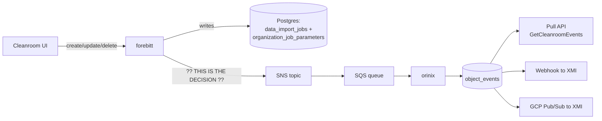

# SUMMARY — orinix Event Production, Architect Follow-up

**Session date:** 2026-07-30 (published 2026-07-31)
**Author:** Aditya Bhardwaj
**Audience:** Anil (Principal Architect), Josh Wo (Principal Architect)
**Tickets:** DV-13856 (platform), DV-15090 / DV-15091 (M1), DV-15496 (epic), DV-15621 (XMI polling / rate limiting)

> **Read this file first.** It is self-contained. Drill into `01`–`08` only when you
> need the line-level evidence behind a claim.

---

## 1. Problem statement

XMI (a partner team) currently **polls** our API to learn when a Data Connection,
Flow or Question changes. DV-15621 records that the resulting rate-limiting problem
"should be helped by enabling pub/sub for status instead of polling."

The receiving side — orinix, the `object_events` table, pull API and webhook
delivery to XMI — is **already approved and scaffolded**. The **producer** side is
not decided, and it is the part that touches other teams' code in other repos.

Two separable decisions, routinely conflated:

- **Decision 1 — WHERE does the event come from?** (five options)
- **Decision 2 — HOW MUCH detail goes in it?** (three levels)

This is the last cheap moment: once XMI integrates against a message shape,
changing it becomes a coordinated multi-team release.

---

## 2. First-principles explanation

A partner needs to know when our work finishes. Today they phone us every few
minutes ("is order 4471 done?"); most calls are wasted. We agree to call them
instead. Two questions follow, and they are the whole discussion:

- **What do we say on the call?** "Something changed" (they must still phone back —
  a doorbell in front of the phone), vs "it is now packed" (they can act), vs "it
  moved from picking to packed and the address changed" (they can act *and* show
  history).
- **Who writes the note?** The **clerk who handled the order** knows it was one
  action, knows before and after, knows who asked. A **camera watching the shelves**
  sees five boxes move and cannot tell they were one order, which box is the order
  and which are items inside it, or who was holding them.

The clerk is our **service layer**. The camera is **Hank's row hooks** or **change
data capture**.

### Why the problem exists at all — three verified root facts

1. **A Data Connection is not one row.** It spans `data_import_jobs` (the connection)
   and `organization_job_parameters` (**one row per setting**). The business object
   the user sees does not match the storage, so any row-level mechanism sees pieces.
2. **Settings are saved by delete-then-reinsert.**
   `forebitt/db/job_parameters.go:109-167` clears *all* settings (`:121`) and
   re-inserts each with `uuid.New()` (`:150`). Changing one setting rewrites all of
   them, and **row identity does not survive an edit**.
3. **The existing notification mechanism was built for a different purpose.**
   `hank/events/model.go:3` — `EventStruct{Service, Action, Object, ObjectID,
   Attributes map[string]string}`. An ID and a bag of strings, designed to tell *our
   own* services "go look at this thing," never an external partner what changed.

---

## 3. High-level architecture



Everything right of the SNS topic is agreed. The open question is **what forebitt
puts into it, and which code produces it**.

A second, frequently-missed fact: **two independent pipelines already exist and
never call each other.** Hank's GORM audit hooks (`hank/db/audit.go`) only write a
stdout log line consumed by Alloy → Loki and Datadog. Hank's event publisher
(`hank/events/service.go:30`) is called **by hand** from ~15 sites in forebitt. So
*"Hank already gives us events on every change"* is false — it gives **log lines**
on every change and **SNS messages** only where a human wrote a publish call.

---

## 4. End-to-end runtime flow (all [VERIFIED] in source, 2026-07-28/29/30)

Worked example: creating *"Adidas EMEA CRM Data"* on `CLIENT_AWS` / `CRM` with three
settings (`DataLocation`, `SampleFilePath`, `FieldDelimiter`).

**Three live HTTP doors all write the same two tables:**

| Door | Route | Handler | File:line |
|---|---|---|---|
| **A** | `POST /v2/organization/{orgId}/data-connection` | `CreateDataConnectionV2` | `forebitt/api/server/dataConnections_v2.go:309` |
| **B** | `POST /forebitt/v1/organization/{orgId}/dataConnection` | `CreateDataConnection` | `forebitt/api/server/job_service.go:1396` |
| **C** | the import-job route | `CreateImportJobV2` | `forebitt/api/server/job_service.go:1293` |

**Door A traced:**

| Step | Line | What happens | Why it matters |
|---|---|---|---|
| 1 | `:313` | `getAuthUser(ctx)` → `*hauth.UserDetails` (`hank/token/authorization.go:25`) | **The only place `performedBy` exists.** No other mechanism has it. |
| 2 | `:318, :323, :328` | validate; resolve dataType, dataSource | after `:328` we hold human-readable names ("S3"), not just UUIDs — free |
| 3 | `:333-341` | build `jobModel`; `NewImportJobFromProtoV2` maps only **six** fields (`forebitt/models/data_import_job.go:76-85`); Status/Stage set separately | the six-field limit is the update-path trap (§5) |
| 4 | `:343-354` | build `dbParameters` — complete settings set in **one slice** | every alternative must rebuild this from fragments |
| 5 | `:356` | `db.InsertJobV2` (`forebitt/db/job_v2.go:13-36`) → **5 row writes in 1 transaction** | see table below |
| 6 | `:362-371` | optional Snowflake setup — **can return an error after COMMIT** | so the emit must come *after* this block |
| 7 | `:372-378` | assemble the response: `convertDataConnectionToProto` + `ToProtoV2()` per param | **★ the punchline** |
| 8 | `:379` | return | |

**One user action = five database writes:**

| # | Table | Op | Note |
|---|---|---|---|
| 1 | `data_import_jobs` | INSERT | the connection |
| 2 | `organization_job_parameters` | DELETE | **matches zero rows** on a create — runs unconditionally |
| 3-5 | `organization_job_parameters` | INSERT ×3 | one per setting, fresh UUID each |

**Door B is the key slide:** `job_service.go:1401-1425` saves the connection
**twice** — draft (`:1418`, INSERT) then final (`:1425`, UPDATE) — and both passes
run delete-all-plus-reinsert on settings.

| Path | Row-hook firings for one "create with 3 settings" |
|---|---|
| Door A | 1 INSERT + 1 phantom DELETE + 3 INSERTs = **5** |
| Door B | pass 1 (1+1+3) + pass 2 (1 UPDATE +1+3) = **10** |

Same user, same button, same final state. **The row-level event count depends on
which route was used, not on what the user did.**

**The core finding:** at `dataConnections_v2.go:378` the handler is holding a
complete, assembled, business-shaped object — *because it needs one anyway for its
response*. The information required for one correct event is not cheap there; it is
**free**.

### The update path and one trap (`UpdateDataConnectionV2`, `dataConnections_v2.go:384`)

- `:393` `dbJob` — the before-image is **already read**
- `:417` `jobModel` is a **six-field patch**, not the after-state
- `:420-431` `dbParameters` built entirely from the request
- **Gap 1:** old settings are never read. Fix: one call to
  `db.FetchOrganizationJobParameters` (already exists, `job_parameters.go:20`) —
  **the only new query in the whole design.**
- **Gap 2 (the trap):** `UpdateJobV2` uses GORM v1 `Updates(*job)`, which drops
  zero-valued fields. Naively diffing `dbJob` vs `jobModel` would emit
  `"stage": {"from":"MAPPING_REQUIRED","to":""}` on **every** update — not noise,
  **wrong**, and XMI's stage consumer would act on it. Fix: start from `dbJob`,
  overlay only non-blank patch fields, then compare (~6 lines).

### What Hank's hook actually records (`hank/db/audit.go`)

`AuditLog{ObjectID, ObjectName, ObjectType, Action, ActionByID, ActionByEmail,
ActionAt, Method, OrgID, RequestID, ImpersonatedBy*}` — and `getObjectDetails`
reads exactly two keys off the model: `"ID"` and `"Name"`.
**There are no field values, and no reference to a parent object.**

And because `forebitt/db/job.go:185` deletes via `tx.Scopes(IDScope(id)).Delete(&models.DataImportJob{})`
— ID in the WHERE clause, **empty struct** passed in — the delete record is:

```json
{ "ObjectType": "DataImportJob", "ObjectID": "", "Action": "DELETE" }
```

*"Somebody deleted a data connection. We are not saying which one."* This is a
defect in the audit log **we already ship**, independent of orinix.

---

## 5. Design options considered

| # | Option | Verdict |
|---|---|---|
| **1** | **Emit from the service function** | **Recommended** |
| 2 | Hank's automatic GORM row hooks | Rejected |
| 2b | Hooks + thin payload + `ObjectType` filter | Strongest form of "just use Hank" — still fails |
| 3 | Change data capture (WAL / Debezium) | **Strongest alternative** — do not dismiss casually |
| 4 | Database triggers → events table | Rejected |
| 5 | Request-scoped buffer, flush at end | Reasonable later; worth naming |
| — | Transactional outbox | **Not a competitor** — an upgrade to Option 1 at the same lines |

**Option 1** — 7 emit sites (`dataConnections_v2.go:378/:405/:453`;
`job_service.go:1505/:1388/:1698/:1672`; delete at `job_service.go:1932`) plus a new
`forebitt/services/observability/` package. Create costs **zero** new queries;
update costs **one** indexed read. Needs a ~10-line double-emit suppression guard
because Door B calls Door C twice.

**Option 2b** genuinely collapses 5 → 1 for create/update by filtering to
`DataImportJob` and dropping child rows. It fails decisively on two points:
the hook record carries `Action`, **not `Status`/`Stage`** — so it can only say
"FlowRun 123 was updated," never "FlowRun 123 is now COMPLETED," which forces XMI
back to polling; and every hook opens with
`tokenClaims, ctx, parsed := claims(scope); if !parsed { return nil }`, so a
background worker (which is almost certainly what completes a flow run) may emit
**nothing at all**.

**Option 3** solves what the hooks cannot — before/after values for free, and
transaction boundaries so "is the set complete?" becomes answerable. It still fails
on: **no actor** (the WAL sees "row changed," not "Aditya changed it"); cannot tell
which of five rows is the main object; Door B's two transactions; **our column names
become XMI's contract**; `REPLICA IDENTITY FULL` inflates WAL volume; secrets
exposure is worse; and it spans several databases (connection in forebitt's,
credential in primage's, flows in unhygienix's).

*One-liner for the meeting:* **change data capture fixes the mechanical problems
(values, grouping) but not the meaning problems (who did it, what business object
this is)** — and buys those fixes with permanent schema/partner coupling.

### Decision 2 — how much detail

| Level | Example | Enough for XMI? |
|---|---|---|
| 0 | "connection X was updated" | **No** — polling with extra steps |
| 1 | "connection X is now at stage CONFIGURATION_COMPLETE" | **Yes, for all four M1 use cases** |
| 2 | "stage went MAPPING_REQUIRED → CONFIGURATION_COMPLETE" | Yes, and also serves audit + product UI |

All four confirmed M1 use cases (data-connection stage change; flow-run
STARTED/COMPLETED/FAILED; flow chaining; trigger-on-all-datasets-assigned) need only
the **new** state. **None asks what it was before.**

---

## 6. Trade-offs

Scored against the seven requirements from `01-problem.md §6`:

| Requirement | 1. Service fn | 2. Hooks | 2b. Hooks+filter | 3. CDC | 4. Triggers |
|---|---|---|---|---|---|
| One message per user action | ✅ always | ❌ 5 or 10 | ⚠️ 1 via A, 2 via B | ❌ 5 + marker | ❌ 5 |
| Names the business object | ✅ `DATA_CONNECTION` | ❌ | ❌ | ❌ | ❌ |
| Enough state to act without calling back | ✅ | ❌ no values | ❌ `Action` only | ✅ | ✅ |
| Says who did it | ✅ | ✅ | ✅ | ❌ **unavailable** | ⚠️ only via session var |
| Stable ID for de-duplication | ✅ | ⚠️ empty on deletes | ⚠️ | ✅ | ✅ |
| Replayable | ✅ | ✅ | ✅ | ✅ | ✅ |
| No schema/secret exposure | ✅ | ✅ | ✅ | ❌ credentials flow through | ❌ |

**Only Option 1 scores clean on all seven.** Option 3 is second, losing on the two
that cannot be bought back cheaply: **who did it**, and **schema privacy**.

**Key failure modes:**
- **Option 1** — loss only, **never a phantom** (publish is strictly after COMMIT).
  Recoverable by backfill. Nothing upstream is affected.
- **Option 2** — the timer-based assembler turns a slow message into a **wrong**
  event rather than a late one: the worst shape, because it looks like success.
- **Option 3** — the **replication-slot disk failure**: a stalled consumer stops the
  slot bookmark advancing, Postgres may not recycle `pg_wal/`, disk fills,
  **production database stops accepting writes**. A failure that travels *backwards*
  from an unhealthy downstream consumer to the production DB. Mitigations
  (`max_slot_wal_keep_size`, slot-lag alerting) are standard but **we do not have
  them today**, on databases owned by other teams.
- **Option 4** — the trigger runs *inside* the transaction, so a PL/pgSQL bug becomes
  an outage on the write path.

**Conceded honestly:** if someone adds a new write path in six months and forgets
the emit block, Option 1 goes silent — the one genuine advantage the automatic
approaches have. Acceptable because all write paths live in **two files**, a test can
fail when a handler writes without emitting, and **silence is detectable by volume
monitoring**, unlike Option 2's wrong-event failure.

**Where the alternatives genuinely win:** Hank's hooks are the *right* tool for
Josh's audit log ("who touched which row, when," across 91 tables). CDC is right if
the requirement were ever "capture everything including manual SQL and migrations."
The outbox will be right for us eventually.

**Transport finding:** the existing topic is FIFO (`habu_events_topic.fifo`), and
`hank/aws/sns/service.go:48` sets `MessageGroupId: aws.String(reqId)` — FIFO orders
only *within* a group, so two updates to the same object from different requests are
**already unordered**. That removes the main argument for staying on FIFO and
supports a new **Standard** topic. Also: `orinjade/.../pegleg.tf:17` already filters
on `"dataImportJob"`, so reusing the existing topic would land our messages in
pegleg's queue — forcing a new topic regardless.

---

## 7. Final recommendation

1. **D1 — Produce events from the service layer (Option 1)**, not Hank's row hooks.
2. **D3 — Level 1** for the state-transition events XMI is blocked on; **Level 2**
   for object create/update/delete. Same 7 sites either way; extra cost is one read.
3. **D2 — org-scoped** Data Connection events, with cleanroom references in context
   fields (open — see §9).
4. **D4 — best-effort delivery for M1, stated honestly in the contract**, plus a
   publish-failure metric and alert (the minimum acceptable position).
5. **D5 — a written JSON schema** as the contract; each service owns its struct.
6. **D6 — per-handler emit** for 7 sites; revisit Option 5 if it grows.

Also asked for: approval of the above, agreement on detail level, confirmation of
which of the three live create/update APIs are still in use (3 sites vs 7), and the
org-vs-cleanroom scoping decision.

---

## 8. Bugs and findings surfaced (pre-existing, not orinix's to fix)

| # | Finding | Where | Severity |
|---|---|---|---|
| 1 | **Delete audit records carry an empty `ObjectID`** — our existing audit log cannot say which connection was deleted | `forebitt/db/job.go:185` + `hank/db/audit.go` | **Raise with Josh; worth its own ticket** |
| 2 | Dead-code stage fallback — `CONFIGURATION_COMPLETE` default overwritten by `""` | `dataConnections_v2.go:337-341` | Medium — `Stage` is what XMI keys off |
| 3 | `UpdateImportJobStage` writes `Status`, not `Stage`, despite the name | `job_service.go:1814` | Confirm intent |
| 4 | Phantom DELETE fires on every create | `job_parameters.go:121` | Low — audit noise |
| 5 | Settings get a fresh UUID on every save → no ID-based history possible | `job_parameters.go:150` | Design constraint |
| 6 | V1 create saves the whole connection twice | `job_service.go:1418` + `:1425` | Low — cleanup if V1 is live |
| 7 | `hank/events/service.go:18` constructs a new SNS client on **every** publish | | Low — hold one client |

---

## 9. Open questions

**Blocking work:**
- **Q1 / D2** — Is a Data Connection event **org-scoped or cleanroom-scoped**?
  `DataImportJob` carries `OrganizationID` and **no cleanroom ID**
  (`forebitt/models/data_import_job.go:20`), yet `object_events` is queried by
  `cleanroom_id`. Decides the table's primary query key. **Riskiest item to build
  around before deciding.**
- **Q2 / V1** — Are the V1 doors serving live traffic? 3 sites vs 7, and whether the
  suppression guard is needed at all. If dead, is deleting them in scope?
- **Q3 / V2** — Do flow-run state changes carry parsed auth claims? If not, Hank's
  hooks emit **nothing** for XMI's most important event, and our own `authUser` may
  also be absent (needing a system actor).
- **Q4 / D6** — Go straight to the request-scoped buffer (Option 5) instead of the
  suppression flag?

**Verification backlog:** V3 `requestId` reliability in audit records · V4 p99 of
`UpdateDataConnectionV2` (currently unmeasured — the "one extra read is negligible"
claim has no number behind it) · V5 is `(ImportDataSourceParameterID, Name)` truly
unique per job (the settings diff key) · V6 does anything parse the `Audit Log:`
stdout lines today · V7 real Grafana Cloud Loki retention · V8 expected event volume.

**Also open:** what to emit for a no-op update · client retries produce two events
with different IDs (the idempotency key does not help across requests) · soft-delete
resurrection semantics · `object_events` has a hard **90-day delete** in its DDL vs
audit-grade multi-year retention · schema versioning for an external partner ·
end-to-end health check (nothing today would notice a row written with no event) ·
security sign-off on the Level 2 field allow-list (`DataLocation`/`SampleFilePath`
are full S3 URIs, `TableName` names a customer's table).

**Strong under-used argument for Option 1:** Jon's read-access auditing ask has no
emit point today — **reads do not write rows, so no database-level mechanism can
ever capture them.** Only the service layer can.

---

## 10. Next steps

**Phase 0 — verify before writing code:** close V1, V2, V5 (these change the design,
not just the estimate).

**Phase 1 — contract and helpers:** new `forebitt/services/observability/` package —
CloudEvents envelope + `DATA_CONNECTION` data; `diffJob` (explicit field list doubles
as the allow-list); `diffParams` keyed on `(ImportDataSourceParameterID, Name)`;
`applyPatch` six-field overlay; `emitDataConnectionEvent`; `WithSuppressed` /
`IsSuppressed`; unit tests for create-with-N-settings, single field change, setting
added/changed/removed, no-op update.

**Phase 2 — transport:** `server.go:72` add `ObservabilityEvents *hevent.Config`;
`commands/server.go:86` add `events.AddEvents(flags, "observability-events")`;
publish via `hank/aws/sns` directly (**no Hank change needed** —
`hank/aws/sns/service.go:34` already takes `message any`); hold one SNS client;
empty-ARN guard so it merges before the topic exists; publish-failure counter + alert.

**Phase 3 — emit sites:** `dataConnections_v2.go:378` (create), `:405` (settings
before-image read), `:453` (update), `job_service.go:1932` (delete); plus
`:1505/:1698/:1388/:1672` **if V1 says the legacy doors are live**.

**Phase 4 — infrastructure:** orinjade Terraform for a new **Standard** SNS topic
`habu-observability-events`, SQS ingest queue, subscription, queue policy, DLQ +
redrive; IAM `sns:Publish` for forebitt; `dyogram/charts/forebitt/values.yaml` topic
ARN key; `fiddley` control-plane overrides, stage then prod.

**Phase 5 — orinix:** SQS listener; insert into `object_events` with
`ON CONFLICT DO NOTHING` on the idempotency key. Pull API, delivery and replay are
unchanged.

**Phase 6 — rollout:** merge behind the empty-ARN guard → enable in stage and confirm
diffs → QE verification → prod.

**Immediately after the meeting:** write D1–D6 into the v6 Confluence design doc ·
close V1/V2/V5 · raise finding 1 as its own ticket with Josh's agreement · update
Jira DV-16045–16056 to match · send Anil and Josh a one-page written record.

**Definition of done for M1:** a create, update and delete each produce **exactly
one** `object_events` row with correct `changedFields`, verified in stage, **whichever
route the request came through**; publish failures counted and alerting; XMI can pull
via `GetCleanroomEvents` and receive by webhook; the schema is written down somewhere
XMI can read it.

---

## 11. Documents in this folder

| File | What it covers |
|---|---|
| [README.md](README.md) | Folder index, one-sentence version, what is being asked for |
| [01-problem.md](01-problem.md) | The problem from first principles; the six constraints C1–C6; the seven-point "what good looks like" |
| [02-current-design.md](02-current-design.md) | One real request traced end to end, with files, functions and line numbers |
| [03-design-options.md](03-design-options.md) | Five ways to produce the event; the three detail levels |
| [04-tradeoffs.md](04-tradeoffs.md) | Seven-point scorecard, cost of change, performance, failure modes, scalability |
| [05-architect-review.md](05-architect-review.md) | The review Aditya would give against his own proposal — assumptions A1–A5, 14 questions, edge cases E1–E8, tech debt, over/under-engineered |
| [06-meeting-preparation.md](06-meeting-preparation.md) | The one-minute open, likely questions with answers, counter-arguments, terminology |
| [07-questions-to-ask.md](07-questions-to-ask.md) | 18 questions for Anil and Josh, ordered by what blocks work |
| [08-next-steps.md](08-next-steps.md) | Decisions D1–D6, verification items V1–V8, six-phase work breakdown, separate tickets |

**Key diagrams (Mermaid, inline):** system shape (README, §3 here) · Door A sequence
trace with hook firings (`02` §3) · the two independent pipelines (`02` §8) ·
per-option execution flows (`03` §1–4) · the five-option divergence scorecard
(`03` §8) · the replication-slot disk-fill failure (`04` §4.3).

**Companion documents (earlier, longer, in the parent folder of the source):**
`2026-07-29_aditya_anil_josh_meet.txt` (plain-language comparison) ·
`2026-07-29_orinix_exact_emission_points_v1_vs_v2_handlers.txt` (line-level patches) ·
`2026-07-30_aditya-josh-anil-q-and-a-30-july.txt` (transport and topic decisions) ·
`2026-07-27_loki-datadog-hank-event-comparision.txt` (why a log store cannot back the
read API).

---

## 12. Evidence standard

Every claim marked **[VERIFIED]** in the detailed documents was read in source on
2026-07-28/29/30, with file and line recorded. Claims marked **[UNVERIFIED]** are
stated as open, not asserted. Unmarked statements are reasoning rather than fact.
