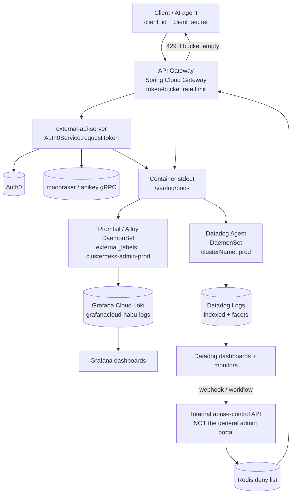
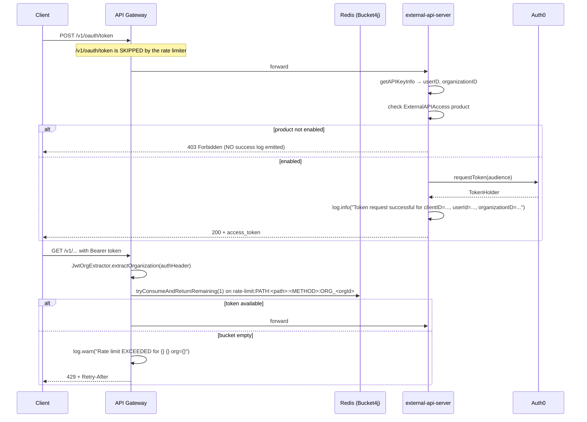

# SUMMARY — Loki / Grafana / Datadog: Token-request abuse visibility for external-api-server

**Date:** 2026-08-02
**Session type:** Observability investigation + dashboard design
**Primary artifacts in this folder:**
- [`datadog-discussion.txt`](datadog-discussion.txt) — the full Datadog Bits AI transcript (widget queries, the Grafana-vs-Datadog volume discrepancy investigation, Promtail/Datadog Agent explanation)
- [`grafana-discussion.txt`](grafana-discussion.txt) — the Grafana Assistant transcript (LogQL for the "Token Request Rate Over Time" panel, cluster-label discovery)

> Read this file first. The two `.txt` files are raw transcripts kept verbatim as evidence; open them only for the exact query text or the exact numbers.

---

## 1. Problem statement

An AI tool (or any client holding a valid `client_id` / `client_secret`) can loop on the Auth0 client-credentials flow and hammer the external API. This has already produced rate-limiting errors in production. Two things are needed:

1. **Detection / visibility** — a Grafana and Datadog view that answers, within ~10 seconds, *"which organization is hitting us hard right now?"* clearly enough for leadership during an incident.
2. **Enforcement** — the ability to blacklist / quarantine that organization or client.

Grafana and Datadog are **observers, not enforcers**. They produce the evidence; the gateway / identity layer performs the block. That separation is the load-bearing idea of the whole session.

A secondary problem surfaced and was solved during the session: **Grafana and Datadog appeared to disagree by ~12×** on token-request volume, which would have destroyed trust in whichever dashboard leadership was shown.

---

## 2. First principles

**Why 429s still cost you.** A rejected request is not free. Where it is rejected determines the cost:

| Rejection point | Work still performed |
|---|---|
| Load balancer / edge | Minimal |
| API Gateway (this system) | TLS termination, JWT parse, org extraction, Redis round-trip, response write, access log |
| Application / DB | Full request cost |

So sustained 429 traffic still burns gateway CPU, network, log-ingestion volume and observability spend. "The rate limiter is holding" is not the same as "we are fine."

**Why `orgId` is the right dimension.** Most teams only have IP addresses. This system has a *business entity* — `organizationID` — carried in the JWT and already logged. That makes the top-offenders view actionable (you can call the customer) rather than merely forensic.

**Cardinality is the constraint on where `orgId` may live.**

| Field | Cardinality | Safe as |
|---|---|---|
| `service`, `env`, `cluster`, `namespace` | very low | Loki **label** / Datadog tag |
| `organizationID` | medium–high (thousands) | Loki **structured metadata / parsed field**, Datadog **facet** |
| `clientID` | high | parsed field / facet |
| `requestId` | ~unique per request | never a metric tag |

Loki builds one stream per unique label *combination*, so promoting `orgId` to an indexed label multiplies streams (`service × env × pod × orgId × clientId × route × status`). Datadog is different: an "index" is not created per org — one logical index holds the logs and `@organizationID` is a *facet* within it. The Datadog cost risk is not the facet, it is (a) indexed log volume × retention, and (b) turning logs into **custom metrics** tagged by `orgId × clientId × route × status × env`, where the tag combinations multiply into millions of series.

---

## 3. High-level architecture



**Key point about the two agents:** Loki and Datadog each keep their **own copy** of the same container logs. Two DaemonSets tail the same `/var/log/pods` files and ship to two backends. That means two retention policies, two costs, two sets of dashboards — sometimes intentional (all logs → Loki cheaply, selected security/429/error logs → Datadog), but it must be a decision, not an accident.

Note: **Promtail reached end of life on 2026-03-02**; Grafana directs new collection work to **Grafana Alloy**.

---

## 4. End-to-end runtime flow (token request)



---

## 5. What the existing dashboards actually query (verified)

### Datadog — "Cleanroom Auth Token Abuse Monitor" (dashboard `jez-iz4-jhd`, author tony.lam@liveramp.com)

| Widget | ID | Type | Query | Group by | Time |
|---|---|---|---|---|---|
| Total token requests (all orgs) | `1077440001378494` | Timeseries (bar) | `service:external-api-server "Token request successful for"` | none | dashboard (24h) |
| Auth Token Requests by Client ID | `469406820273072` | Toplist (stacked) | same | `@clientID` (top 30) + `@organizationID` (top 30) | dashboard (24h) |
| Orgs above threshold (table) - 1HOUR | `1178936414740306` | Query table | same | `@organizationID` (top 10) | **widget override: last 1h** |

All: aggregation `count`, indexes `*`, storage Hot.

Two findings about these widgets:
- **"Orgs above threshold" has no threshold.** No numeric threshold, no conditional formatting, nothing in the dashboard description. The title is aspirational; it is just a top-10 ranked table. Any real threshold logic lives in a monitor or in application code, not here.
- The 1-hour widget-level override (`time: {type:"live", unit:"hour", value:1}`) is why its max (~14) looked *smaller* than the 24h client-ID widget. Not a bug — a time-window mismatch. Comparable only if the override is removed or the dashboard picker is set to 1h.

### Grafana — "Token Requests by Organization" (`habu.grafana.net/d/alrhs5q`), panel 3

```logql
sum(rate({service_name="external-api-server", cluster=~"$cluster"} |= "Token request successful" [$__auto])) * 3600
```

Datasource `grafanacloud-habu-logs` (Loki), `$cluster` = `eks-admin-prod`, legend "Total requests/hr", **panel unit `reqpm`**.

---

## 6. Bug / root cause: the "12× discrepancy" was a Grafana panel defect

The investigation ran in this order, and the first two hypotheses were **disproved**:

| Hypothesis | Verdict |
|---|---|
| Search-string mismatch (`"Token request successful"` vs `..." for"`) | ❌ Disproved — both match the identical 62 logs in the same hour |
| Datadog ingesting fewer logs than Loki (agent/DaemonSet/exclusion-filter gap) | ❌ Disproved — Datadog actually ingests **more** total logs (3.36k/hr vs Loki's 1,847/hr) |
| Cluster naming mismatch (`cluster=eks-admin-prod` vs `kube_cluster_name:prod`) | ⚠️ Real, but cosmetic — same cluster, different agent configs |
| **Grafana panel arithmetic + unit label** | ✅ **Root cause** |

**Apples-to-apples numbers, once measured the same way:**

| Metric | Grafana/Loki (`eks-admin-prod`) | Datadog (`kube_cluster_name:prod`) |
|---|---|---|
| "Token request successful" avg/hr | 73 (range 32–299) | ~62 (range 1–252) |
| Total external-api-server logs/hr | 1,847 (range 650–4,534) | 3,360 |

**Why the panel said 780.** `$__auto` resolves to a short window (~2 min on a 24h panel). `rate()` over 2 minutes captures a micro-burst, and `* 3600` extrapolates that burst as if it had been sustained for a full hour. On top of that, the panel's unit is set to `reqpm` while the expression computes requests **per hour** — so a value that is already inflated is also mislabelled by 60×.

Worked example — 10 logs arrive in a 2-minute burst, then nothing for 58 minutes:
- `rate([2m]) * 3600` = (10/120) × 3600 = **300**
- `count_over_time([1h])` = **10** ← the truth

**Corrected queries:**

```logql
# Option 1 — real count per 1h bucket (panel: Time series, Min interval 1h, Unit short)
sum(count_over_time({service_name="external-api-server", cluster=~"eks-admin-prod"} |= "Token request successful" [1h]))

# Option 2 — 24h average per hour (instant query) → ~73
sum(count_over_time({service_name="external-api-server", cluster=~"eks-admin-prod"} |= "Token request successful" [24h])) / 24

# Total log volume, for the ingestion-parity check
sum(count_over_time({service_name="external-api-server", cluster=~"eks-admin-prod"}[1h]))
```

**Conclusion: there is no log-ingestion gap.** Both platforms see the same token-request volume. The Datadog dashboard was correct all along; the Grafana panel needs its expression and unit fixed before it is shown to anyone.

**Traffic shape observed (24h to 2026-08-02):** bursty, coefficient of variation 0.53, 8 confirmed level shifts clustered 16:30–21:45 IST on Aug 1; token-request peak 299/hr at 20:15 IST Aug 1; token requests are ~1.8% of total external-api-server log lines. This is retry-storm-shaped, not steady traffic — which is exactly the pattern a naive `rate()` panel exaggerates.

---

## 7. Repository evidence

### Where the log line comes from — `external-api-server`

`src/main/java/com/habu/api/external/service/auth0/Auth0Service.java`

| Line | Code | Significance |
|---|---|---|
| 44 | `requestToken(String clientId, String clientSecret, String audience)` | entry point for the client-credentials flow |
| 50–51 | `userID`, `organizationID` from `getAPIKeyInfo` gRPC | where `organizationID` is resolved |
| 63–65 | `throw new ForbiddenException("External API Access is not enabled")` | **early return — no success log** |
| 73 | `tokenRequest.execute()` | actual Auth0 call |
| 75 | `log.info("Token request successful for clientID={}, userId={}, organizationID={}", ...)` | **the single line every dashboard in this session keys off** |

⚠️ **Coverage gap (important, and not raised in the transcripts):** line 75 fires **only on success**, after the Auth0 round-trip. A client flooding with a bad secret, or an org without the `ExternalAPIAccess` product, produces **zero** dashboard signal while still consuming gRPC calls to moonraker and Auth0 round-trips. Every current abuse dashboard is blind to failed-auth floods.

The `clientID=`/`organizationID=` key-value shape of line 75 is what lets Datadog auto-parse `@clientID` / `@organizationID` as facets. In Loki the same line needs `| logfmt` or a regex to aggregate by org — it is not a stream label.

Also in `external-api-server`: `organizationID` is threaded widely (`InternalJwtTokenFilter.java`, `CleanRoomUserBuilder.java`, `Constants.java`, all v1 controllers), but a repo-wide search finds **no rate-limiting and no 429 handling anywhere in this service**. Throttling is entirely upstream.

### Where the throttling lives — `aditya-external-api-api-gateway`

> Scope note: this is the local Spring Cloud Gateway study project (`com.aditya.gateway`, `/Users/adbhar/Documents/project-sprint-understanding-1/aditya-external-api-api-gateway`, no git remote), not the LiveRamp production gateway. The mechanism is representative; treat the production limits as unverified.

| File | Line | Detail |
|---|---|---|
| `filter/RateLimitFilter.java` | 39 | `GlobalFilter, Ordered` — applies to every route |
| | 62 | `filter(ServerWebExchange, GatewayFilterChain)` |
| | 72, 109–112 | `shouldSkipRateLimiting` — **`/actuator` and `/v1/oauth/token` are exempt** |
| | 78 | `jwtOrgExtractor.extractOrganization(authHeader)` |
| | 81–89 | builds `RateLimitConfig` with `strategy=PATH`, path, method, orgId |
| | 92 | `rateLimiter.isAllowed(config)` |
| | 95, 117–124 | emits `X-RateLimit-Limit`, `X-RateLimit-Remaining`, `Retry-After` |
| | 101 | `log.warn("Rate limit EXCEEDED for {} {} org={}", method, path, orgId)` |
| | 129–142 | `handleRateLimitExceeded` → `429 TOO_MANY_REQUESTS` + JSON body |
| | 146–147 | `getOrder() = -1` — runs before routing |
| `service/TokenBucketRateLimiter.java` | 99 | `isAllowed(RateLimitConfig)` |
| | 106 | `bucket.tryConsumeAndReturnRemaining(...)` (Bucket4j) |
| | 119 | `log.warn("Rate limit EXCEEDED for key={}, wait={}s", ...)` |
| | 129–136 | **fail-open** — if Redis errors, the request is allowed |
| | 142–166 | Redis-backed `ProxyManager` bucket, in-memory fallback if Redis is down |
| `model/RateLimitConfig.java` | 66–82 | `toRedisKey()` → `rate-limit:PATH:<PATH>:<METHOD>:ORG_<orgId>` (or `:ORG_ALL`) |
| `model/RateLimitStrategy.java` | 12–36 | `PATH` / `QUOTA` / `IP` / `HEADER` — only `PATH` is wired up |
| `service/JwtOrgExtractor.java` | 41–88 | decodes JWT payload, reads claim `https://aditya-api.com/org`, **base64-decodes the value** |
| `src/main/resources/application.yml` | 63–97 | defaults `replenish-rate: 10/s`, `burst-capacity: 20`; per-path overrides; per-org quotas (`org-001`, `org-002`) |
| | 52–56 | `oauth-service` route explicitly carries no rate limiter |

### Three structural gaps this evidence exposes

1. **The token endpoint is not rate-limited.** `RateLimitFilter.java:111` skips `/v1/oauth/token` with the comment *"Token endpoint has its own limits"* — and `application.yml:52–56` shows the oauth route has no limiter attached. The exact flood vector described in the problem statement (loop the client-credentials grant) passes through unthrottled.
2. **429s are invisible to the org dashboards.** The rejection log at `RateLimitFilter.java:101` is a plain string with `org=` — it is not JSON, has no `organizationID=` key matching the Datadog facet, and carries no status code. So "top orgs by 429" cannot be built from it today. The dashboards can show *who requests tokens*, never *who is being throttled*.
3. **Fail-open on Redis failure** (`TokenBucketRateLimiter.java:129–136`) means a Redis outage silently disables all throttling. There is no metric or alert on that path.

---

## 8. Design options considered

**A. Where to emit the abuse telemetry**
1. Per-service logging — inconsistent formats, must be re-done per new API. ❌
2. **API Gateway emits one standardised access log** — it already knows orgId, clientId, route, method, status and rate-limit outcome. ✅ chosen
3. Log-derived custom metrics tagged by org — powerful, but the tag cross-product (orgs × clients × routes × statuses × envs) explodes into millions of series and cost. ⚠️ selectively only

**B. Grafana vs Datadog — why keep both**

| Need | Better fit |
|---|---|
| Custom executive dashboard, Kubernetes/Prometheus views | Grafana |
| Low-cost bulk log retention and exploration | Loki / Grafana |
| Logs + metrics + traces correlation, fast investigation | Datadog |
| Monitor lifecycle, alert routing, incident creation | Datadog |
| Webhook / workflow-driven remediation | Datadog |
| Vendor independence, self-hosting | Grafana / Loki |

They overlap heavily; the difference is the surrounding platform, not the charting. Different audiences (leadership + platform vs on-call + SRE + security), different historical adoption, and a cost strategy of *all logs → Loki, selected high-value logs → Datadog* all independently justify keeping both.

**C. When to blacklist** — an escalation ladder, not a trigger:

```
normal → approaching quota → 429 rate limiting → sustained violation
      → alert + investigation → temporary block → permanent disable (only after confirmation)
```

Frequent 429s alone are **not** grounds for a blacklist — a 429 means the limiter is working. The decisive behavioural signal is: **does the client keep hammering after repeated 429s and `Retry-After`?** A well-behaved client backs off. A candidate compound condition:

```
rate > 10 × configured limit
AND 429 ratio > 90%
AND sustained ≥ 10 minutes
AND traffic continues despite repeated 429
AND measurable platform impact
```

Prefer blocking the **`clientId` before the whole `orgId`** — one org may run several applications and only one may be misconfigured or compromised.

**D. Automation maturity** — Stage 1 alert-only (Slack/PagerDuty → human blocks) → Stage 2 one-click approval workflow → Stage 3 automatic short quarantine with hard expiry. Do not start at Stage 3.

---

## 9. Trade-offs

| Decision | Gain | Cost |
|---|---|---|
| `orgId` as Loki **label** | fast label-filtered queries | stream/cardinality explosion; against Grafana guidance for customer IDs |
| `orgId` as parsed field / structured metadata | safe cardinality | slower aggregation, needs `logfmt`/regex in LogQL |
| Log-derived Datadog metric per org | cheap dashboards, long retention | custom-metric cost scales with tag cross-product |
| Gateway-level access log | one consistent stream for all services | gateway becomes a single point of telemetry failure |
| Datadog webhook → auto-block | fast mitigation, no human latency | observability tool gains destructive power; false positive blocks a paying customer |
| Fail-open rate limiter | availability during Redis outage | throttling silently disappears exactly when load is highest |

---

## 10. Final recommendation

1. **Fix the Grafana panel first.** Replace `rate(...[$__auto]) * 3600` with `count_over_time(...[1h])`, set Min interval `1h`, change the unit from `reqpm` to `short`. Until this is done the two platforms will keep appearing to disagree, and a leadership dashboard that contradicts Datadog is worse than no dashboard.
2. **Emit one structured access log at the gateway** for every request: `organizationID`, `clientID`, `route`, `method`, `status`, `latencyMs`, `rateLimited`, `reason`, `limit`, `remaining`, `requestId`. Specifically upgrade `RateLimitFilter.java:101` to the same `key=value` shape as `Auth0Service.java:75` so `@organizationID` works as a facet on 429s.
3. **Also log token-request *failures*** (the `ForbiddenException` path at `Auth0Service.java:63` and Auth0 rejections), so failed-auth floods stop being invisible.
4. **Rate-limit the token endpoint**, or document explicitly where its "own limits" are enforced. This is the highest-value gap found.
5. **Grafana owns the executive view** — top orgs by request rate, top orgs by 429, 429 %, current-vs-normal, per-org endpoint breakdown, platform impact — with an `orgId` template variable so clicking one org filters every panel.
6. **Datadog owns the operational monitors** — sustained 429 by org, single-org traffic concentration (>40% of all traffic), per-org anomaly, no-backoff behaviour, latency correlated with one org's volume — plus alert routing.
7. **Keep enforcement outside both tools.** Datadog decides *"this needs action"*; a narrow internal endpoint (`POST /internal/api-abuse/quarantines`, **not** a general `/admin/organizations/{id}/disable`) decides *"is this authorised, for how long, client or whole org"*; the gateway enforces. That endpoint must enforce max duration (30–60 min), automatic expiry, idempotency, replay protection, a monitor allowlist, a dedicated service identity, full audit trail and manual override. Also throttle the workflow trigger so it does not re-fire the block repeatedly.
8. **Map `orgId` → customer name** in the dashboard. Leadership remembers "Nike", not `xx123`.
9. **Show growth, not just totals.** `current vs 7-day-normal` per org identifies anomalies that absolute counts hide.

---

## 11. Open questions

- Where are the token endpoint's "own limits" actually enforced? (`RateLimitFilter.java:111` asserts they exist; nothing in the repo implements them.)
- What are the **production** gateway limits? The values here come from the local study project, not LiveRamp's gateway.
- Should the cluster naming be aligned — Datadog Agent `clusterName: eks-admin-prod`, or Promtail/Alloy `cluster: prod`? Either creates a historical split in dashboards and monitors at the change boundary.
- Is the Promtail → **Alloy** migration planned? Promtail is EOL as of 2026-03-02.
- What are the configured retention periods? Datadog retention is per-index (Logs → Configuration → Indexes → Retention); Loki retention is the Compactor's `limits_config.retention_period`. Neither was read during the session — both are deployment-specific and must be inspected, not assumed.
- Why does Datadog ingest ~1.8× more total lines than Loki (3.36k vs 1,847/hr)? Likely extra stdout/stderr/container-lifecycle lines that the Promtail pipeline filters, but unconfirmed.
- Who owns the "Cleanroom Auth Token Abuse Monitor" dashboard going forward (currently tony.lam@liveramp.com)?

---

## 12. Next steps

1. Fix the Grafana panel expression + unit (`d/alrhs5q`, panel 3). Smallest change, largest credibility gain.
2. Rename "Orgs above threshold (table) - 1HOUR" to what it is, or attach a real threshold via conditional formatting + a matching monitor.
3. Add structured `key=value` fields to the gateway 429 log; verify `@organizationID` becomes a usable Datadog facet on 429s.
4. Add failure-path logging in `Auth0Service.requestToken`.
5. Build the Grafana "API Tenant Health & Abuse" dashboard with an `orgId` variable.
6. Create the Datadog monitors (sustained 429 by org, traffic concentration, per-org anomaly).
7. Verify the token endpoint's throttling story and close the gap.
8. Design `POST /internal/api-abuse/quarantines` with the safety properties in §10.7 — and ship Stage 1 (alert-only) first.
9. Read the actual Loki and Datadog retention configuration and record it here.

---

## 13. Related knowledge in this repository

- [`2026-07-31/older_discussion_observability/2026-07-27_loki-datadog-hank-event-comparision.txt`](../../2026-07-31/older_discussion_observability/2026-07-27_loki-datadog-hank-event-comparision.txt) — earlier Loki/Datadog/Hank comparison
- [`2026-07-31/2026-07-30-aditya-architect-followup/SUMMARY.md`](../../2026-07-31/2026-07-30-aditya-architect-followup/SUMMARY.md) — Hank audit-log / orinix event production design
