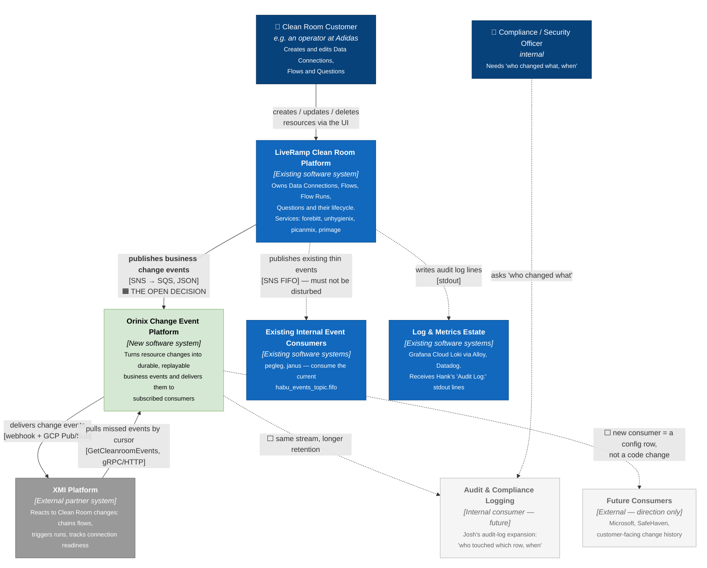

# 01 — C4 Level 1: System Context

**Question this answers:** *Who uses this, what systems does it touch, and why does
it exist at all?*

At this level Orinix is a single box. We care only about who talks to it and what
crosses the boundary.

---

## 1. The context diagram

---

## 2. Actors and systems

| Element | Type | Responsibility | Status |
|---|---|---|---|
| **Clean Room Customer** | Person | Creates/edits Data Connections, Flows, Questions through the Clean Room UI | 🟩 |
| **Compliance / Security Officer** | Person | Consumes audit history; Jon's read-access auditing ask sits here | ⬜ |
| **LiveRamp Clean Room Platform** | Existing system | Owns the business resources and their lifecycle. Services named in source: `forebitt` (data connections/import jobs), `unhygienix`, `picanmix`, `primage` (credentials), all sharing the `hank` library | 🟩 |
| **Orinix Change Event Platform** | **New system** | Ingest → store → replay → deliver. The subject of this package | 🟦 receiving side agreed & scaffolded |
| **XMI Platform** | External partner | The M1 consumer. Four confirmed use cases (§3) | 🟩 exists, integration pending |
| **Audit & Compliance Logging** | Future internal consumer | Josh's expansion — same stream, different retention and detail needs | ⬜ |
| **Future Consumers** | Future external | Microsoft, SafeHaven named in the design doc; customer-facing history UI | ⬜ |
| **Existing Internal Event Consumers** | Existing systems | `pegleg`, `janus` consume `habu_events_topic.fifo` today. **Constraint C1: do not disturb them** | 🟩 |
| **Log & Metrics Estate** | Existing systems | Grafana Cloud Loki (via the Alloy agent) and Datadog receive Hank's `Audit Log:` stdout lines. Explicitly **cannot** back the read API | 🟩 |

---

## 3. Why the system exists — the driving requirements

XMI has **four confirmed M1 needs** (`01-problem.md §2`):

1. Tell us when a **Data Connection's stage** changes.
2. Tell us when a **Flow Run's state** changes — STARTED / COMPLETED / FAILED.
3. When **Flow 1 completes, trigger Flow 2** — flow chaining.
4. During cleanroom onboarding, **when all datasets are assigned, trigger a run**.

The wider brief adds **Question changes** and **Flow changes**, and a second internal
customer: Josh's audit-log expansion needs *"who changed what, when"* across the
platform for compliance.

**The critical sizing observation** (`03-design-options.md §7`): all four M1 use cases
act on the **new state**, and **none asks what the value was before**. That single
finding is what makes a smaller, faster-to-ship payload defensible for the events XMI
is blocked on.

---

## 4. What crosses the system boundary

| From → To | Data | Protocol | Status |
|---|---|---|---|
| Clean Room Platform → Orinix | Business change events (resource identity, action, state, actor, timestamp) | SNS → SQS, JSON | 🟧 **the open decision** |
| Orinix → XMI | Change events | Signed webhook (HTTPS, egress to partner) | 🟦 |
| Orinix → XMI | Change events | GCP Pub/Sub (cross-cloud) | 🟦 |
| XMI → Orinix | Cursor-based catch-up | `GetCleanroomEvents` | 🟦 |
| Clean Room Platform → pegleg/janus | Existing thin events | SNS FIFO | 🟩 **unchanged — hard constraint** |
| Clean Room Platform → Loki/Datadog | `Audit Log:` lines | stdout → Alloy | 🟩 unchanged |

---

## 5. The six constraints shaping everything below

From `01-problem.md §4`. These are the reason the architecture looks the way it does.

| # | Constraint | Consequence |
|---|---|---|
| **C1** | Do not disturb `pegleg` or `janus` | `pegleg.tf:17`'s subscription filter **already matches `"dataImportJob"`**, so publishing to the existing topic would land our messages in pegleg's queue → **forces a new topic** |
| **C2** | Delivery to XMI must be at-least-once | Needs an idempotency key and stored history → **forces `object_events`** |
| **C3** | The audit tier needs long retention | `object_events` has a hard **90-day delete** in its DDL → **forces a second tier** |
| **C4** | We cannot leak secrets | `primage/models/models.go:219-226` — the `Credential` table has a `Value` column and the same audit embed → **any "log all field values" approach writes secrets somewhere** |
| **C5** | `hank` is shared | Used by unhygienix, forebitt, primage, picanmix, pegleg → **any Hank change lands in every service on the next version bump** |
| **C6** | Three live entry points, not one | All three are registered HTTP routes → **whatever we do, we do it in more than one place** |

---

## 6. Why a separate system, rather than producers calling XMI directly

Asked and answered in `06-meeting-preparation.md §2`. Publishing straight from each
producer to XMI's Pub/Sub would mean:

- **Google Cloud credentials in 10+ repositories**
- **A code change in every producer** to add a second consumer
- **No replay, no history** — nothing to serve a catch-up API from

With Orinix in the middle, adding Microsoft or SafeHaven is **a configuration row,
not a code change**. That is the strongest architectural argument for the middle
service, and it is independent of the producer-side decision.

---

**Next:** [02-containers.md](02-containers.md) — open the two big boxes.
