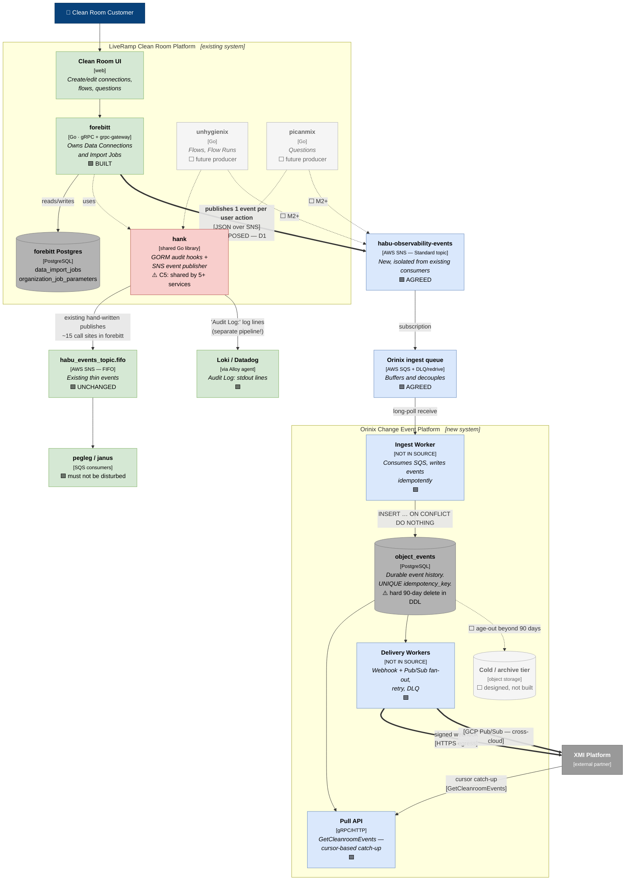
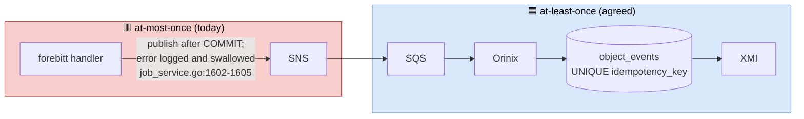
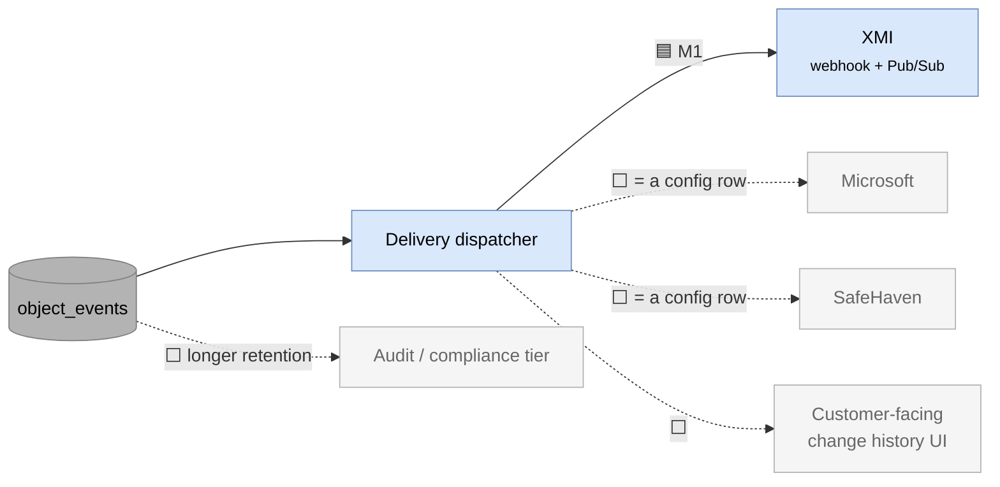

# 02 — C4 Level 2: Containers

**Question this answers:** *What are the separately deployable or runnable pieces,
what technology is each, and what protocol connects them?*

We now open the two boxes from L1: the **Clean Room Platform** (the producer side)
and **Orinix** (the receiving side).

---

## 1. The container diagram

**Read the thick arrows.** They are the change-event path. The one from `forebitt` to
the new SNS topic is the only 🟧 element on it — everything downstream is agreed.

---

## 2. Container inventory

### Producer side

| Container | Technology | Responsibility | Status |
|---|---|---|---|
| **Clean Room UI** | web | Where the user action originates | 🟩 |
| **forebitt** | Go, gRPC + grpc-gateway | Owns Data Connections / Import Jobs. **The M1 producer** | 🟩 built; 🟧 emit code proposed |
| **unhygienix** | Go | Flows and Flow Runs. Needed for XMI use cases 2–4 | ⬜ M2+ |
| **picanmix** | Go | Questions | ⬜ M2+ |
| **forebitt Postgres** | PostgreSQL | `data_import_jobs` + `organization_job_parameters` | 🟩 |
| **hank** | shared Go library | **Two independent pipelines**: GORM audit hooks → stdout, and an SNS publisher called by hand. C5: shared by 5+ services | 🟩 |

> **The most-misunderstood box on this diagram is `hank`.** Its audit hooks and its
> event publisher are **completely separate and never call each other**
> (`02-current-design.md §8`). The hooks only ever call
> `hlog.LogEntryCtx(ctx).Infof("Audit Log: %s", …)` — no DB write, no publish. The
> publisher is `hank/events/service.go:30`, invoked by hand from ~15 sites in
> forebitt alone. So *"Hank already gives us events on every change"* is **false**:
> it gives **log lines** on every change, and **SNS messages** only where a human
> wrote a publish call.

### Transport

| Container | Technology | Responsibility | Status |
|---|---|---|---|
| **habu-observability-events** | AWS SNS, **Standard** | Carries the new business events | 🟦 |
| **Orinix ingest queue** | AWS SQS + DLQ/redrive | Buffers, decouples, absorbs Orinix downtime | 🟦 |
| **habu_events_topic.fifo** | AWS SNS, FIFO | Existing thin events to pegleg/janus | 🟩 **unchanged** |

**Why a new topic and not the existing one** (`04-tradeoffs.md §5`,
`06-meeting-preparation.md §2`):

- `orinjade/aws/modules/habu-events/pegleg.tf:17` — pegleg's subscription filter
  **already matches `"dataImportJob"`**. Publishing with the natural attribute value
  would land our messages in pegleg's queue. Avoiding that means editing pegleg's
  filter policy — the thing we promised not to touch (C1).
- The existing topic is **FIFO**, capped at 300 msg/s, **and its ordering guarantee is
  weaker than people assume**: `hank/aws/sns/service.go:48` sets
  `MessageGroupId: aws.String(reqId)`, and FIFO orders only *within* a group. **Two
  updates to the same object from different requests are already unordered.** That
  removes the main argument for staying on FIFO and supports a **Standard** topic.

### Orinix

| Container | Technology | Responsibility | Status |
|---|---|---|---|
| **Ingest Worker** | *[NOT IN SOURCE]* | SQS listener → `INSERT … ON CONFLICT DO NOTHING` on the idempotency key | 🟦 |
| **`object_events`** | PostgreSQL | The durable, replayable history. **Hard 90-day delete in its DDL** | 🟦 |
| **Pull API** | gRPC/HTTP | `GetCleanroomEvents`, cursor-based | 🟦 |
| **Delivery Workers** | *[NOT IN SOURCE]* | Webhook + GCP Pub/Sub fan-out, retry, DLQ | 🟦 |
| **Cold/archive tier** | object storage | Long retention for the compliance tier (C3) | ⬜ designed, not built |

> **[NOT IN SOURCE]:** the architect-followup documents specify Orinix's *behaviour*
> and its *database contract*, but not its implementation language, framework or
> internal module layout. Those are settled in `orinix-why-and-how/` in the sibling
> archive folder. I have deliberately not guessed them here.

---

## 3. Why the queue exists between the topic and Orinix

Three reasons, all load-bearing:

1. **Decoupling from producer availability** — forebitt publishes and returns; it
   never waits on Orinix.
2. **Absorbing Orinix downtime** — messages accumulate in SQS rather than being lost.
3. **DLQ and redrive** — a poison message is isolated instead of blocking the stream.

Note what the queue **cannot** fix: if the *publish* fails inside forebitt, nothing
downstream ever knows. See §4.

---

## 4. The reliability boundary — stated plainly

**The producer edge is the weak link, and the source documents say so bluntly**
(`05-architect-review.md §1 A5`, `§7`):

- **Can happen:** the row exists, no event was sent. Recoverable by backfilling from
  the source table.
- **Cannot happen:** an event for a row that does not exist — the publish is
  **strictly after `COMMIT`**, so we can fail to announce something that happened,
  but never announce something that did not.
- **Today we would not know how many we lost.** Minimum fix: a failure counter and an
  alert. Proper fix: a **transactional outbox**, which sits at exactly the line the
  publish is on today — so choosing best-effort now does not make it harder later.

This is identified in the source as *"the weakest part of the proposal"* and the gap a
reviewer should push hardest on.

---

## 5. Multi-consumer fan-out — the architectural payoff

Adding a consumer must remain **a configuration row, not a code change in 10+
producer repositories**. This is the property that justifies Orinix existing at all,
and it holds regardless of how D1 is decided.

---

**Next:** [03-components-orinix.md](03-components-orinix.md) — inside Orinix.
