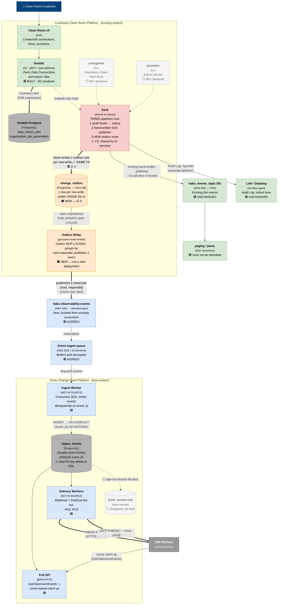
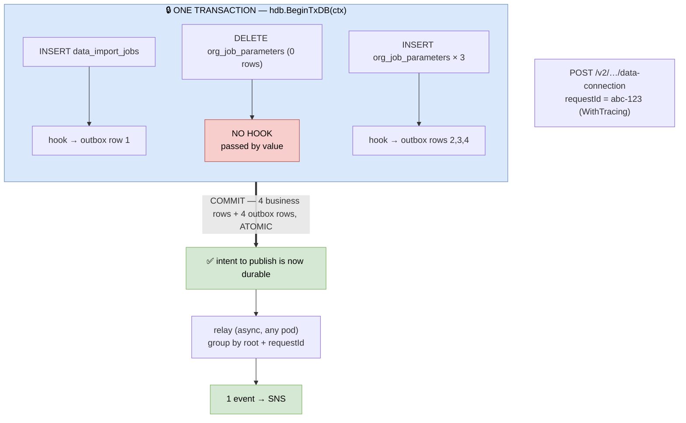
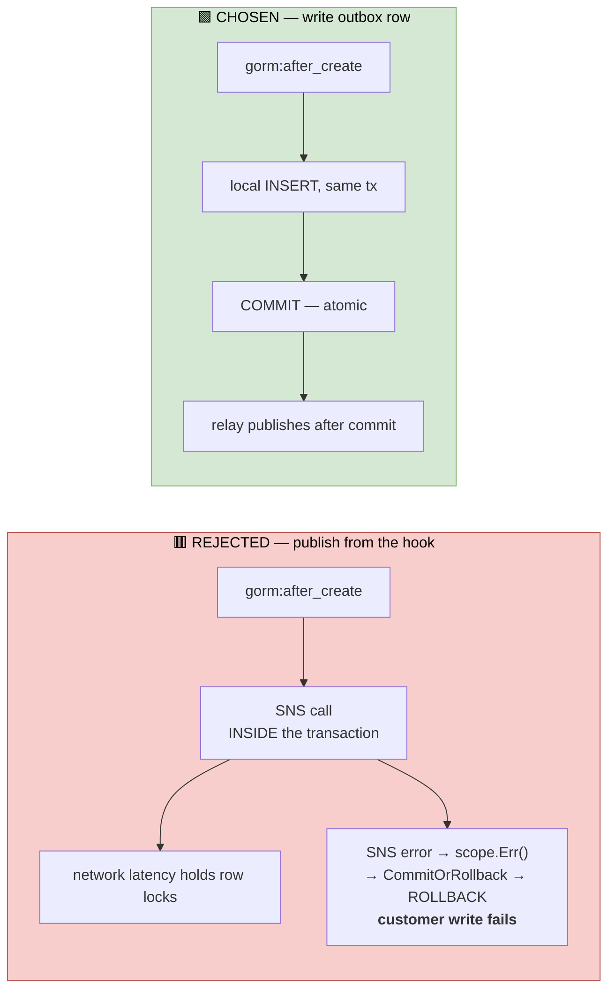
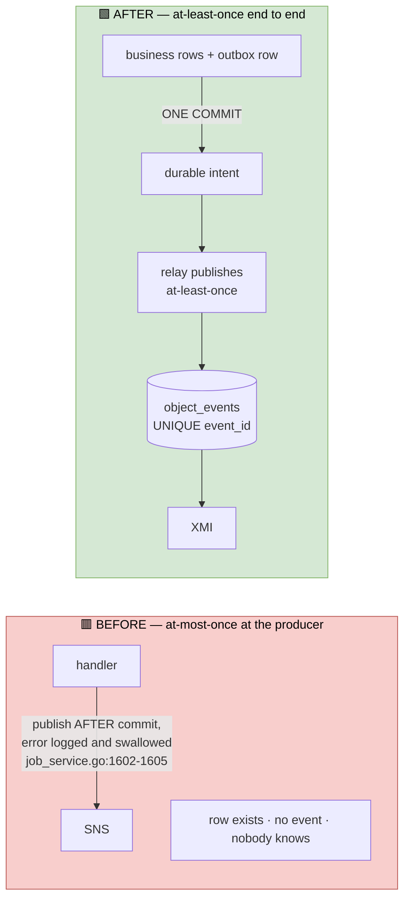
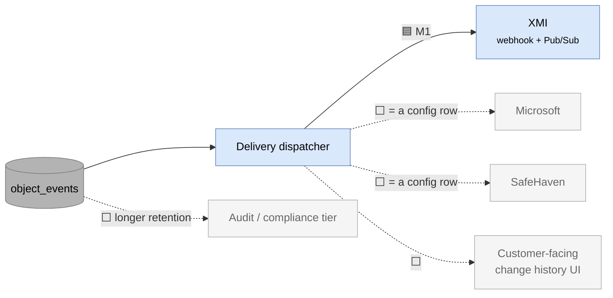

# 02 (UPDATED) — C4 Level 2: Containers

> **This supersedes [`02-containers.md`](02-containers.md).**
> That version was written on 2026-07-31, before the architect decision, and shows
> the producer edge as the open question with a proposed `services/observability`
> package in forebitt. **Decision D1 has since been made** (2026-07-30 meeting, Anil
> and Josh): events are produced from **Hank's model-layer GORM hooks**, not from
> per-handler service-layer code.
>
> The original is kept for the decision trail. **Use this file.**
>
> **Updated:** 2026-08-03 · **Changes:** §8 lists every diff from the original.

**Question this answers:** *What are the separately deployable or runnable pieces,
what technology is each, and what protocol connects them?*

---

## 1. The container diagram



**Read the thick arrows.** They are the change-event path. The two 🟧 elements —
`change_outbox` and the `Outbox Relay` — are what this review is being asked to
approve (decision **D-A**). The *approach* (Hank, model layer) is already decided;
only the delivery mechanism from hook to topic is open.

---

## 2. What changed conceptually since the original

The original diagram had **one arrow** from `forebitt` straight to SNS, labelled
"?? THE DECISION ??". That arrow is now **three hops**, and the reason is not
decoration — each hop removes a specific failure:

| Hop | Removes |
|---|---|
| hook → `change_outbox` (same tx) | **event loss.** Intent-to-publish commits atomically with the data, so a pod dying after `COMMIT` loses nothing |
| relay → SNS (after commit) | **network I/O inside a transaction**, and the risk of an SNS error rolling back a customer write |
| relay groups by `(root, requestId)` | **fan-out.** 4 row-level records become 1 business event, deterministically |

---

## 3. The transaction boundary — the whole design in one picture



**Why completeness is not a timer.** All four outbox rows become visible at the same
`COMMIT`. If the relay sees one, it sees all of them. The transaction boundary *is*
the completeness signal — which is what dissolved the original objection to hooks
(*"an assembler cannot know when all the records have arrived"*).

> ⚠️ **Correction to the original document.** A create fires **4 hooks, not 5**.
> `forebitt/db/job_parameters.go:81` passes the model **by value**
> (`Delete(models.OrganizationJobParameter{})`), and `hdb.Audit`'s hooks have
> **pointer receivers**. GORM only takes `.Addr()` when the value is addressable
> (`scope.go:434-436`), so the hook is never found. Verified against GORM's exact
> reflection logic: `Delete(Model{})` → not found; `Delete(&Model{})` → found.
> The phantom-DELETE record described in the original **does not exist**.
>
> | Route | SQL writes | Hook firings | Events |
> |---|---|---|---|
> | V2 (Door A) create | 5 | **4** | 1 |
> | V1 (Door B) create | 10 | **8** | 1 |

---

## 4. Container inventory

### Producer side

| Container | Technology | Responsibility | Status |
|---|---|---|---|
| **Clean Room UI** | web | Where the user action originates | 🟩 |
| **forebitt** | Go, gRPC + grpc-gateway | Owns Data Connections / Import Jobs. **The M1 producer** | 🟩 built |
| **unhygienix** | Go | **Questions, Flows and Flow Runs.** Needed for XMI use cases 2–4 | ⬜ M2+ |
| **picanmix** | Go | **Export service** | ⬜ M2+ |
| **forebitt Postgres** | PostgreSQL | `data_import_jobs` + `organization_job_parameters` | 🟩 |
| **`change_outbox`** | PostgreSQL, **same database** | One row per row-write, written **inside the business transaction**. Pruned after publish | 🟧 **NEW — D-A** |
| **Outbox Relay** | goroutine **inside forebitt** | Claims rows `FOR UPDATE SKIP LOCKED`, groups by `(root, requestId)`, publishes, marks published | 🟧 **NEW — D-A** |
| **hank** | shared Go library | Audit hooks → stdout · hand-written SNS publisher · **NEW outbox writer**. C5: shared by unhygienix, forebitt, primage, picanmix, pegleg | 🟩 + 🟧 |

> **The relay is not a new service.** It is a goroutine started at forebitt boot. Two
> consequences worth stating in review: no new deployment or on-call surface, and
> multiple forebitt pods are safe because rows are claimed with
> `FOR UPDATE SKIP LOCKED`. Hank ships it, so unhygienix and picanmix inherit it.

> **Why `change_outbox` must live in forebitt's own database.** The outbox write has
> to be in the *same transaction* as the business write, and transactions do not span
> databases. A shared outbox database would silently lose the guarantee. The table is
> therefore per-service — but the *work* is not, because Hank already owns the
> migration seam (`hank/db/service.go:16` `WithAutoMigrate(Modeler)`, used by forebitt
> at `server.go:199`). A service opts in with one line.

> **`hank` is still the most-misunderstood box.** Its audit hooks and its event
> publisher are **separate and never call each other**. The hooks only call
> `hlog.LogEntryCtx(ctx).Infof("Audit Log: %s", …)`; the publisher
> (`hank/events/service.go:30`) is invoked by hand from ~15 sites in forebitt. The
> new outbox writer is a **third** pipeline, and it deliberately does **not** publish
> — see §5.

### Transport

| Container | Technology | Responsibility | Status |
|---|---|---|---|
| **habu-observability-events** | AWS SNS, **Standard** | Carries the new business events | 🟦 |
| **Orinix ingest queue** | AWS SQS + DLQ/redrive | Buffers, decouples, absorbs Orinix downtime | 🟦 |
| **habu_events_topic.fifo** | AWS SNS, FIFO | Existing thin events to pegleg/janus | 🟩 **unchanged** |

**Why a new topic and not the existing one** — unchanged from the original:

- `orinjade/aws/modules/habu-events/pegleg.tf:17` — pegleg's subscription filter
  **already matches `"dataImportJob"`**, so our messages would land in pegleg's queue.
  Avoiding that means editing pegleg's filter policy — the thing we promised not to
  touch (C1).
- The existing topic is **FIFO**, capped at 300 msg/s, **and its ordering guarantee is
  weaker than assumed**: `hank/aws/sns/service.go:48` sets
  `MessageGroupId: aws.String(reqId)`, and FIFO orders only *within* a group. Two
  updates to the same object from different requests are **already unordered**.

### Orinix

| Container | Technology | Responsibility | Status |
|---|---|---|---|
| **Ingest Worker** | *[NOT IN SOURCE]* | SQS listener → `INSERT … ON CONFLICT (event_id) DO NOTHING` | 🟦 |
| **`object_events`** | PostgreSQL | Durable, replayable history. **Hard 90-day delete** | 🟦 |
| **Pull API** | gRPC/HTTP | `GetCleanroomEvents`, cursor-based | 🟦 |
| **Delivery Workers** | *[NOT IN SOURCE]* | Webhook + GCP Pub/Sub fan-out, retry, DLQ | 🟦 |
| **Cold/archive tier** | object storage | Long retention for the compliance tier (C3) | ⬜ |

> **`change_outbox` and `object_events` are different tables and must not be
> conflated:**
>
> | | `forebitt.change_outbox` | `orinix.object_events` |
> |---|---|---|
> | Side | producer | consumer |
> | Database | forebitt's | orinix's |
> | Written | **inside** the business tx | on SQS consume |
> | Purpose | never lose an event | history, replay, fan-out |
> | Lifetime | pruned days after publish | 90 days |
> | Grain | one row per **row write** | one row per **event** |
> | Read by | the relay only | XMI, via `GetCleanroomEvents` |

---

## 5. Why the hook writes a row instead of publishing

This is the single most important implementation constraint, and it is **verified**,
not stylistic.



**Evidence** (gorm v1.9.11):

- `callback_create.go:10-18` registers `gorm:after_create` **immediately before**
  `gorm:commit_or_rollback_transaction` — so the hook runs **inside** the transaction.
- `callback_create.go:166` → `scope.CallMethod("AfterCreate")`;
  `scope.go:450-451` pushes a returned error onto the scope;
  `scope.go:414-426` `CommitOrRollback` **rolls back** when the scope has an error.

So publishing from the hook would give the notification system the power to fail
customer writes during an SNS outage. A local INSERT in the same transaction has
neither problem.

---

## 5A. The relay — where it lives, who starts it, how it is automated

Nothing external calls it. It is a `time.Ticker` in a goroutine, started at boot and
running until the pod shuts down — the same lifecycle as the HTTP server. No cron, no
scheduler, no new deployment.

**forebitt side — two lines**, beside the existing DB setup (`server.go:~201`):

```go
database, err := hdb.New(opts.DB, dbOpts...)                                // exists today
relay, err := hdb.StartChangeEventRelay(ctx, database, opts.ChangeEvents)   // NEW
defer relay.Stop()                                                          // graceful shutdown
```

**hank side — `hank/db/relay.go` (new):**

```go
func StartChangeEventRelay(ctx context.Context, db *gorm.DB, cfg RelayConfig) (*Relay, error) {
    if !cfg.Enabled { return &Relay{}, nil }        // opt-in: no-op when disabled
    r := &Relay{db: db, cfg: cfg}
    r.ctx, r.cancel = context.WithCancel(ctx)
    go r.run()                                      // <-- "who runs the every 5s"
    return r, nil
}

func (r *Relay) run() {
    ticker := time.NewTicker(r.cfg.Interval + jitter(r.cfg.Interval))  // jitter: pods don't sync
    defer ticker.Stop()
    for {
        select {
        case <-r.ctx.Done(): return                 // pod shutting down
        case <-ticker.C:     r.drain()
        }
    }
}

func (r *Relay) drain() error {
    tx := r.db.Begin()
    var rows []ChangeOutbox
    if err := tx.Where("published_at IS NULL").
        Order("occurred_at").Limit(r.cfg.Batch).
        Set("gorm:query_option", "FOR UPDATE SKIP LOCKED").   // other pods skip these
        Find(&rows).Error; err != nil { tx.Rollback(); return err }
    if len(rows) == 0 { tx.Rollback(); return nil }           // idle tick: cheap no-op

    for _, g := range groupBy(rows, rootType, rootID, requestID) {
        if err := r.publish(buildEvent(g)); err != nil {      // SNS
            tx.Rollback(); return err                          // retry on the next tick
        }
        tx.Model(&ChangeOutbox{}).Where("id IN (?)", idsOf(g)).
            Update("published_at", time.Now())
    }
    return tx.Commit().Error
}
```

**Is the polling a problem?** The query hits a **partial index** that only ever contains
unpublished rows:

```sql
CREATE INDEX idx_change_outbox_unpublished
    ON change_outbox (occurred_at) WHERE published_at IS NULL;
```

So its cost is proportional to **backlog, not table size** — an idle tick is a
sub-millisecond index scan returning zero rows. At 5s across 3 pods that is ~36 trivial
queries a minute.

Two honest caveats:

- **Latency floor.** Polling adds up to one interval of delay (~5s worst case). Fine
  for stage changes and flow chaining, but it should be a *stated* number.
- **Thundering herd.** Mitigated by jitter, above.

**The upgrade if latency ever matters: Postgres `LISTEN`/`NOTIFY`.** `NOTIFY` is
delivered **on COMMIT**, which is exactly the semantics we want, and wakes the relay in
milliseconds. But it is **not durable** — if no listener is connected at that instant it
is lost — so it can never be the only mechanism. The standard shape is **NOTIFY for
latency + a slow poll (30s) as the safety net**. Recommendation: ship polling for M1,
document NOTIFY as the tuning step.

---

## 5B. The hook — the exact change in hank

**`hank/db/audit.go`** — one line added to each of the three hooks; everything else
untouched:

```go
func (a *Audit) AfterCreate(scope *gorm.Scope) error {
    if err := recordChangeEvent(scope, ActionCreate); err != nil {   // NEW
        return err
    }
    // ---- existing audit-log code, unchanged ----
    tokenClaims, ctx, parsed := claims(scope)
    if !parsed { return nil }
    ...
}
```

**`hank/db/event.go`** (new) — where the root is resolved:

```go
type EventScoped interface {
    EventRoot() (objectType string, objectID string)
}

func recordChangeEvent(scope *gorm.Scope, action string) (err error) {
    cfg, ok := eventConfigFrom(scope)
    if !ok || !cfg.Enabled { return nil }               // opt-in

    defer func() {                                       // our bug never fails a write
        if rec := recover(); rec != nil { metrics.EmitPanics.Inc(); err = nil }
    }()

    // scope.Value is the model gorm is writing.
    es, ok := scope.Value.(EventScoped)
    if !ok { return nil }                                // model not opted in
    rootType, rootID := es.EventRoot()
    if rootID == "" {                                    // the job.go:185 empty-struct case
        metrics.SkippedNoRoot.Inc()
        log.Warnf("change event skipped: empty root for %s", scope.TableName())
        return nil
    }
    return writeOutbox(scope, buildEvent(scope, action, rootType, rootID))
}
```

**Declare `EventRoot()` with a VALUE receiver** so both `T` and `*T` satisfy the
interface, whichever form gorm happens to hold:

```go
func (j DataImportJob) EventRoot() (string, string)            { return "DATA_CONNECTION", j.ID }
func (p OrganizationJobParameter) EventRoot() (string, string) { return "DATA_CONNECTION", p.DataImportJobID }
```

The child's parent id is **already populated** when the hook fires —
`job_parameters.go:149` sets `inParamObj.DataImportJobID` *before* `:154` calls
`tx.Create`. Nothing is inferred or looked up.

---

## 5C. The three write paths for a parameter row — and what each produces

⚠️ **This is the part most likely to surprise a reviewer.** Verified across every write
site for `OrganizationJobParameter`:

| Business op | Call site | Form passed | Hook fires? | Usable record? |
|---|---|---|---|---|
| **CREATE** | `job_parameters.go:154` `tx.Create(inParamObj)` | pointer, **populated** | ✅ | ✅ root resolvable |
| **UPDATE** | `job_parameters.go:62` `Model(models.OrganizationJobParameter{}).Update(…)` | **by value** | ❌ | — |
| **DELETE** (clear-all) | `job_parameters.go:81` | **by value** | ❌ | — |
| **DELETE** (by id) | `job_parameters.go:182` `Delete(&…{})` | pointer, **empty** | ✅ | ❌ `ObjectID=""` → skipped |
| **DELETE** (cascade) | `job.go:207` | **by value** | ❌ | — |

**Only the CREATE path yields a usable parameter record.** Cause is the same in every
row: `hdb.Audit`'s hooks have **pointer receivers**, and GORM only takes `.Addr()` when
the value is addressable (`scope.go:434-436`).

Why this is nonetheless survivable for M1: settings are saved by **delete-all +
insert-all**, so a settings change always produces records *from the INSERTs*. What it
does confirm:

- **Deleting a data connection produces no usable record at all** until
  `forebitt/db/job.go:185` carries the id. Already a known blocker.
- **A settings change that removes the last parameter and adds none emits nothing**
  (gap G-1).

### The row-level records (internal — the outbox row / audit line)

**CREATE** — `job_parameters.go:154`, the only path that works:

```json
{ "ObjectType": "OrganizationJobParameter", "ObjectID": "p1-uuid",
  "ObjectName": "DataLocation", "Action": "CREATE",
  "ActionByEmail": "aditya@...", "RequestID": "abc-123",
  "rootObjectType": "DATA_CONNECTION", "rootObjectID": "d56ada74",
  "state": { "name": "DataLocation" },
  "eventID": "9f2c…", "schemaVersion": "1.0" }
```

No `changedFields` — see §5D. `state` carries `name` (the setting **key**) but **never
`Value`**, which is a customer S3 URI (constraint C4).

**UPDATE** — no record is produced. `Model(models.OrganizationJobParameter{})` is
by-value, so no hook fires.

**DELETE** — no usable record. Two of the three sites are by-value (no hook); the third
passes an empty struct, so `ObjectID` and root are both `""` and the row is skipped
with a `WARNING` and a `change_events_skipped_total{reason="no_root"}` increment.

---

## 5D. `changedFields` — corrected, and what XMI actually sees

### Correction

An earlier draft showed `"changedFields": ["name","value"]` on a **CREATE**. That was
**not derivable**. Verified: `gorm:update_attrs` is set only on the update path
(`callback_update.go:27`); `createCallback` builds its column list as a **local
variable** and never stores it in the scope, so there is no `gorm:create_attrs`.

| Action | `changedFields` | Source |
|---|---|---|
| **CREATE** | **omitted** | `action: "CREATED"` already means everything is new |
| **UPDATE** | keys of `gorm:update_attrs` | `scope.InstanceGet("gorm:update_attrs")` — free, no before-image |
| **DELETE** | **omitted** | nothing changed; the row is gone |

### XMI does **not** see raw column names

Two different records exist, and they must not be confused:

| | row-level record | published event |
|---|---|---|
| Grain | one per row write | one per `(root, requestId)` |
| Audience | internal (outbox, audit log) | **XMI** |
| Field names | our column names | **resource-level names** |

So **XMI never sees `["name","value"]`**, and must not, for three reasons:

1. **It leaks our schema.** `name`/`value` are columns of `organization_job_parameters`,
   an internal child table. Keeping our schema private is one of the seven requirements.
2. **It is meaningless.** Three parameter rows each contribute `name`,`value`, which
   dedupes to `["name","value"]` — telling XMI nothing about *which* setting changed.
3. **It collides.** `data_import_jobs.name` is the **connection's** name;
   `organization_job_parameters.name` is a **setting key**. Same token, different
   meaning.

**The mapping rule the relay applies when building the event:**

| Row that changed | Contributes to `changedFields` |
|---|---|
| the root row (`data_import_jobs`) | its own resource field names — `stage`, `status`, `name` |
| a child row (`organization_job_parameters`) | `parameters.<Name>` — e.g. `parameters.DataLocation` |

This is exactly why the parameter's `Name` is tagged `event:"state"`: the relay uses it
to build an addressable, unambiguous, schema-free token.

### What XMI receives for each business operation

**Create a data connection** — 4 hook firings collapse to one event:

```json
{ "objectType": "DATA_CONNECTION", "objectId": "d56ada74",
  "action": "CREATED",
  "state": { "name": "Adidas EMEA CRM Data",
             "status": "ACTIVE", "stage": "CONFIGURATION_COMPLETE" },
  "actor": { "email": "aditya@...", "type": "USER" },
  "requestId": "abc-123", "eventId": "9f2c…", "schemaVersion": "1.0" }
```

No `changedFields` — `CREATED` says everything is new.

**Update a data connection** (stage change + one setting edited):

```json
{ "objectType": "DATA_CONNECTION", "objectId": "d56ada74",
  "action": "UPDATED",
  "state": { "stage": "MAPPING_REQUIRED" },
  "changedFields": ["stage", "parameters.DataLocation"],
  "actor": { "email": "aditya@...", "type": "USER" },
  "requestId": "def-456", "eventId": "3a71…", "schemaVersion": "1.0" }
```

`changedFields` earns its place here: XMI filters on `stage` and ignores the rest.

**Delete a data connection** — the target shape, **blocked today**:

```json
{ "objectType": "DATA_CONNECTION", "objectId": "d56ada74",
  "action": "DELETED",
  "actor": { "email": "aditya@...", "type": "USER" },
  "requestId": "ghi-789", "eventId": "b820…", "schemaVersion": "1.0" }
```

Not emittable until `forebitt/db/job.go:185` populates the primary key on the struct
passed to `Delete` — today `objectId` would be `""`.

> **Honest caveat on a settings-only update.** If no `data_import_jobs` row is written,
> no row in the group carries the connection's `stage`/`status`, so `state` is empty and
> the event degrades to `action: UPDATED` + `changedFields` only. XMI gets a correct,
> addressable notification but must call back for state. Level 1 degrades to Level 0 for
> that one case.

---

## 6. The reliability boundary — now closed end to end



**This is the biggest change from the original document.** The original said the
producer edge was *"the weakest part of the proposal"* — at-most-once, with silent,
unmeasured loss. With the outbox it becomes **at-least-once**, and the guarantees are:

- **Cannot happen:** an event for a row that does not exist. The outbox row rolls back
  with the transaction, so a phantom event is structurally impossible.
- **Cannot happen:** a committed row with no event. The intent to publish committed
  with the data.
- **Can happen:** *late* delivery — and that is **visible**, as
  `outbox_oldest_unpublished_secs`. Alert on it.
- **Can happen:** duplicate publish (relay crashes after publishing, before marking).
  Absorbed by `ON CONFLICT (event_id) DO NOTHING`. At-least-once producer, idempotent
  consumer.

---

## 7. Multi-consumer fan-out — unchanged, and still the reason Orinix exists



Adding a consumer must remain **a configuration row, not a code change in 10+ producer
repositories**. This holds regardless of how events are produced, and it is why
publishing directly from each producer to XMI's GCP Pub/Sub was rejected: Google Cloud
credentials in 10+ repos, a code change everywhere to add a second consumer, and no
replay or history.

---

## 8. Diff from the original `02-containers.md`

| # | Change | Why |
|---|---|---|
| 1 | **`picanmix` = Export service** (was "Questions") | Corrected 2026-08-03 |
| 2 | **`unhygienix` = Questions, Flows, Flow Runs** (was "Flows, Flow Runs") | Corrected 2026-08-03 |
| 3 | Producer edge is no longer 🟧 "THE DECISION" | **D1 decided** — Hank, model layer |
| 4 | Removed the proposed `forebitt/services/observability` package | Superseded by the Hank approach |
| 5 | **Added `change_outbox`** container | D-A — atomicity |
| 6 | **Added `Outbox Relay`** container | D-A — publishes after commit |
| 7 | `hank` now described as **three** pipelines | The outbox writer is new |
| 8 | **New §3** — the transaction boundary diagram | The core of the design |
| 9 | **New §5** — why the hook must not publish | Verified rollback risk |
| 10 | §6 reliability rewritten: at-most-once → **at-least-once** | The outbox closes it |
| 11 | Hook-firing count corrected **5 → 4** (and 10 → 8) | By-value delete fires no hook |
| 12 | `object_events` dedupe key named `event_id` | Was "idempotency_key" |
| 13 | **New §5A** — relay code, lifecycle, polling cost, `LISTEN`/`NOTIFY` upgrade | "Who runs the every-5s call?" |
| 14 | **New §5B** — the exact hook diff and `EventScoped` assertion | "Where in hank does this live?" |
| 15 | **New §5C** — all five parameter write paths; only CREATE yields a usable record | Verified; surprises reviewers |
| 16 | **New §5D** — `changedFields` corrected; resource-level mapping | `["name","value"]` on a CREATE was **not derivable** |

**Two corrections carried in §5C/§5D that reviewers of the earlier draft should note:**
`changedFields` is **not available on a CREATE** (no `gorm:create_attrs`), and **XMI
never sees raw column names** — child-row changes map to `parameters.<Name>`, because
`data_import_jobs.name` and `organization_job_parameters.name` would otherwise collide.

**Unchanged and still valid:** the new-topic rationale (C1, FIFO ordering), the queue's
three jobs, the Orinix container set, the multi-consumer payoff, and all
`[NOT IN SOURCE]` markers on Orinix internals.

---

## 9. What this review is being asked to approve

- **D-A** — the outbox: hook writes to `forebitt.change_outbox` inside the
  transaction; a relay goroutine publishes. *(The alternative — publishing from the
  hook — can roll back customer writes: §5.)*
- **D-B** — **Level 1** payload: current state via `event:"state"` struct tags, not
  action-only. Without it the event can say *"the flow run was updated"* but never
  *"the flow run COMPLETED"*.
- **D-E** — Orinix keeps `object_events` and remains the fan-out point, rather than
  producers publishing to XMI's Pub/Sub directly (§7).

**Known blockers, owned separately:** the job delete carries no id
(`forebitt/db/job.go:185`), so DELETE events are impossible until fixed; and
background paths need a system actor plus an explicit request id at the start of the
unit of work.

---

**Next:** [03-components-orinix.md](03-components-orinix.md) — inside Orinix.
**Superseded:** [02-containers.md](02-containers.md) — kept for the decision trail.
