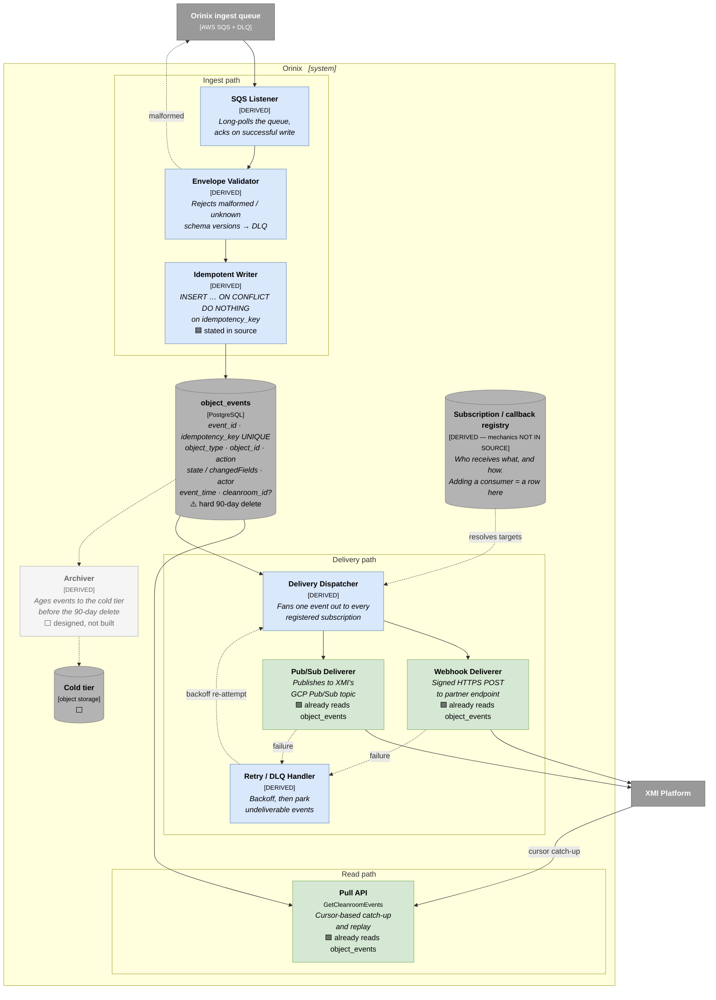
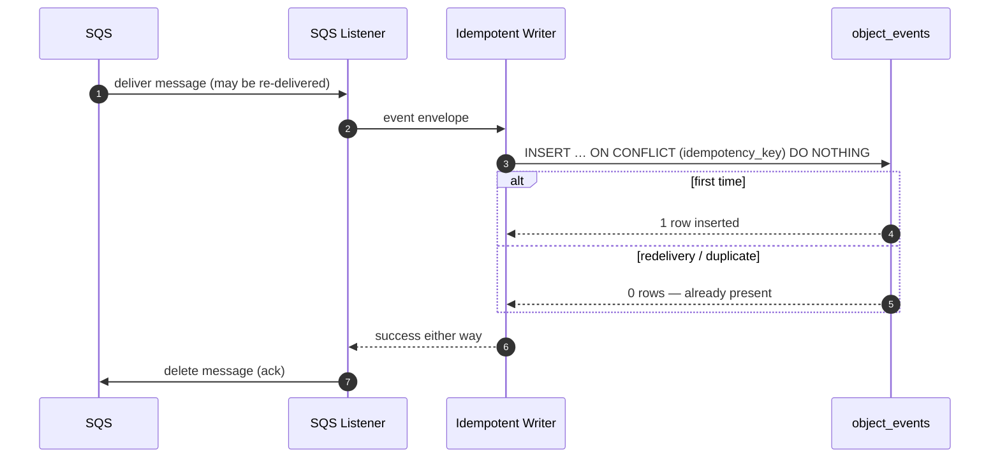
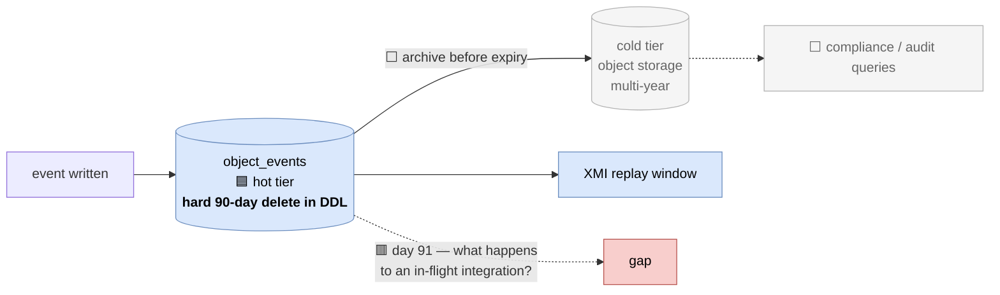

# 03 — C4 Level 3: Components inside Orinix

**Question this answers:** *What is inside the Orinix box, and which part is
responsible for each guarantee we make to XMI?*

---

## ⚠️ Evidence note — read before using this diagram

The architect-followup documents specify Orinix's **behaviour and data contract**
precisely, but they do **not** enumerate its internal classes or modules. What is
stated in source:

- SQS listener on the new queue *(`08-next-steps.md` Phase 5)*
- `INSERT` into `object_events` with **`ON CONFLICT DO NOTHING` on the idempotency
  key** *(Phase 5)*
- *"Nothing else changes — the pull API, delivery and replay **already read from**
  `object_events`"* *(Phase 5)* → **these components already exist**
- `GetCleanroomEvents` is the cursor-based pull API *(`README.md`, `01 §6`)*
- Delivery to XMI by **webhook** and **GCP Pub/Sub** *(`README.md`)*
- `object_events` carries a **stable ID for de-duplication** and is **replayable**
  *(`01-problem.md §6`, `04-tradeoffs.md §1`)*
- `object_events` has a **hard 90-day delete in its DDL** *(C3)*

The components below are therefore drawn **from stated responsibilities**, not from
reading Orinix's source. Boxes marked **[DERIVED]** are a faithful decomposition of
those responsibilities; they are not claimed to match actual class names. Orinix's
language, framework and module layout are **[NOT IN SOURCE]** here — see
`orinix-why-and-how/` in the sibling archive folder.

---

## 1. Component diagram

---

## 2. Which component delivers which guarantee

Mapping the seven requirements from `01-problem.md §6` onto the components that
satisfy them:

| Requirement | Delivered by | Notes |
|---|---|---|
| Names the **business object** (`DATA_CONNECTION`, not table names) | **Producer**, not Orinix | Orinix cannot recover this if the producer does not send it — see `04-components-producer.md` |
| **Enough state to act** without calling back | **Producer** payload level (D3) | Orinix stores whatever it is given |
| Says **who did it** | **Producer** (`authUser`) | Only the service layer has it |
| **Stable ID** for de-duplication | **Idempotent Writer** + `UNIQUE(idempotency_key)` | `ON CONFLICT DO NOTHING` |
| **Replayable** | `object_events` + **Pull API** cursor | Bounded by the 90-day delete |
| **One message per user action** | **Producer** | Orinix cannot un-merge 5 row-level events into 1 |
| **No schema or secret exposure** | **Producer** field allow-list | C4 |

> **The architecturally important observation:** *five of the seven guarantees are
> earned or lost at the **producer**, not inside Orinix.* Orinix can make delivery
> reliable and replayable; it **cannot** reconstruct meaning that was never sent.
> This is precisely why D1 — where the event is produced — is the decision that
> everything else hangs off.

---

## 3. Idempotency and the de-duplication boundary

**What this protects against:** SQS at-least-once redelivery, and Orinix crashing
between write and ack.

**What it explicitly does NOT protect against** *(`05-architect-review.md §1 A2, §2
Q1)*: two genuinely distinct emissions of the same logical change — a client retrying
a request, or a missing suppression flag causing a double-emit. Those arrive as **two
events with two different IDs**, so the unique key does not help. That failure must be
prevented **at the producer**, which is why the suppression guard is called
*"load-bearing correctness logic"* in the review.

---

## 4. Retention: the two-tier problem (C3)

`object_events` deletes at 90 days; audit-grade retention is measured in **years**.
The hot/cold split with one read API routing by age is designed but **not built**, and
`05-architect-review.md` logs **E5** — *"`object_events` reaching the 90-day boundary
mid-integration"* — as a known unresolved edge case, and Q10 — *"what happens to XMI's
replay window on day 91?"* — as an open question.

---

## 5. What is missing from this picture, and should be

Called out honestly in `05-architect-review.md §7` ("what feels under-engineered"):

| Gap | Consequence |
|---|---|
| **No end-to-end health check** | Nothing today would tell us forebitt wrote a row and no event arrived |
| **No publish-failure metric** | We cannot say how many events were lost |
| **Schema ownership and versioning not written down** | An external partner contract with no versioning story (D5, Q12–Q13) |
| **Back-pressure undesigned** | *"I have not designed for back-pressure at all"* — Q12: if a consumer falls badly behind, do we grow, drop, or push back? |

These are architecture-level gaps, not implementation details, and belong in the
review conversation.

---

**Next:** [04-components-producer.md](04-components-producer.md) — where the event is
born, and the decision being asked for.
