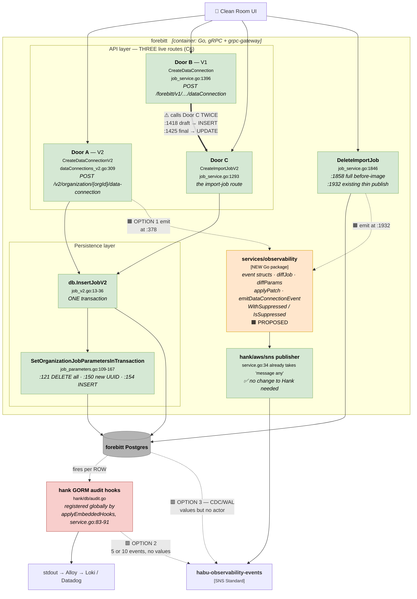
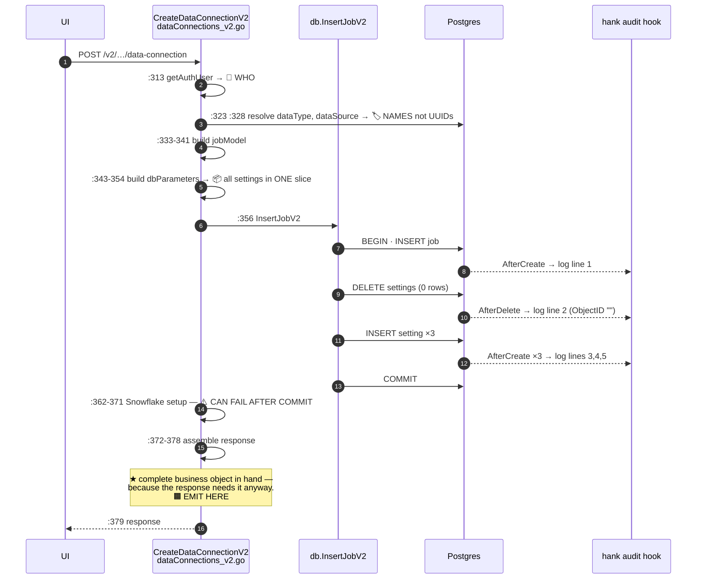
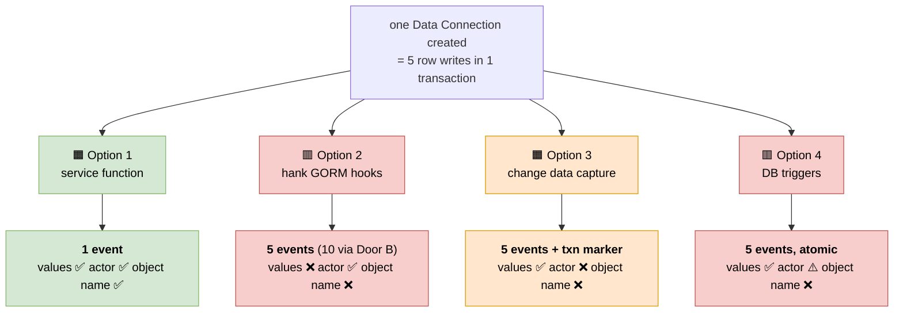

# 04 — C4 Level 3: Components inside the Producer (forebitt)

**Question this answers:** *Where exactly is the event born, and why is that the
decision the whole design hangs off?*

Everything in this document is **[VERIFIED]** in the source documents — read in
repository source on 2026-07-28/29/30, with file and line recorded — **except** items
explicitly marked `[UNVERIFIED]`.

---

## 1. Why this level matters more than the others

A **Data Connection is not one row.** It is stored across two tables:

| Table | Holds |
|---|---|
| `data_import_jobs` | the connection — name, source, stage, status |
| `organization_job_parameters` | its settings, **one row per setting** |

So **the business object the user sees does not match the storage**, and any
mechanism operating at the row level sees *pieces*, not the object. That single fact
generates every trade-off in this architecture.

---

## 2. Component diagram — the three doors and the five candidate emission points



---

## 3. One user action = five row writes

Traced example: creating *"Adidas EMEA CRM Data"* on `CLIENT_AWS` / `CRM` with three
settings (`DataLocation`, `SampleFilePath`, `FieldDelimiter`).

| # | Table | Op | Note |
|---|---|---|---|
| 1 | `data_import_jobs` | INSERT | the connection |
| 2 | `organization_job_parameters` | DELETE | **matches zero rows** on a create — runs unconditionally (`job_parameters.go:121`) |
| 3–5 | `organization_job_parameters` | INSERT ×3 | one per setting, **fresh UUID each** (`:150`) |

All five inside **one transaction** (`job_v2.go:19` BEGIN → `:31` COMMIT).

### And Door B doubles it

`job_service.go:1401-1425` saves the whole connection **twice** — draft (`:1418`,
INSERT) then final (`:1425`, UPDATE) — and **both** passes run delete-all-plus-reinsert
on the settings.

| Path | Row-hook firings for one "create with 3 settings" |
|---|---|
| Door A | 1 INSERT + 1 phantom DELETE + 3 INSERTs = **5** |
| Door B | pass 1 (1+1+3) + pass 2 (1 UPDATE + 1 + 3) = **10** |

**Same user, same button, same final database state.** The row-level event count
depends on *which route the request took*, not on what the user did. A partner
integration must not change behaviour because we refactored an internal save path.

---

## 4. Why the service layer — the "free at line 378" argument



**The punchline.** At `:378` the handler holds a complete, assembled, business-shaped
representation of what was just created — *because it needs one anyway to build its
response*. The information required for one correct event is not cheap there; it is
**free**. Every other option throws that away and rebuilds it, less accurately,
somewhere else.

**Why `:378` and not `:358`:** `:362-371` can return an error **after the transaction
already committed**. Emitting before that block would tell XMI the connection was
created while telling the user it failed. Emitting at `:378` removes this entirely, at
no cost.

### Runtime cost

| Path | Additional queries |
|---|---|
| Create | **zero** — every value is already a local variable |
| Update | **one** indexed read (`FetchOrganizationJobParameters`, `job_parameters.go:20` — already exists) |
| Delete | zero, optionally one for old settings |

> **Do not overstate this.** `05-architect-review.md §1 A4` is explicit: the p99 of
> `UpdateDataConnectionV2` has **not been measured** (V4). The defensible claim is
> *"one indexed lookup on a path that already performs three or four reads"* — not
> *"negligible"*.

---

## 5. The update-path trap

`UpdateDataConnectionV2`, `dataConnections_v2.go:384`:

| Line | What |
|---|---|
| `:393` | `dbJob` fetched — **the before-image is already read** |
| `:417` | `jobModel` is a **six-field patch**, not the after-state |
| `:420-431` | `dbParameters` built entirely from the request |
| `:432` | `UpdateJobV2` — UPDATE job, then DELETE-all + re-INSERT settings |

**Gap 1 — old settings are never read.** Nothing loads the existing
`organization_job_parameters`; `ClearOrganizationJobParameters` fetches only parameter
*IDs* (`job_parameters.go:72`), not values. Fix: one call to an existing function.

**Gap 2 — the trap.** `NewImportJobFromProtoV2` maps only **six** fields
(`data_import_job.go:76-85`) and **not** Status or Stage, and `UpdateJobV2` uses GORM
v1 `Updates(*job)` (`job_v2.go:45`), which drops zero-valued fields. Diffing `dbJob`
against `jobModel` naively would emit, on **every** update:

```json
"status": { "from": "ACTIVE",           "to": "" }
"stage":  { "from": "MAPPING_REQUIRED", "to": "" }
```

Not noise — **wrong**, and XMI's stage consumer would act on it. Fix: start from
`dbJob`, overlay only non-blank patch fields, then compare (~6 lines, the `applyPatch`
helper).

---

## 6. Why the alternatives lose — at component level



**Only Option 1 gets all three, and it is the only one where the count is 1.**

### What Hank's hook actually records

`hank/db/audit.go` — the complete record, no other fields exist:
`{ObjectID, ObjectName, ObjectType, Action, ActionByID, ActionByEmail, ActionAt,
Method, OrgID, RequestID, ImpersonatedBy*}`, and `getObjectDetails` marshals the model
and reads exactly two keys: `"ID"` and `"Name"`.

**There are no field values, and no reference to a parent object.** And because
`forebitt/db/job.go:185` deletes via `tx.Scopes(IDScope(id)).Delete(&models.DataImportJob{})`
— ID in the WHERE clause, **empty struct** passed in — the delete record reads:

```json
{ "ObjectType": "DataImportJob", "ObjectID": "", "Action": "DELETE" }
```

*"Somebody deleted a data connection. We are not saying which one."* **This is a
defect in the audit log we already ship**, independent of Orinix, and worth its own
ticket.

### The strongest form of "just use Hank" — and why it still fails

Option **2b**: filter to `ObjectType ∈ {DataImportJob, Flow, FlowRun,
CleanRoomQuestion}` and drop child-table records. This genuinely collapses 5 → 1 for
create and update — the assembler problem disappears because we stop assembling. It
should be acknowledged as the honest strongest version. It fails on two points:

1. **The record carries `Action`, not `Status`/`Stage`.** It can say *"FlowRun 123 was
   updated."* It cannot say *"FlowRun 123 is now COMPLETED."* XMI would call our API
   after every update to find out — **which is the polling problem DV-15621 exists to
   remove.** It cannot even reach payload Level 1.
2. **The claims gate.** Every hook opens with
   `tokenClaims, ctx, parsed := claims(scope); if !parsed { return nil }`. No parsed
   auth claims → **no record at all**. A flow run completing is almost certainly a
   background worker. **[UNVERIFIED] but high-probability: the single most important
   event may emit nothing.** This is verification item **V2** and it must be closed
   before anyone commits to this option — *and it may bite Option 1 too*, which would
   need a system actor.

### Change data capture — the strongest alternative, treated honestly

It solves what the hooks cannot: **before/after values for free** (with
`REPLICA IDENTITY FULL`), and **transaction boundaries**, so *"when is the set
complete?"* becomes answerable. It still fails on:

- **No actor.** The WAL sees *"row changed,"* not *"Aditya changed it."* The standard
  workaround — write the user into a column on every table — is application work
  everywhere, so the "no code changes" advantage evaporates.
- Still cannot say **which of the five rows is the main object**.
- **Our column names become XMI's contract** — a one-way door.
- **Operational risk:** a stalled consumer stops the replication-slot bookmark
  advancing, Postgres cannot recycle `pg_wal/`, disk fills, **the production database
  stops accepting writes**. A failure that travels *backwards* from an unhealthy
  downstream consumer. Mitigations are standard but **we do not have them today**, on
  databases owned by other teams.
- Spans several databases — connection in forebitt's, credential in primage's, flows
  in unhygienix's.

*One line:* **CDC fixes the mechanical problems (values, grouping) but not the meaning
problems (who did it, what business object this is).*

---

## 7. The double-emit guard — load-bearing, and the argument for Option 5

Because Door B calls Door C **twice**, the inner handler must stay quiet when invoked
from an outer one:

```go
ctx = observability.WithSuppressed(ctx)     // set by the outer handler
…
func (s *Server) emitDataConnectionEvent(ctx, change) {
    if observability.IsSuppressed(ctx) { return }
    …
}
```

~10 lines, written once. **The review flags this as the weak point** (`§1 A2`): the
flag is *"now load-bearing correctness logic."* If someone adds a fourth door or calls
Door C from a new place without setting it, we emit **two events with distinct IDs** —
and `UNIQUE(idempotency_key)` will **not** save us, because they are not duplicates of
one event.

**Option 5** — handlers append to a per-request list, one piece of middleware
publishes on success — makes double-emission **structurally impossible** and gives a
single place to add retry, batching or the outbox later. Rejected for M1 only on
"extra machinery for 7 call sites." **If the reviewer weights this concern heavily,
go straight to Option 5** (question Q4 / decision D6).

---

## 8. Scope of instrumentation — 3 sites or 7?

| Where | File:line | Needed if… |
|---|---|---|
| Create, Door A | `dataConnections_v2.go:378` | always |
| Update, Door A | `dataConnections_v2.go:453` (+ before-image read after `:405`) | always |
| Delete | `job_service.go:1932` | always |
| Create, Door B | `job_service.go:1505` | **V1 says the legacy doors are live** |
| Create, Door C | `job_service.go:1388` | ″ |
| Update, Door B | `job_service.go:1698` | ″ |
| Update, Door C | `job_service.go:1672` | ″ |

**V1 is the cheapest question with the largest effect on scope.** If Doors B and C are
legacy, this is **3 sites and no suppression flag** instead of 7 with one. The review
lists instrumenting all three doors before confirming they are in use under *"what
feels over-engineered."*

And the honest concession (`04-tradeoffs.md §6`): **if someone adds a new write path
in six months and forgets the emit block, that path goes silent.** This is the one
genuine advantage the automatic approaches have. It is acceptable because all write
paths live in **two files**, a test can fail when a handler writes without emitting,
and **silence is detectable by volume monitoring** — far better than the *wrong* event
a timer-based assembler produces.

---

**Next:** [05-runtime-flows.md](05-runtime-flows.md) — the sequences end to end.
