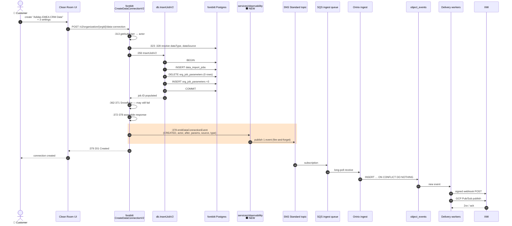
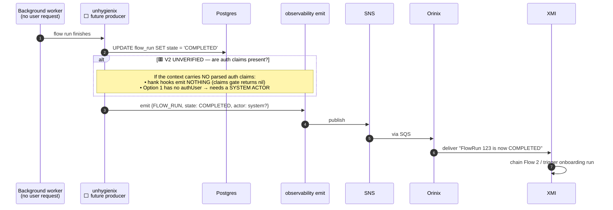
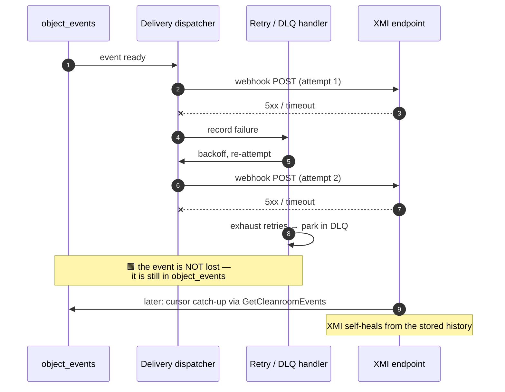
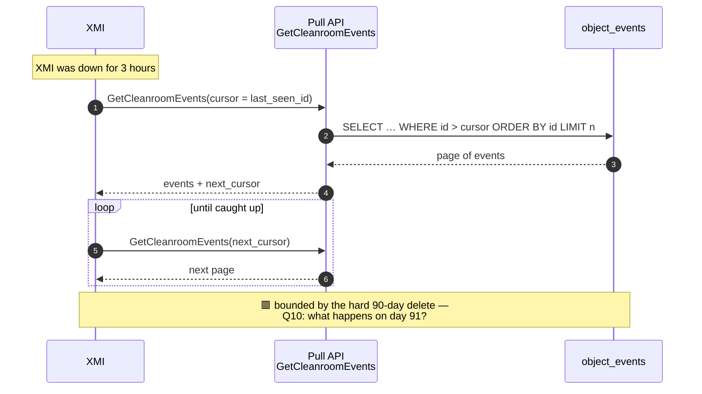
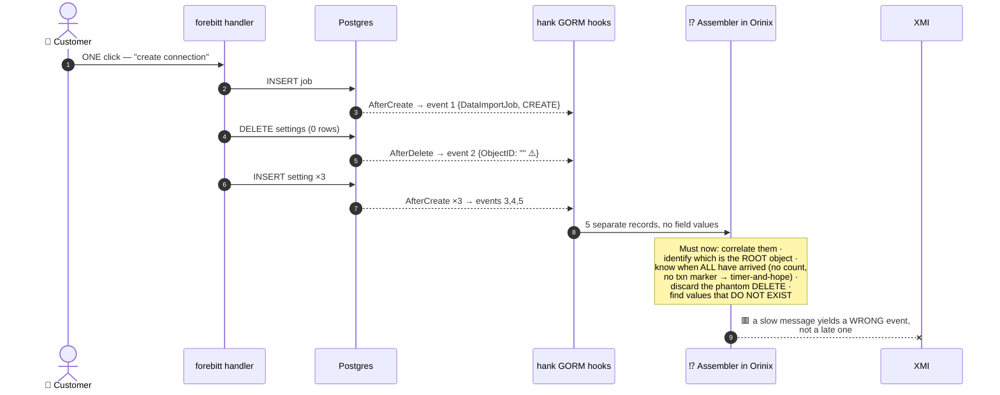
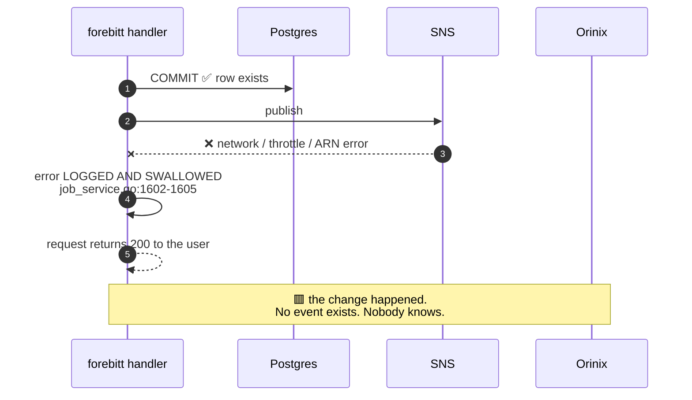

# 05 — Runtime Interaction Flows (C4 Dynamic)

**Question this answers:** *What actually happens, in order, when something changes —
including when things go wrong?*

Six flows. The first is the happy path; the rest are the ones that decide whether this
architecture is sound.

---

## Flow 1 — Data Connection created, end to end (the M1 happy path)

**Key ordering guarantees visible here:**

- The **emit is after `COMMIT`** → we can never announce something that did not
  happen.
- The **emit is after the Snowflake block** (`:362-371`) → we never announce a create
  the caller was told failed.
- The **user's response does not wait on delivery** → publish is fire-and-forget.
- **Exactly one event** regardless of the five underlying row writes.

---

## Flow 2 — Flow Run completes (XMI's most important use case, and the biggest risk)

This is use case 2 *and* the trigger for use cases 3 and 4 (flow chaining,
onboarding). It is also the flow with an **open, high-probability risk**.

**Why this flow decides the payload level.** XMI must be able to act on *"is now
COMPLETED"*. A payload that only says *"FlowRun 123 was updated"* (Level 0) sends them
straight back to polling — the very problem DV-15621 is solving. **This is also the
single sharpest argument against Hank's hooks**: the hook record carries `Action`, not
`Status`, so it cannot express this event *at all*.

> **🟥 Verification item V2 — the highest-value open question in the package.**
> A flow run completing is almost certainly a background worker, not a user request.
> If no parsed auth claims reach the context: Hank's hooks emit **nothing**, and
> Option 1 must supply a **system actor**. Close this before committing to any option.

---

## Flow 3 — Delivery fails, retries, then dead-letters

**The architectural point:** because `object_events` is the durable record and the
pull API reads from it, **delivery failure degrades to catch-up rather than data
loss**. This is why storage sits between ingest and delivery instead of Orinix
forwarding straight through.

---

## Flow 4 — Replay and catch-up (cursor)

**Idempotent by construction:** XMI may reprocess overlapping pages safely because
every event carries a stable ID. That same ID makes Orinix's ingest idempotent against
SQS redelivery.

---

## Flow 5 — What the rejected alternative would produce (contrast)

Same user action as Flow 1. This is the diagram to show if anyone asks *"why not just
use the hooks we already have?"*

**And via Door B the same click produces 10 records, not 5.**

The failure shape is what condemns it: a timer-based assembler turns a slow message
into a **wrong** event — *the worst possible failure, because it looks like success*.
Compare Option 1's worst case: one event missing, detectable by volume monitoring.

---

## Flow 6 — The reliability gap, stated honestly

| | |
|---|---|
| **Can happen** | Row exists, no event sent → recoverable by backfilling from the source table |
| **Cannot happen** | An event for a row that does not exist → publish is strictly after `COMMIT` |
| **Today** | We would **not know** how many we lost |
| **Minimum fix** | A publish-failure counter and an alert (D4) |
| **Proper fix** | **Transactional outbox** — write the event row in the same transaction, a worker sends it and marks it done. Goes at **exactly the line the publish is on today**, so choosing best-effort now does not make it harder later |

The source calls this *"the weakest part of the proposal"* and *"the gap I would push
hardest on if I were reviewing."* A review package that hid it would be doing the
reader a disservice.

---

## Flow summary — which flows are proven and which are not

| Flow | Status | Blocking item |
|---|---|---|
| 1 — Data Connection create | 🟧 emit proposed; downstream 🟦 agreed | D1, D3, V1 |
| 2 — Flow Run completion | 🟥 **producer not built, actor unverified** | **V2**, unhygienix instrumentation (M2+) |
| 3 — Delivery retry / DLQ | 🟦 agreed | — |
| 4 — Replay by cursor | 🟩 pull API already reads `object_events` | 90-day boundary (Q10) |
| 5 — Hook-based alternative | 🟥 rejected | — |
| 6 — Publish loss | 🟥 **accepted gap for M1** | D4 |

---

**Next:** [06-deployment.md](06-deployment.md) — where all this actually runs.
