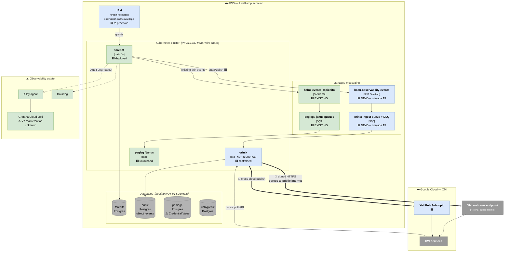
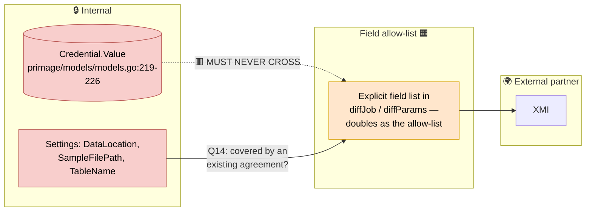
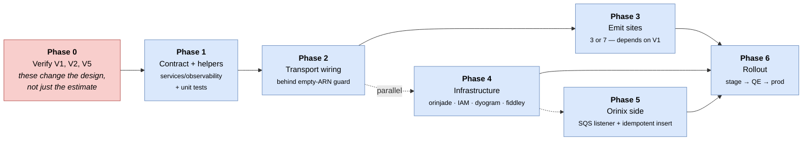

# 06 — Deployment, Configuration and Trust Boundaries

**Question this answers:** *Where does this run, what has to be provisioned, and
where are the security and network boundaries?*

---

## ⚠️ Evidence note

The architect-followup documents name the **repositories and files that own each piece
of infrastructure** (Phase 2 and Phase 4 of `08-next-steps.md`), and those are quoted
verbatim below. They do **not** describe the cluster topology, VPC layout, or database
hosting. Boxes marked **[INFERRED]** are reasonable deductions from the artefacts
named (e.g. Helm `values.yaml` implies Kubernetes); boxes marked **[NOT IN SOURCE]**
are left deliberately unelaborated.

---

## 1. Deployment diagram

---

## 2. Trust and network boundaries

| # | Boundary | Crosses it | Why it matters |
|---|---|---|---|
| **B1** | **Process → managed messaging** (in-account) | `sns:Publish` from forebitt | New IAM grant required; the **empty-ARN guard** lets code merge before the topic exists |
| **B2** | **Service → service database** | Each service owns its own Postgres | **This is why no database-level mechanism can span the platform**: a Dataset depends on a DataImportJob (forebitt) which depends on a Credential (primage) — three services, three databases |
| **B3** | **AWS → public internet** (egress) | Signed webhook POST to XMI | The only outbound internet path; needs signing + endpoint verification |
| **B4** | **AWS → GCP** (cross-cloud) | Pub/Sub publish to XMI's topic | Publishing this from *each producer* instead would put **Google Cloud credentials in 10+ repositories** — the argument for centralising it in Orinix |
| **B5** | **Internal → external partner** (data) | Event payloads | **C4 secrets constraint** + Level 2 field allow-list; `DataLocation` and `SampleFilePath` are full S3 URIs and `TableName` names a customer's table |
| **B6** | **Existing consumer isolation** | pegleg/janus subscriptions | **C1** — a separate topic gives isolation *by construction* rather than by filter policy |

### The security boundary that needs a named owner

**Option 1's structural advantage here:** because the emit code names its fields
explicitly, the allow-list *is* the implementation — no secret can leak by accident.
CDC and triggers invert this: credential values flow into the pipeline by default and
must be filtered out at the infrastructure layer. Open: **who signs off on the
allow-list** (Q13), and whether sending customer-identifying S3 URIs to XMI is already
covered by an existing agreement (Q14).

---

## 3. What must be provisioned — the deployment checklist

Verbatim from `08-next-steps.md` Phases 2 and 4:

### Application configuration

| Repo / file | Change |
|---|---|
| `forebitt/api/server/server.go:72` | add `ObservabilityEvents *hevent.Config` beside the existing `Events` |
| `forebitt/cmd/forebitt/commands/server.go:86` | add `events.AddEvents(flags, "observability-events")` |
| — | publish via `hank/aws/sns` directly — **`hank/aws/sns/service.go:34` already takes `message any`, so no change to Hank is needed** ✅ |
| — | hold **one** SNS client rather than constructing one per publish (`hank/events/service.go:18` does the latter) |
| — | **empty-ARN guard** so this can merge and deploy before the topic exists |
| — | a **counter and alert on publish failure** — the minimum answer to D4 |

### Infrastructure

| Repo / file | Change |
|---|---|
| `orinjade` Terraform | new **Standard** SNS topic `habu-observability-events`, SQS ingest queue, subscription, queue policy, **DLQ and redrive** |
| IAM | forebitt's role needs `sns:Publish` on the new topic |
| `dyogram/charts/forebitt/values.yaml` | new topic ARN key (mirrors `:188`) |
| `fiddley` control-plane | forebitt overrides, **stage then prod** (mirrors `prod-overrides.yaml:78`) |

**Note the ordering dependency this creates:** infrastructure lives in `orinjade` and
`fiddley`, owned by other teams, with an unknown lead time (Q8). The **empty-ARN
guard** is the decoupling device — it lets application code merge and deploy before
the topic exists, and is why it appears in Phase 2 rather than being deferred.

---

## 4. Rollout sequence

**Phase 0 is a gate, not a formality.** V1 (are the legacy doors live?), V2 (do
flow-run changes carry auth claims?) and V5 (is `(ImportDataSourceParameterID, Name)`
genuinely unique?) **change the design**, not merely the estimate.

**Definition of done for M1** (`08-next-steps.md §6`):

- A create, an update and a delete each produce **exactly one** row in `object_events`
  with correct `changedFields`, verified in stage.
- The same is true **whichever route the request came through**.
- Publish failures are **counted and alert**.
- XMI can pull those events through `GetCleanroomEvents` **and** receive them by
  webhook.
- The message schema is **written down somewhere XMI can read it**.

---

## 5. Operational risks by environment

| Risk | Where it bites | Mitigation | Status |
|---|---|---|---|
| Publish failure is silent | forebitt, prod | failure counter + alert | 🟥 **not built** |
| No end-to-end health check | whole path | *"forebitt wrote a row and no event appeared"* alert (Q9, Q11) | 🟥 **not designed** |
| `object_events` 90-day delete | orinix DB | hot/cold tier split | ⬜ designed, not built |
| Topic lead time blocks merge | orinjade/fiddley | empty-ARN guard | 🟦 planned |
| Consumer falls behind | delivery | grow / drop / back-pressure? | 🟥 **Q12 — not designed** |
| Loki retention unknown | observability | V7 — do not quote the self-hosted chart's dead 168h config | 🟥 open |

> **Had CDC been chosen**, this table would carry a materially worse entry: a stalled
> replication slot preventing `pg_wal/` recycling until the **production database stops
> accepting writes** — an outage travelling *backwards* from an unhealthy downstream
> consumer, on databases owned by other teams, with `max_slot_wal_keep_size` and
> slot-lag alerting that **we do not have today**. This is a deployment-level argument
> for Option 1, not just a design-level one.

---

**Next:** [07-decisions-and-open-items.md](07-decisions-and-open-items.md)
