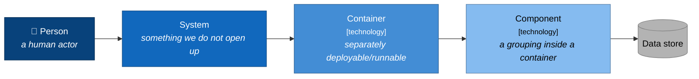

# Orinix Change Event Platform — C4 Architecture Package

**Date:** 2026-07-31
**Prepared by:** Aditya Bhardwaj
**Audience:** Principal Architects, Staff/Principal Engineers, Engineering Managers, partner teams (XMI), and engineers with no prior exposure to these repositories
**Tickets:** DV-13856 (platform), DV-15090 / DV-15091 (M1), DV-15496 (epic), DV-15621 (XMI polling / rate limiting)

**Source of truth:** [`2026-07-31/2026-07-30-aditya-architect-followup`](https://github.com/adbhardw/Aditya-AI-Knowledge/tree/master/2026-07-31/2026-07-30-aditya-architect-followup)
in `adbhardw/Aditya-AI-Knowledge@master`, read in full at commit `0fe9858`.
Every architectural claim here traces back to those documents; anything I could not
find there is marked **[NOT IN SOURCE]** rather than invented.

---

## The system in one paragraph

XMI, a partner team, needs to know when Clean Room business resources change — a
Data Connection's stage, a Flow Run's state, a Flow completing, a Question changing,
onboarding datasets all being assigned. Today they **poll** our API, and DV-15621
records the resulting rate-limiting pain. **Orinix** is the service that replaces
polling with push: it ingests change events from Clean Room producer services,
stores them durably in `object_events` as a replayable history, and delivers them to
XMI via three channels — a cursor-based pull API, signed webhooks, and GCP Pub/Sub.
The same event stream is intended to serve future consumers (Microsoft, SafeHaven),
a customer-facing change-history UI, and compliance audit logging.

---

## Read the diagrams in this order

| # | Document | C4 level | Answers |
|---|---|---|---|
| 1 | [01-system-context.md](01-system-context.md) | **L1 — Context** | Who are the actors and systems, and why does this platform exist? |
| 2 | [02-containers.md](02-containers.md) | **L2 — Container** | What are the deployable/runnable pieces and the protocols between them? |
| 3 | [03-components-orinix.md](03-components-orinix.md) | **L3 — Component** | What is inside Orinix — ingest, store, pull API, delivery? |
| 4 | [04-components-producer.md](04-components-producer.md) | **L3 — Component** | What is inside the producer, and **where exactly does the event get born?** This is the open decision. |
| 5 | [05-runtime-flows.md](05-runtime-flows.md) | **Dynamic** | Five end-to-end sequences, including the failure paths and the rejected alternative. |
| 6 | [06-deployment.md](06-deployment.md) | **Deployment** | Cloud accounts, clusters, network and trust boundaries, and where config lives. |
| 7 | [07-decisions-and-open-items.md](07-decisions-and-open-items.md) | ADR-style | What is decided, what is proposed, what is unverified, and what blocks whom. |
| — | [SUMMARY.md](SUMMARY.md) | — | Self-contained executive summary; **start here if you only read one file.** |

Deliberately **not** one oversized diagram. Each level answers one question and hides
the level below it.

---

## Status legend — read this before any diagram

This platform is **half-built**, and a review package that blurs that is misleading.
Every element carries one of these states:

| Marker | Meaning |
|---|---|
| 🟩 **BUILT** | Exists and is scaffolded/approved today |
| 🟦 **AGREED** | Design agreed, not yet built |
| 🟧 **PROPOSED** | Recommended in the source documents, **awaiting architect approval** |
| 🟥 **OPEN** | Genuinely undecided — blocks work |
| ⬜ **FUTURE** | Named as a direction, not in M1 scope |

**The single most important thing to understand about this architecture:**

> Everything **downstream** of the SNS topic — the queue, Orinix, `object_events`, the
> pull API, webhook and Pub/Sub delivery — is **approved and scaffolded** (🟩/🟦).
> The **producer** side — *which code emits the event, and what it contains* — is
> **🟧 PROPOSED / 🟥 OPEN**, and it is the part that touches other teams' code.
>
> *Source: `README.md`, `01-problem.md §5`.*

The diagrams use colour for this, so a reviewer can see at a glance which boxes are
being asked about and which are settled.

---

## Notation

These use Mermaid `flowchart` / `sequenceDiagram` with **C4 semantics applied
rigorously** (person → system → container → component, each with technology and
responsibility annotations), rather than Mermaid's experimental `C4Context` blocks.
The reason is practical: the standard diagram types render reliably in GitHub, IDEs
and Confluence exports, and this package has to survive being pasted into a design
review. Every box states its **technology** and its **one responsibility**.

Status colours used throughout: 🟩 built `#d5e8d4` · 🟦 agreed `#dae8fc` ·
🟧 proposed `#ffe6cc` · 🟥 open/risk `#f8cecc` · ⬜ future `#f5f5f5`.

---

## Scope boundary — what this package does and does not cover

**Covers:** the change-event path from a user action in the Clean Room UI through to
delivery at XMI, plus the storage, replay and multi-consumer fan-out that Orinix
provides.

**Does not cover:** Orinix's implementation language and module layout, callback
registration and HMAC signing mechanics, and the orinix↔XMI authentication design
(CAC / nexus / JWKS). These are decided or discussed in *other* folders of the
knowledge base — principally
[`2026-07-31/older_discussion_observability`](https://github.com/adbhardw/Aditya-AI-Knowledge/tree/master/2026-07-31/older_discussion_observability)
(`orinix-why-and-how/`, `aditya_auth_authz_orinix/`) — and are **not** stated in the
architect-followup documents this package is built from. Where a diagram needs to
show them, the box is marked **[NOT IN SOURCE]** and left deliberately unelaborated
rather than guessed at.

---

## The four questions this package puts to the reviewer

Carried directly from `README.md` and `08-next-steps.md §1`:

1. **D1** — Approve producing events from the **service layer**, not from Hank's
   automatic row hooks, change data capture, or database triggers.
2. **D3** — Agree the **payload detail level**: current state for the state-change
   events XMI is blocked on, full before-and-after for object create/update/delete.
3. **V1** — Confirm which of the **three live create/update APIs** are still in use.
   This is the difference between instrumenting **3 sites and 7**.
4. **D2** — Decide whether a Data Connection event is scoped to the **organisation**
   or the **cleanroom**. It has no cleanroom ID on it today, and this sets the
   primary query key of `object_events`.
