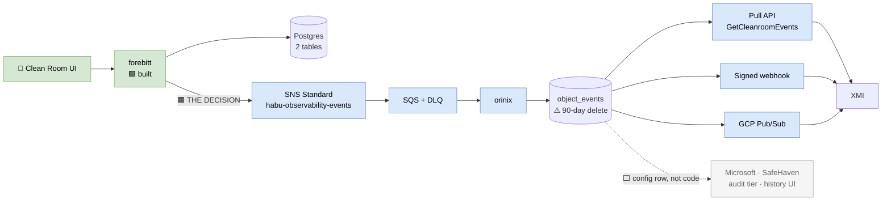

# SUMMARY — Orinix Change Event Platform, C4 Architecture Package

> ⚠️ **DESIGN SUPERSEDED (2026-08-04).** The final agreed design is
> [`2026-08-04/2026-08-04-aditya-final-hank-audit-event-to-xmi/`](../../2026-08-04/2026-08-04-aditya-final-hank-audit-event-to-xmi/SUMMARY.md).
> The outbox, the aggregate root and every `AuditLog` struct addition were **dropped**;
> XMI now subscribes to our SNS and orinix leaves the M1 path. **The source-level
> findings in this document remain correct** and are still cited by the final design —
> keep it as the decision trail, do not implement from it.

**Date:** 2026-07-31
**Prepared by:** Aditya Bhardwaj
**Audience:** Principal Architects, Staff/Principal Engineers, Engineering Managers, XMI
**Tickets:** DV-13856, DV-15090 / DV-15091 (M1), DV-15496 (epic), DV-15621 (XMI polling)
**Built from:** `2026-07-31/2026-07-30-aditya-architect-followup` @ `adbhardw/Aditya-AI-Knowledge` commit `0fe9858`, all ten documents read in full

> **Self-contained.** Another assistant or engineer can read only this file and
> understand the architecture. Drill into `01`–`07` for the diagrams and evidence.

---

## 1. Problem statement

XMI, a partner team, must know when Clean Room business resources change — Data
Connection stage, Flow Run state, Flow completion (for chaining), onboarding
dataset-assignment completion, Question and Flow changes. Today they **poll** our API;
DV-15621 records the resulting rate-limiting pain and states it "should be helped by
enabling pub/sub for status instead of polling."

**Orinix** is the service that replaces polling with push: ingest change events →
store them durably and replayably in `object_events` → deliver via cursor pull API,
signed webhooks, and GCP Pub/Sub. The same stream is intended to serve Microsoft,
SafeHaven, a customer-facing change-history UI, and compliance audit logging.

**The decision actually on the table is narrower than the platform.** Everything
downstream of the SNS topic is approved and scaffolded. **The producer side — which
code emits the event and what it contains — is undecided**, and it is the part that
touches other teams' code in other repositories. It is also the last cheap moment:
once XMI integrates against a message shape, changing it becomes a coordinated
multi-team release.

---

## 2. First principles — why this is hard at all

A partner needs to know when our work finishes. Two questions follow:

- **What do we say?** *"Something changed"* (they must call back — a doorbell in front
  of the phone) vs *"it is now COMPLETED"* (they can act) vs *"it went from X to Y"*
  (they can act **and** show history).
- **Who writes the note?** The **clerk who handled the order** knows it was one
  action, knows before and after, and knows who asked. A **camera watching the
  shelves** sees five boxes move and cannot tell they were one order, which box *is*
  the order, or who was holding them.

The clerk is the **service layer**. The camera is **Hank's GORM row hooks** or
**change data capture**.

**Three verified root causes:**

1. **A Data Connection is not one row** — it spans `data_import_jobs` and
   `organization_job_parameters` (**one row per setting**). The business object does
   not match the storage, so row-level mechanisms see pieces.
2. **Settings are saved delete-then-reinsert** — `job_parameters.go:109-167` clears
   *all* settings (`:121`) and re-inserts each with a **fresh UUID** (`:150`). Row
   identity does not survive an edit.
3. **The existing event mechanism was built for a different purpose** —
   `hank/events/model.go:3` carries an ID and a bag of strings, designed to tell *our
   own* services "go look at this thing," never to tell a partner what changed.

---

## 3. High-level architecture

**Why a middle service at all** — independent of the producer decision. Publishing
straight from each producer to XMI's Pub/Sub would mean Google Cloud credentials in
**10+ repositories**, a **code change in every producer** to add a second consumer,
and **no replay or history**. With Orinix, a new consumer is **a configuration row**.

**Why a new topic** — `pegleg.tf:17`'s subscription filter **already matches
`"dataImportJob"`**, so reusing the existing topic would deliver our messages into
pegleg's queue (constraint C1). And the existing topic is FIFO whose ordering is
weaker than assumed: `hank/aws/sns/service.go:48` sets `MessageGroupId` to the request
ID, and FIFO orders only *within* a group — **two updates to the same object from
different requests are already unordered**. Hence a **Standard** topic.

---

## 4. End-to-end runtime flow

One user action — create a connection with three settings — produces **five row writes
in one transaction**: INSERT job · DELETE settings (**matches zero rows**, runs
unconditionally) · INSERT setting ×3.

**Via the V1 route it is ten**, because `job_service.go:1418`/`:1425` saves the whole
connection **twice** (draft → INSERT, then final → UPDATE), each pass re-running
delete-all-plus-reinsert. *Same user, same button, same final state — the row-level
event count depends on which route was taken.*

Meanwhile, at `dataConnections_v2.go:378`, the handler holds a **complete, assembled,
business-shaped object** — the actor (`:313`), human-readable source/type names
(`:323`/`:328`), and every setting in one slice (`:343-354`) — **because it needs all
of that anyway to build its response**. The information for one correct event is not
cheap there; it is **free**.

Emission must come **after** `:362-371`, because that block can return an error *after
the transaction already committed*; emitting earlier would announce a create the user
was told failed.

Then: SNS → SQS → Orinix → `INSERT … ON CONFLICT DO NOTHING` on the idempotency key →
`object_events` → webhook + Pub/Sub to XMI, with cursor-based catch-up if XMI was down.

---

## 5. Design options considered

| # | Option | Verdict |
|---|---|---|
| **1** | **Emit from the service function** | **Recommended** |
| 2 | Hank's automatic GORM row hooks | Rejected |
| 2b | Hooks + thin payload + ObjectType filter | Strongest form of "just use Hank" — still fails |
| 3 | Change data capture (WAL/Debezium) | **Strongest alternative** |
| 4 | Database triggers → events table | Rejected |
| 5 | Request-scoped buffer, flush at end | Reasonable; would remove the suppression flag |
| — | Transactional outbox | **Not a competitor** — an upgrade to Option 1 at the same line |

**Scored against the seven requirements** (one message per action · names the business
object · enough state to act · says who did it · stable dedup ID · replayable · no
schema/secret exposure): **only Option 1 scores clean on all seven.** CDC is second,
losing on the two that cannot be bought back cheaply — **who did it**, and **schema
privacy**.

**Why 2b fails despite genuinely collapsing 5→1:** the hook record carries `Action`,
**not `Status`/`Stage`**. It can say *"FlowRun 123 was updated"*; it cannot say
*"FlowRun 123 is now COMPLETED"* — sending XMI straight back to polling. And every hook
opens with a claims gate (`if !parsed { return nil }`), so a background worker may emit
**nothing at all**.

**Why CDC fails:** it fixes the *mechanical* problems (values, transaction grouping)
but not the *meaning* problems (who did it, which of the five rows is the business
object) — and buys those fixes with **our column names becoming XMI's contract** and a
replication slot on production Postgres that, if the consumer stalls, prevents WAL
recycling until **the database stops accepting writes**.

**Payload detail:** Level 0 = polling with extra steps. **Level 1 satisfies all four
M1 use cases** — all act on the new state, **none asks what it was before**. Level 2
adds before/after and serves audit and the product UI.

---

## 6. Trade-offs, honestly

**The one genuine advantage the automatic approaches have:** if someone adds a new
write path in six months and forgets the emit block, that path goes **silent**.
Acceptable because all write paths live in **two files**, a test can fail when a
handler writes without emitting, and **silence is detectable by volume monitoring** —
far better than the **wrong** event a timer-based assembler produces.

**Where the alternatives genuinely win:** Hank's hooks are the *right* tool for Josh's
audit log ("who touched which row, when," across 91 tables). CDC is right if the
requirement were ever "capture everything, including manual SQL and migrations."

**Cost:** create = **zero** new queries; update = **one** indexed read
(`FetchOrganizationJobParameters`, already exists). But the p99 of
`UpdateDataConnectionV2` has **not been measured** (V4) — the defensible claim is "one
indexed lookup on a path that already does three or four," not "negligible."

**The weakest part of the proposal, named as such in the source:** publish is
fire-and-forget with the error logged and swallowed (`job_service.go:1602-1605`).
Failure mode is **loss only, never a phantom** (publish is strictly after `COMMIT`) —
but **today we would not know how many we lost**.

---

## 7. Final recommendation

1. **D1 — service-layer emission** (Option 1), not row hooks, CDC or triggers.
2. **D3 — Level 1** for state transitions, **Level 2** for create/update/delete.
3. **D2 — org-scoped** events with cleanroom references in context fields.
4. **D4 — best-effort for M1, stated honestly in the contract**, plus a publish-failure
   counter and alert.
5. **D5 — a written JSON schema** as the contract; each service owns its struct.
6. **D6 — per-handler emit** for 7 sites; go straight to Option 5 if the reviewer
   weights the suppression-flag risk heavily.

**Fallback if approval stalls:** instrument only `CreateDataConnectionV2`,
`UpdateDataConnectionV2` and `DeleteImportJob`, at Level 1, behind an empty-ARN guard —
three blocks, no security review, no infrastructure, and it proves the path with XMI.

---

## 8. Key repository references

| Concern | File:line |
|---|---|
| Door A create | `forebitt/api/server/dataConnections_v2.go:309` (emit at `:378`) |
| Door A update | `dataConnections_v2.go:384` (before-image `:393`; emit `:453`) |
| Door B create (double save) | `forebitt/api/server/job_service.go:1396`, `:1418`, `:1425` |
| Door C | `job_service.go:1293` |
| Delete | `job_service.go:1846`; existing publish `:1932`; empty-struct delete `forebitt/db/job.go:185` |
| Transaction | `forebitt/db/job_v2.go:13-36` |
| Settings clear+reinsert | `forebitt/db/job_parameters.go:109-167` (`:121`, `:150`, `:154`) |
| Existing before-image read | `job_parameters.go:20` |
| Six-field mapping | `forebitt/models/data_import_job.go:76-85` |
| Hank audit hook record | `hank/db/audit.go`; registered `hank/db/service.go:83-91` |
| Hank event publisher | `hank/events/service.go:30`; new client per publish `:18` |
| SNS publish accepts `any` | `hank/aws/sns/service.go:34`; MessageGroupId `:48` |
| Swallowed publish error | `job_service.go:1602-1605` |
| pegleg filter | `orinjade/aws/modules/habu-events/pegleg.tf:17` |
| Credential secret risk | `primage/models/models.go:219-226` |
| Config wiring | `forebitt/api/server/server.go:72`; `forebitt/cmd/forebitt/commands/server.go:86`; `dyogram/charts/forebitt/values.yaml:188`; `fiddley … prod-overrides.yaml:78` |

---

## 9. Diagrams in this package

| Document | Level | Contents |
|---|---|---|
| [01-system-context.md](01-system-context.md) | L1 Context | Actors, systems, boundary crossings, the six constraints C1–C6 |
| **[02-containers_updated.md](02-containers_updated.md)** ⭐ | L2 Container | **Current.** Rewritten for the Hank/outbox decision: `change_outbox` + relay containers, the transaction-boundary diagram, why the hook must not publish, relay code and lifecycle, the exact hook diff, all five parameter write paths, corrected `changedFields`, and at-least-once end to end |
| [02-containers.md](02-containers.md) | *superseded* | Pre-decision version, kept for the decision trail |
| [03-components-orinix.md](03-components-orinix.md) | L3 Component | Ingest/store/read/deliver, idempotency, two-tier retention |
| [04-components-producer.md](04-components-producer.md) | L3 Component | Three doors, five candidate emission points, the update trap, the suppression flag |
| [05-runtime-flows.md](05-runtime-flows.md) | Dynamic | Six sequences: happy path, flow-run completion, retry/DLQ, replay, the rejected alternative, publish loss |
| [06-deployment.md](06-deployment.md) | Deployment | Cloud/network/trust boundaries, provisioning checklist, rollout phases |
| [07-decisions-and-open-items.md](07-decisions-and-open-items.md) | ADR | D1–D6, V1–V8, risk register R1–R11, edge cases E1–E8, traceability |

---

## 10. Bugs and findings surfaced

| # | Finding | Where | Severity |
|---|---|---|---|
| 1 | **Delete audit records carry an empty `ObjectID`** — the shipped audit log cannot say which connection was deleted | `forebitt/db/job.go:185` + `hank/db/audit.go` | **Own ticket; raise with Josh** |
| 2 | Dead-code stage fallback overwritten by `""` — and **`Stage` is what XMI keys off** | `dataConnections_v2.go:337-341` | Medium |
| 3 | `UpdateImportJobStage` writes `Status`, not `Stage` | `job_service.go:1814` | Confirm intent |
| 4 | Phantom DELETE fires on every create | `job_parameters.go:121` | Low |
| 5 | Settings re-keyed with a new UUID every save → no ID-based history possible | `job_parameters.go:150` | Design constraint |
| 6 | V1 create saves the whole connection twice | `job_service.go:1418`+`:1425` | Low |
| 7 | New SNS client constructed on every publish | `hank/events/service.go:18` | Low |

---

## 11. Open questions and next steps

**Blocking (Phase 0 gate — these change the design, not the estimate):**

- **V1** — are the V1 doors live? **3 emit sites vs 7**, and whether the suppression
  flag is needed at all.
- **V2** — do flow-run state changes carry parsed auth claims? If not, hooks emit
  **nothing** for XMI's most important event, and Option 1 needs a **system actor**.
  *Assessed the highest-value unknown in the package.*
- **V5** — is `(ImportDataSourceParameterID, Name)` genuinely unique per job? The
  settings diff depends on it.
- **D2** — org vs cleanroom scoping. Sets the primary query key; *"the riskiest thing
  on the list"* to build around before deciding.

**Also open:** no-op update semantics · client retries producing two events with
different IDs (the idempotency key does not help) · soft-delete resurrection ·
`object_events` 90-day delete vs multi-year audit retention · schema versioning for an
external partner · **no end-to-end health check** · **no back-pressure design** ·
security sign-off on the Level 2 field allow-list (`DataLocation`/`SampleFilePath` are
full S3 URIs; `TableName` names a customer's table) · V3, V4, V6, V7, V8.

**Strong under-used argument for Option 1:** Jon's read-access auditing ask has **no
emit point today — reads do not write rows, so no database-level mechanism can ever
capture them.** Only the service layer can.

**Next steps:** Phase 0 verify (V1/V2/V5) → Phase 1 `forebitt/services/observability`
package + unit tests → Phase 2 transport behind an empty-ARN guard + failure metric →
Phase 3 emit sites (3 or 7) → Phase 4 orinjade/IAM/dyogram/fiddley infrastructure →
Phase 5 Orinix SQS listener + idempotent insert → Phase 6 stage → QE → prod.

**Definition of done for M1:** create, update and delete each produce **exactly one**
`object_events` row with correct `changedFields`, verified in stage, **whichever route
the request came through**; publish failures counted and alerting; XMI can pull via
`GetCleanroomEvents` and receive by webhook; the schema is written down somewhere XMI
can read it.

---

## 12. Evidence standard

Claims marked **[VERIFIED]** in the source were read in repository source on
2026-07-28/29/30 with file and line recorded, and are reproduced here with those
citations. Claims the source marks **[UNVERIFIED]** are carried through as open, never
promoted to fact. Architecture elements the source does not describe — Orinix's
implementation language and module layout, callback/HMAC mechanics, orinix↔XMI
authentication, cluster and database hosting — are marked **[NOT IN SOURCE]** or
**[INFERRED]** in the diagrams rather than invented. Those topics are settled in
`orinix-why-and-how/` and `aditya_auth_authz_orinix/` in the sibling
`older_discussion_observability` folder.
