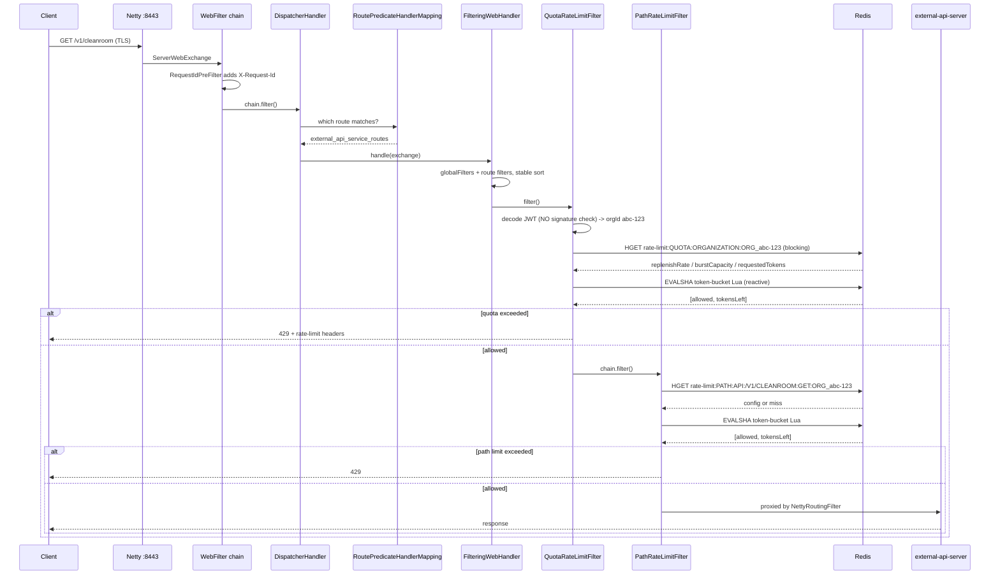

# 02 — End-to-end trace: `GET /v1/cleanroom`

Assume `Authorization: Bearer <jwt>` carrying org claim `abc-123`, and **no** `LR-Org-ID` header.



---

## ① Netty — TLS termination on `:8443`

```yaml
# application.yml:24-32
server:
  port: ${SERVER_LISTEN:8443}
  ssl:
    enabled: ${SERVER_TLS_ENABLED:true}
    key-store: file:${SERVER_KEYSTORE}
    key-store-type: PKCS12
```

Netty's `SslHandler` decrypts the bytes. Everything after this point sees plaintext HTTP.
"TLS termination" simply means *the encrypted tunnel ends here* — the gateway→backend hop is a
separate connection (also HTTPS here, since the downstream URLs are `https://`).

## ② `WebFilter` chain — WebFlux level, before gateway routing

`RequestIdPreFilter` (`RequestIdPreFilter.java:20`) implements `WebFilter, Ordered` and stamps
`X-Request-Id` if absent, so one request can be correlated across every downstream service.

> Note the in-code `FIXME`: MDC does not propagate across reactive operators, so the
> `MDC.put("requestId", ...)` on `:31` is unreliable on a reactive stack. The **header** is
> still set correctly; only the log-context binding is affected.

**There is no `SecurityWebFilterChain` in this service.** The gateway is not an auth boundary —
it never validates a JWT signature. It only *decodes* the payload to read the org claim
(`JwtDecoder.decodeWithoutValidation`, `security/JwtDecoder.java:25`). Downstream services do
the real validation.

## ③ `DispatcherHandler` → `RoutePredicateHandlerMapping`

`DispatcherHandler` is the reactive front controller. It asks each `HandlerMapping` whether it
can handle the exchange. `RoutePredicateHandlerMapping` (from `GatewayAutoConfiguration`)
answers by consulting the merged route table built in Phase A.

## ④ Route matching — two candidates for `/v1/**`

| Route id | Predicates | Result |
|---|---|---|
| `external_api_lr_routes` (`ApiGatewayConfig:169`) | `path(/v1/**)` **AND** `header(LR-Org-ID)` | ✗ header absent |
| `external_api_service_routes` (`ApiGatewayConfig:238`) | `path(/v1/**)` | ✓ **match** |

First match wins. See [`05-routes-and-lr-token-exchange.md`](05-routes-and-lr-token-exchange.md)
for why both are order `0` and why that is fragile.

## ⑤ `FilteringWebHandler` — build and sort the chain

```java
// FilteringWebHandler.getAllFilters(route), verified from the 4.3.5 jar
List<GatewayFilter> combined = new ArrayList<>(this.globalFilters);
combined.addAll(route.getFilters());
AnnotationAwareOrderComparator.sort(combined);
```

Resulting effective chain for this route:

```
RemoveCachedBodyFilter          HIGHEST_PRECEDENCE
AdaptCachedBodyGlobalFilter     HIGHEST_PRECEDENCE + 1000
NettyWriteResponseFilter        -1
ForwardPathFilter                0
QuotaRateLimitFilter             0   <- inserted 1st  (ApiGatewayConfig:91)
PathRateLimitFilter              0   <- inserted 2nd  (ApiGatewayConfig:92)
RewritePathFilter                0   <- inserted 3rd
RouteToRequestUrlFilter          10000
NettyRoutingFilter               LOWEST_PRECEDENCE
```

Quota-before-path is **correct**, but see
[`03-filter-ordering-defect.md`](03-filter-ordering-defect.md) — it is not achieved by the
mechanism the code appears to intend.

## ⑥ `QuotaRateLimitFilter.filter()`

```
getOrganizationIdFromRequest(exchange)                          :89
  ├─ Authorization header present?
  │    └─ jwtDecoder.getOrganizationFromJwt(token, isInternal=false)
  │         (isInternal = path.startsWith("/internal") -> false here)
  ├─ org claim empty? fall back to LR-Org-ID header             :101
  └─ decode threw? fall back to LR-Org-ID header                :108

orgId null/empty -> chain.filter(exchange)   [PASS THROUGH]     :44

rateLimiterConfig.quotaRateLimiter("abc-123")                   :49
  -> RateLimiterConfig.createQuotaRateLimiter                   :98
       Step 1  HGET rate-limit:QUOTA:ORGANIZATION:ORG_abc-123
       Step 2  HGET rate-limit:QUOTA:ORGANIZATION:ORG_ALL
       Step 3  both miss -> return null -> PASS THROUGH UNLIMITED  :130

quotaRateLimiter.isAllowed("quota_organization", "abc-123")     :63
  -> bucket keys:
       request_rate_limiter.{quota_organization.abc-123}.tokens
       request_rate_limiter.{quota_organization.abc-123}.timestamp
  -> !allowed -> 429 + headers, chain STOPS                     :74
  -> allowed  -> chain.filter(exchange)                         :79
```

## ⑦ `PathRateLimitFilter.filter()`

```
orgId missing -> defaults to the literal string "ALL"           :72
rateLimiterConfig.pathRateLimiter("/v1/cleanroom","GET","abc-123")  :82
  -> RateLimiterConfig.createPathRateLimiter                    :177
       Step 1  exact API match, key UPPER-CASED by buildRedisKey:
                 rate-limit:PATH:API:/V1/CLEANROOM:GET:ORG_abc-123
               then retry with ORG_ALL                          :268-270
       Step 2  SCAN rate-limit:PATH:REGEX*  -> filter by method + org,
               regex-match the path, keep LONGEST pattern       :190-204
       Step 3  same but organization == "ALL"                   :213-227
       null -> caller substitutes buildLimiter(50, 50)          :145

isAllowed("api_path_method_organization", "/v1/cleanroom:GET:abc-123")  :89
  -> request_rate_limiter.{api_path_method_organization./v1/cleanroom:GET:abc-123}.tokens
```

### The asymmetry worth remembering

| | no matching config |
|---|---|
| **Quota** | `null` → request passes through **unlimited** (fails open) |
| **Path** | `null` → a hard-coded **50/50** limiter is substituted |

## ⑧ Rewrite

`rewritePath("/v1/(?<path>.*)", "/v1/${path}")` — a **no-op**. It exists only because the shared
helper `createRouteForService` (`ApiGatewayConfig:82`) always applies one.

## ⑨ `NettyRoutingFilter`

Order `LOWEST_PRECEDENCE`, so it runs last. Proxies to
`${EXTERNAL_API_SERVER_URL}/v1/cleanroom`.

---

## Performance note

Every single request performs **blocking** Redis reads (`StringRedisTemplate`, via
`RateLimiterService` → `RedisRateLimitConfigRepository`) on a **Netty event-loop thread**, then
a separate reactive `EVALSHA` for the bucket. Blocking I/O on an event loop is the classic
reactive anti-pattern — it ties up a thread that is meant to serve thousands of concurrent
connections. Worse, `createPathRateLimiter` Step 2 issues a Redis **`SCAN`** over
`rate-limit:PATH:REGEX*` whenever the exact-match lookup misses, and a fresh `RedisRateLimiter`
object is allocated per request. A cache with a refresh listener would remove all three costs.
