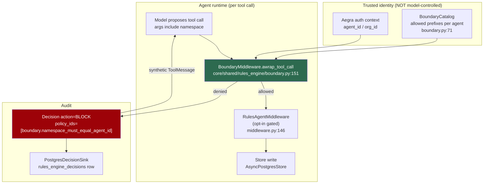
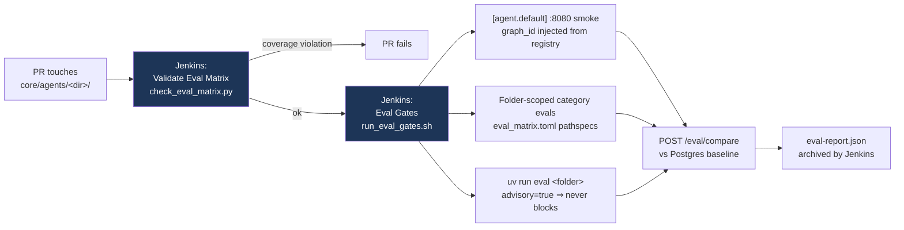

# agentic-core: the MLOps workstream and PR #1052 — namespace boundaries + Jenkins eval gates

**Session date:** 2026-08-17
**Subject:** [LiveRamp/agentic-core PR #1052](https://github.com/LiveRamp/agentic-core/pull/1052) — "Mlop 461 agentic boundaries checks ci hooks"
**Jira:** [MLOP-461](https://liveramp.atlassian.net/browse/MLOP-461) under epic [MLOP-411 "FY27Q2: Agentic Core X MLops"](https://liveramp.atlassian.net/browse/MLOP-411)

---

## 1. Problem statement

The question asked was: *what is Varsha and her team doing in agentic-core, what is PR #1052, and why — from first principles?*

**First correction, and it matters for how the PR is read: Varsha is the _author_ of #1052, not a reviewer.** The PR is authored by `vkota-93` (Varsha Kota). The requested reviewer is `msahu-onramp` plus three teams (`dev-ops`, `habu-dev`, `ghm-agentic-core`). At the time of analysis the only review on it was CodeRabbit's bot pass — **no human had commented**.

The underlying engineering problem the work addresses:

`agentic-core` is a **multi-tenant agent platform** — 18+ LangGraph graphs, many different owning teams, one shared Postgres store, one shared eval service. Three properties that a single-team prototype can leave implicit become load-bearing once the platform is shared:

1. **Tenant isolation.** Agents write to a shared `AsyncPostgresStore` under a *namespace convention*. Convention is not enforcement, and the namespace argument reaches the store as **model-chosen text inside a tool call**.
2. **Quality regression gates.** With many owning teams, "did this PR make an agent worse?" cannot be answered by unit tests, and per-team opt-in to evals does not scale — teams forget.
3. **Cost attribution.** Who spent what, per org / user / agent / provider.

MLOP-411 is the epic that retrofits all three. PR #1052 is the isolation + gating half of it.

---

## 2. First-principles explanation

### Why namespace isolation cannot be a convention

The store is shared. Isolation is by namespace tuple: agent A writes under `("A", ...)`, agent B under `("B", ...)`. But the namespace arrives as a **tool-call argument**, and tool-call arguments are produced by the model. Therefore:

> Any control that lives *above* the model — a prompt instruction, a docstring, a naming convention — is advisory. A prompt injection, or an ordinary bug, produces a namespace the platform will happily honour.

In a multi-tenant system, agent A writing into agent B's namespace is a **cross-org data leak**, not a bug report. So the check has to move *below* the model, into the tool-call path, and derive identity from the **caller's auth context** rather than from anything the model can influence.

### Why eval gates must be on-by-default

A gate that each team has to opt into is a gate that measures the teams who were already careful. With 18+ graphs the failure mode is silent: a new agent lands with no eval coverage and nobody notices for months. The design response is to make **coverage itself** the thing CI enforces — a stage that fails the PR when an agent exists without a matrix entry — and to give every enrolled agent a generic smoke test automatically so the default is "covered", not "unregistered".

### Why the eval harness needs its own monitoring

The subtle one. An eval judge that fails returns `value == 0.0`. A genuinely bad agent response also scores `0.0`. **Without a detector, "the eval service is broken" and "all evals green" produce the same dashboard.** Hence the three detectors in the sibling ticket MLOP-459.

---

## 3. High-level architecture

---

## 4. End-to-end runtime flow (boundary check)

Verified by reading `core/shared/rules_engine/boundary.py` in full on branch `MLOP-461-Agentic-boundaries-checks-CI-hooks`:

1. Model emits a tool call. `BoundaryMiddleware.awrap_tool_call` (`boundary.py:151`) intercepts before the tool runs.
2. If `self._boundary_enabled` is false → delegate straight to `super()`. (`boundary.py:152-154`)
3. `extract_namespace_from_args` (`boundary.py:57`) looks for the **first** of three arg keys — `("namespace", "ns", "store_namespace")` (`boundary.py:29`).
4. **If no namespace arg is found → the call passes through unchecked** (`boundary.py:164-165`, and `is_allowed` returns `True` at `boundary.py:102-103` with the comment *"no namespace target → not a boundary concern"*).
5. `_resolve_org_id` (`boundary.py:180`) resolves org identity in priority order: constructor `self.org_id` → `tool_args["org_id"]` → `state["org_id"]` → `state["configurable"]["org_id"]`.
6. `BoundaryCatalog.is_allowed` (`boundary.py:94`) permits the write when `ns[0]` equals the `agent_id`, the `org_id`, or a registered prefix — each compared across hyphen/underscore variants via `_id_variants` (`boundary.py:67`).
7. On denial: `_block_decision` (`boundary.py:196`) builds a `Decision(action=BLOCK, tier=PLATFORM, severity=ERROR, policy_ids=(BOUNDARY_POLICY_ID,))` carrying `namespace`, `org_id` and `allowed_prefixes` in metadata.
8. `_emit_audit` (`boundary.py:220`) calls `emit_decision(...)` to fan out to all registered sinks, plus an optional explicit `_decision_sink` wrapped in a `try/except` that logs rather than raises.
9. The caller receives `_blocked_tool_message(...)` (`middleware.py:251`) — a **synthetic `ToolMessage`**, not an exception, so the agent sees the refusal in-conversation and can recover.

### The three design choices that carry the whole ticket

| Choice | Where | Why it matters |
|---|---|---|
| `ns[0]` must equal `agent_id` / `org_id`, taken from auth context | `boundary.py:94-118` | The agent cannot *name* its way out of its own namespace. Identity is never read from a model-supplied field except as a fallback for `org_id`. |
| Boundary checks **bypass the rules-engine opt-in gate** | `boundary.py:130-135` docstring; contrast `should_enable_rules` at `middleware.py:46` | Every other rule is two-key opt-in (env `RULES_ENGINE_ENABLED` **and** per-agent `rules_engine.enabled` in `liveramp.agents.json`). Isolation is deliberately *not* opt-in. A security property that a forgotten config line can disable is not a security property. |
| BLOCK is auditable, not silent | `boundary.py:196-250` | "We blocked it" is worth nothing at a security review without the `rules_engine_decisions` row to prove it. |

---

## 5. What PR #1052 actually contains

`+6471 / −265` across **76 files**. It is **not one change** — it is four, and it is **stacked on two of the author's own still-open PRs**.

| # | Change | Key paths |
|---|---|---|
| 1 | **Namespace boundary enforcement** — the only part matching MLOP-461 | `core/shared/rules_engine/boundary.py` (249 lines), `middleware.py`, `tests/test_boundary_middleware.py` (252 lines) |
| 2 | **Eval gates moved GitHub Actions → Jenkins** | `Jenkinsfile` (+38), `scripts/ci/*` (~1000 lines new), `.github/workflows/pr-eval*.yml` reduced to `workflow_dispatch` |
| 3 | **Postgres-backed eval service** | `compatibility/eval/job_store.py`, `baseline_store.py`, `rubrics/store.py`, 3 SQL migrations |
| 4 | **Platform metrics + drift detection** | `metrics/cost_metrics.py`, `metrics/policy_metrics.py`, `monitoring/detectors.py` |

### The stacking problem

Commit history on the branch shows merge commits from `mlop-459-model-monitoring-eval-hooks`, and commit `b4af93c4 "Add baseline storage and comparison functionality"` is the head of PR #722:

| PR | Opened | Size | State |
|---|---|---|---|
| [#722](https://github.com/LiveRamp/agentic-core/pull/722) baseline storage | 2026-07-20 | +2018/−24 | **open** |
| [#1041](https://github.com/LiveRamp/agentic-core/pull/1041) MLOP-459 monitoring | 2026-08-14 | +5944/−265 | **open** |
| [#1052](https://github.com/LiveRamp/agentic-core/pull/1052) MLOP-461 boundaries | 2026-08-17 | +6471/−265 | **open** |

#1041 and #1052 are nearly the same size because #1052 *contains* #1041. **Reviewing #1052 in isolation means re-reviewing #722 and #1041.** Reviewing them in the wrong order, or merging them out of order, produces conflicts.

Note also the PR carries the label `change/standard` — *"Trivial / minor changes that are low-impact, low risk"* — on a 76-file diff that adds a security control.

---

## 6. Why the CI changes were made this way

Read from `docs/test-and-evaluate/eval-gates-for-agent-owners.md` (new in this PR) and `AGENTS.md`:

**Why Jenkins and not GitHub Actions.** An eval is not a unit test — it needs the whole stack up (Postgres, Langfuse, ChromaDB, agent-server on `:8080`, search-server on `:8081`) plus LLM credentials for the judge. Jenkins already owns the deploy pipeline, the k8s agent pods (`k8sAgentYaml(cpu: '4', memory: '8Gi')`) and the credential store. The GitHub Actions workflows are kept as `workflow_dispatch` manual fallbacks rather than deleted — a reversible migration.

**Coverage by default, not by opt-in.**
- `[agent.default]` in `scripts/ci/eval_matrix.toml` gives every enrolled agent a generic `:8080` smoke automatically, with the runner injecting the registry `graph_id`. The doc is explicit: *"no per-agent smoke entry required"* and *"do not hand-edit a per-agent smoke block."*
- `check_eval_matrix.py` runs as the Jenkins stage **Validate Eval Matrix** and fails the PR on coverage violations. `AGENTS.md` adds it to the new-agent checklist marked **"do not skip"**. The gate enforces its own adoption.

**Folder-scoped triggers.** A change under `core/agents/marketplace-search/` does *not* run segmentation/xmi/cleanroom evals. Categories in `eval_matrix.toml` (`prompts`, `tools`, `models`, `retrieval`, `guardrails`) fire on git pathspec match. Without scoping, every PR pays for every agent's evals and teams route around the gate.

**Graduated enforcement — the mature call.** Three separate escape hatches, all *visible*:
- `advisory = true` on a `uv_eval` block → runs, reports `ADVISORY FAIL`, never blocks.
- `opt_out = true` + a required `reason` → for reference stubs only.
- `POST /eval/compare` regression check is advisory unless the agent is in `EVAL_REGRESSION_ALLOWLIST`.

> A gate with no legitimate downgrade path gets disabled outright. A gate with a *named, visible* downgrade path stays on and stays honest about what is degraded.

---

## 7. Design options considered (as implied by the diff and tickets)

| Option | Chosen? | Trade-off |
|---|---|---|
| Enforce isolation via prompt/docstring convention | ✗ (status quo being replaced) | Zero cost, zero enforcement — model-controlled |
| Enforce in each store tool | ✗ | Per-tool duplication; unit of forgetting = every new tool |
| **Enforce in middleware at `awrap_tool_call`** | ✓ | One choke point; but only sees args it knows the names of |
| Enforce in Postgres (RLS / grants) | ✗ (not discussed in tickets read) | Strongest, but the store is a single app-owned connection; no per-agent DB principal exists |
| Boundary behind the rules-engine opt-in gate | ✗ | Consistent with other rules, but disableable by omission |
| **Boundary independent of the opt-in gate** | ✓ | Cannot be silently turned off; cost is one more always-on hook in every tool call |
| Keep evals in GitHub Actions | ✗ | No stack, no credentials, no k8s pods |
| **Move to Jenkins, keep GHA as `workflow_dispatch`** | ✓ | Reversible; but splits CI across two systems |
| Per-agent eval registration | ✗ | Does not scale to 18+ graphs across many teams |
| **`[agent.default]` smoke + CI-enforced coverage check** | ✓ | On by default; cost is a generic smoke that proves little beyond "agent responds" |

---

## 8. Findings — open issues on the PR

### From CodeRabbit (7 actionable, 2 Critical) — bot-reported, **not independently verified in this session**

| Severity | File:line | Finding |
|---|---|---|
| 🔴 Critical | `scripts/ci/eval_plan.py:58` | A **no-work eval plan turns the Eval Gates stage red** — a PR touching nothing eval-relevant fails CI. The gate's own false positive. |
| 🔴 Critical | `scripts/ci/ensure_eval_matrix_entry.py:109` | Can emit a **duplicate `[agent.<dir>.uv_eval]` table** — the idempotency the doc promises is not there. |
| 🟠 Major | `compatibility/eval/baseline_store.py:105` | `_connect()` has **no connect timeout** on `psycopg.connect`. |
| 🟠 Major | `compatibility/eval/routers/evals.py:140` | Three `async def` endpoints make **blocking** baseline-store calls — should run in a worker thread. |
| 🟠 Major | `scripts/ci/run_eval_gates.sh:110` | The eval-service container is **never removed**, so re-runs fail. |
| 🟠 Major | `Jenkinsfile:259` | Security & privacy finding. |
| 🟡 Minor | `scripts/eval_ci.py:54` | Functional correctness. |

### Found by reading the source in this session (highest-value review comment)

**`extract_namespace_from_args` only recognises three arg names** — `("namespace", "ns", "store_namespace")` at `boundary.py:29` — and `is_allowed` **returns `True` when no namespace is found** (`boundary.py:102-103`).

> Any store-write tool whose parameter is called something else — `path`, `key`, `scope`, `collection`, `bucket` — gets **no isolation at all, and nothing reports it.** The failure is silent and indistinguishable from "allowed".

This is the single thing worth raising in review, because everything else on the list is recoverable while this one is a security control with a quiet hole. Two possible hardenings: fail-closed for tools on a known store-write allowlist, or assert at registration time that every store-write tool declares a recognised namespace parameter.

### Process observations

- **Jira and git have diverged.** MLOP-459 and MLOP-461 are both marked **Done** (updated 2026-08-16) while their PRs sit **open and un-reviewed by any human**.
- Three stacked open PRs from one author spanning 2026-07-20 → 2026-08-17, total ~+14,400 lines, with no human review on the newest.

---

## 9. The team and the epic

Epic **[MLOP-411 "FY27Q2: Agentic Core X MLops"](https://liveramp.atlassian.net/browse/MLOP-411)** — status **On Track**, priority 3-Low. Varsha Kota is the **reporter on every child story inspected**, i.e. she decomposed the epic.

| Workstream | Owner | Stories seen |
|---|---|---|
| **Eval / CI gates / monitoring / boundaries** | Varsha Kota | MLOP-459 model monitoring (Done), MLOP-461 boundary checks + CI hooks (Done), MLOP-455 decide filestore future (Done) |
| **Cost attribution & billing** | Manoj Kumar | MLOP-438 design (Done), MLOP-428 cost attribution middleware (Done), MLOP-436 Grafana cost dashboard (Done), MLOP-437 `aca_cost_ledger` daily rollups (To Do), MLOP-429 pod cost via `/metrics` (To Do, unassigned) |
| **Shared memory + governance** | Geetha Vardhan | MLOP-451 `core/shared/memory/` over `AsyncPostgresStore` (Done), MLOP-452 rules-engine governance on memory ops (Done), MLOP-453 memory registry opt-in (To Do, unassigned), MLOP-458 data-access regression tests (To Do) |

⚠️ **Only 10 of ~22 child stories were enumerated** — the Jira API paged out with `remainingCount: 12`. The workstream split above is complete for what was read, not for the epic.

**The connective tissue worth noticing:** MLOP-451 defines the memory namespace as `("mem", scope, org_id, agent_id, [user_id], collection)` built from auth identity, *"never agent input, so cross-agent access is impossible by construction"*. MLOP-461's boundary middleware is the **enforcement** for exactly that claim — Geetha's design asserts the invariant, Varsha's middleware makes it true at runtime. They are two halves of one control.

---

## 10. Prior art in the same repo (from PR history)

| PR | Date | State | Relevance |
|---|---|---|---|
| [#36](https://github.com/LiveRamp/agentic-core/pull/36) | 2026-04-06 | merged | Original CI evaluation system with GitHub Actions + rubric assessment — the thing #1052 is migrating off |
| [#211](https://github.com/LiveRamp/agentic-core/pull/211) | 2026-06-03 | merged | **Rules engine** (+8118) — the framework `BoundaryMiddleware` extends |
| [#596](https://github.com/LiveRamp/agentic-core/pull/596) | 2026-07-03 | open | "Test Eval CI" Jenkinsfile stage — first move toward Jenkins |
| [#37](https://github.com/LiveRamp/agentic-core/pull/37) | 2026-04-08 | open | `[DONOT MERGE]` eval PR-comment experiment |

---

## 11. Key files, classes and methods (all verified on branch `MLOP-461-Agentic-boundaries-checks-CI-hooks`)

| Symbol | Location |
|---|---|
| `BOUNDARY_POLICY_ID = "boundary.namespace_must_equal_agent_id"` | `core/shared/rules_engine/boundary.py:26` |
| `_NAMESPACE_ARG_KEYS = ("namespace", "ns", "store_namespace")` | `boundary.py:29` |
| `normalize_namespace()` | `boundary.py:32` |
| `extract_namespace_from_args()` | `boundary.py:57` |
| `_id_variants()` — hyphen/underscore equivalence | `boundary.py:67` |
| `class BoundaryCatalog` | `boundary.py:71` |
| `BoundaryCatalog.register()` | `boundary.py:83` |
| `BoundaryCatalog.is_allowed()` | `boundary.py:94` |
| ↳ *"no namespace target → not a boundary concern"* | `boundary.py:102-103` |
| `get_default_catalog()` / `_DEFAULT_CATALOG` | `boundary.py:120`, `:123` |
| `class BoundaryMiddleware(RulesAgentMiddleware)` | `boundary.py:128` |
| `BoundaryMiddleware.awrap_tool_call()` | `boundary.py:151` |
| `BoundaryMiddleware._resolve_org_id()` | `boundary.py:180` |
| `BoundaryMiddleware._block_decision()` | `boundary.py:196` |
| `BoundaryMiddleware._emit_audit()` | `boundary.py:220` |
| `should_enable_rules()` — the two-key opt-in gate boundary bypasses | `core/shared/rules_engine/middleware.py:46` |
| `_env_enabled()` / `_agent_flag()` | `middleware.py:57`, `:66` |
| `class RulesAgentMiddleware(AgentMiddleware)` | `middleware.py:146` |
| `RulesAgentMiddleware.awrap_tool_call()` | `middleware.py:188` |
| `_blocked_tool_message()` | `middleware.py:251` |
| `__getattr__` lazy re-export of `BoundaryCatalog`/`BoundaryMiddleware` | `middleware.py:662` |
| Boundary tests (252 lines) | `core/shared/rules_engine/tests/test_boundary_middleware.py` |
| Eval matrix categories + `[agent.default]` | `scripts/ci/eval_matrix.toml` |
| Coverage gate | `scripts/ci/check_eval_matrix.py` (240 lines) |
| Matrix entry helper | `scripts/ci/ensure_eval_matrix_entry.py` (169 lines) |
| Jenkins gate runner | `scripts/ci/run_eval_gates.sh` (139 lines) |
| Agent-owner migration doc | `docs/test-and-evaluate/eval-gates-for-agent-owners.md` (80 lines, new) |

---

## 12. Verified vs inferred

**Verified — read directly from the branch or the Jira API:**
- PR #1052 metadata, file list, commit list, reviewers, labels, review state
- `core/shared/rules_engine/boundary.py` — read in full, line numbers confirmed by grep
- `core/shared/rules_engine/middleware.py` — read in full, line numbers confirmed by grep
- `docs/test-and-evaluate/eval-gates-for-agent-owners.md` — read in full
- `AGENTS.md` — read (partial, ~120 lines)
- `scripts/ci/eval_matrix.toml` — read (first ~110 lines, 5 of the categories)
- `Jenkinsfile` — read **first 70 lines only** (environment + early stages)
- Jira MLOP-461, MLOP-459 full descriptions; 10 child stories of MLOP-411
- PR list for `vkota-93` and the last 40 repo PRs

**Inferred — NOT read at source, treat as unconfirmed:**
- `compatibility/eval/monitoring/detectors.py` — the three detectors (judge saturation, zero-score spike, PSI drift) and the ">10% zero scores" threshold come from the **MLOP-459 ticket text**, not the code.
- `cost_metrics.py`, `policy_metrics.py`, `baseline_store.py`, `job_store.py`, `run_eval_gates.sh`, `eval_plan.py`, `check_eval_matrix.py` — described from the CodeRabbit walkthrough and the docs, **not read**.
- The Jenkins **"Validate Eval Matrix"** and **"Eval Gates"** stages are described from `eval-gates-for-agent-owners.md`; the actual stage bodies in the `Jenkinsfile` were **not** read.
- The `max_concurrent_judge_calls = 5` semaphore cap comes from the MLOP-459 ticket.
- All 7 CodeRabbit findings are **bot claims, not independently reproduced**.

---

## 13. Open questions

1. **Does any store-write tool in the repo use a namespace parameter outside the three recognised names?** This determines whether the boundary hole is theoretical or live. Requires grepping the tool definitions under `core/agents/**/tools/**` and `core/shared/`.
2. **Is `BoundaryMiddleware` actually wired into any agent's middleware chain on this branch**, and is it placed *first* as its docstring requires? The class exists and is tested; adoption was not verified.
3. **Why are MLOP-459 and MLOP-461 marked Done with PRs open?** Is there a parallel merged path, or is Jira ahead of reality?
4. **What is the intended merge order** for #722 → #1041 → #1052, and does anyone besides the author know they are stacked?
5. **Does `_DEFAULT_CATALOG` being a process-wide mutable singleton** (`boundary.py:120`) create cross-test or cross-tenant bleed in a multi-agent server process?
6. The remaining **12 unenumerated MLOP-411 child stories** — is there a fourth workstream?
7. Does the `change/standard` label ("low-impact, low risk") route this PR around a heavier review path it should be getting?

---

## 14. Next steps

1. **Raise the arg-name coverage gap** on PR #1052 as the primary review comment — it is the one finding that is silent when it fails.
2. Grep `core/agents/**/tools/**` for store-write tool signatures to convert open question #1 from theoretical to answered.
3. Ask whether #722 / #1041 / #1052 can be merged bottom-up, or whether #1052 should be split so the ~250-line boundary change can land independently of ~6,200 lines of eval infrastructure.
4. Check whether `BoundaryMiddleware` is registered in any agent graph, and whether ordering-before-`ResourceMiddleware` is asserted anywhere other than the docstring.
5. Read `compatibility/eval/monitoring/detectors.py` to confirm the detector thresholds match the MLOP-459 acceptance criteria (>10% zero-score, no false positives on healthy baseline).
6. Reconcile Jira status with PR state before the epic is reported as On Track at the next review.

---

## 15. Related knowledge

Nothing else in this knowledge base covers `agentic-core` internals — this is the first entry on it. The rules-engine framework that `BoundaryMiddleware` extends was merged as agentic-core PR #211 (2026-06-03) and is not documented here.

A separate, unpublished note comparing habu-gai to agentic-core as a platform choice exists at `Habu_Cloned_Repo/aditya-Habu_analysis_May_2026/2026-07-07-habu-gai-vs-agentic-core-recommendation.txt` on the local machine.
