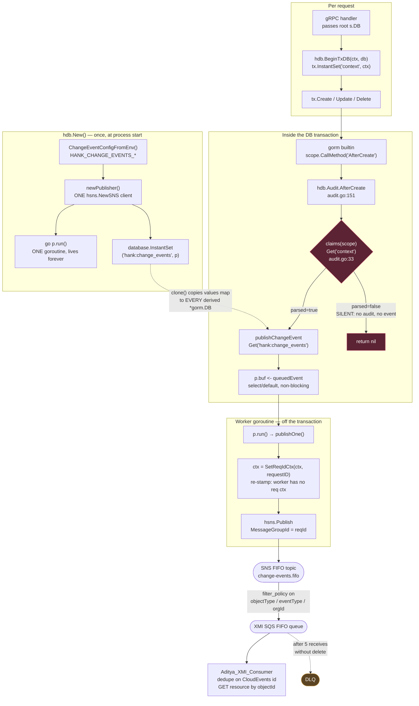

# hank Change Events → XMI: wiring, filtering, and the silent-skip audit

**Date:** 2026-08-17
**Repos:** `hank` (producer), `forebitt` (host service), `Aditya_XMI_Consumer` (Java reference consumer), `orinjade` (terraform)
**Status:** DATA_CONNECTION verified end to end. 7 silent-skip defects found in forebitt. FLOW / FLOW_RUN / DATASET not yet swept.

---

## Problem statement

LiveRamp Clean Room needs to push change notifications to the XMI team so they can stop polling. The chosen mechanism is a CloudEvents v1.0 envelope on a FIFO SNS topic, emitted from hank's gorm model-layer audit hook (decision recorded 2026-07-30, Anil/Josh: model-layer hooks over service-layer emit).

Three questions had to be answered before handing the contract to XMI:

1. **How is the SNS client wired?** The reviewer's prior pattern built a client per publish call (`hevent.New(config)` inside every operation). The new code does something different and it wasn't obvious how one client reaches every forebitt operation.
2. **How does XMI filter the stream?** The existing `habu-events` terraform filters on a message attribute; the ask was whether `subject` could be used the same way.
3. **Is the stream trustworthy?** Specifically: can a write succeed and emit nothing?

Answer to (3) is **yes, and it does — 7 places in forebitt.** That's the substantive finding.

---

## First principles: why there is no per-operation client

The old pattern is **call-site wiring** — each handler constructs a client and calls publish. The new pattern is **construction-site wiring**: the client is built once and every operation *finds* it. There is no publish call site at all; the publish is a side effect of the row write.

The mechanism is gorm v1's per-`*gorm.DB` `values sync.Map`:

```go
// hank/db/service.go:74-84
if ceCfg := ChangeEventConfigFromEnv(); ceCfg.Enabled && ceCfg.TopicARN != "" {
    if p, err := newPublisher(ceCfg); err != nil {
        logrus.Errorf("change events disabled: %v", err)   // never fatal
    } else {
        go p.run()                                  // ONE goroutine, lives forever
        database.InstantSet(changeEventsKey, p)     // stash on the DB
    }
}
```

Two details carry the whole design:

- **`InstantSet`, not `Set`.** `Set` (gorm@v1.9.16/main.go:774) clones and returns the *clone*; the `database` that `New()` returns would not have the publisher. `InstantSet` (main.go:779) mutates in place.
- **`clone()` copies the values map** (main.go:844). Every chain method — `Where`, `Model`, `Create`, `Begin` — clones, so the publisher propagates to every derived `*gorm.DB` in the process, including inside transactions. The stored value is a `*publisher`, so thousands of clones share one SNS client and one goroutine.

The hook fires without per-model registration because `hdb.Audit` defines `AfterCreate`/`AfterUpdate`/`AfterDelete`, gorm calls those by reflection (`callback_create.go:192`, `callback_update.go:115`, `callback_delete.go:61`), and every forebitt model embeds `hdb.Audit`. **So it is wired per model embedding, not per operation.** That's also why one `db.Create(&job)` produced 3 events in the 2026-08-15 run — the hook fires per *row*, and a `DataImportJob` insert cascades two `OrganizationJobParameter` children.

**The elegant part:** the same mechanism carries the request context. `BeginDB`/`BeginTxDB` (`audit.go:224-234`) call `tx.InstantSet("context", ctx)`. Identical call, different receiver — and that alone sets the scope:

| Key | Set on | Set when | Visible to |
|---|---|---|---|
| `hank:change_events` | root `database` from `New()` | once, at boot | every clone in the process, forever |
| `context` | the `tx` from `db.Begin()` | every request | only clones of that transaction |

`clone()` copies downward and never upward, so process-scoped infrastructure and request-scoped state ride the same rail without colliding.

---

## High-level architecture



The red path is the defect: the publisher is always reachable via the values map, but `claims()` decides whether it is ever asked.

## End-to-end runtime flow

```
service code → db.Create/Save/Delete/Update
  → gorm builtin callback → scope.CallMethod("AfterCreate")
    → hdb.Audit.AfterCreate                        audit.go:151
      → claims(scope)  ── reads scope.DB().Get("context")   audit.go:33   ← THE GATE
        → publishChangeEvent(ctx, scope, auditLog) audit.go:165
          → scope.DB().Get("hank:change_events")   change_events.go:236
            → p.buf <- queuedEvent{...}  (select/default, non-blocking)  :277
              → p.run() → p.publishOne()           :176 / :190
                → ctx = contexts.SetReqIdCtx(ctx, qe.requestID)   ← re-stamp
                  → hsns.Publish → sns.PublishInput{MessageGroupId: reqId}
                                                   hank/aws/sns/service.go:33-48
```

`p.buf <-` is the **handoff, not the emission**. Three hops remain. `queuedEvent` carries `requestID` as its own field because the worker goroutine runs on `context.Background()` and has no request context — without re-stamping, `GetReqIdCtx` mints a fresh uuid per message and every event lands in its own FIFO group, i.e. no ordering at all (`change_events.go:102-106`).

**Why async and never returns an error:** the hook runs *inside* the transaction, immediately before `gorm:commit_or_rollback_transaction`. A returned error rolls the transaction back. Synchronous SNS would hold row locks across a network round trip, and an SNS outage would fail customer writes. The cost: an event can be published for a transaction that later rolls back — which is why the contract is "GET the resource by `objectId`".

---

## The defect: emission is gated on something unrelated to emitting

`claims()` is called in exactly five places, all `hank/db/audit.go`, always as the first statement, and every one bails on `!parsed` with a bare `return nil`:

```
:126 BeforeCreateHook   :151 AfterCreate   :170 BeforeUpdateHook
:187 AfterUpdate        :206 AfterDelete
```

`claims()` returns `parsed=false` when `"context"` is absent — and `"context"` is **only** ever set by `BeginDB`/`BeginTxDB`. So a write on a raw `*gorm.DB` commits with **no audit log, no change event, no error, no warning.** The publisher was reachable the whole time; it was simply never asked.

### Proof pair — same model, same file

```go
// forebitt/db/job_run_mapping.go:13  — EMITS
func CreateQuestionRunMapping(ctx context.Context, db *gorm.DB, ...) {
    tx := hdb.BeginTxDB(ctx, db, &sql.TxOptions{})   // InstantSet("context", ctx)
    err := tx.Create(&mappingInfo).Error

// forebitt/db/job_run_mapping.go:64  — SILENT
func DeleteQuestionRunMapping(ctx context.Context, db *gorm.DB, ...) error {
    scopes := db.Scopes()          // raw db. ctx is RIGHT THERE and unused.
    err := scopes.Delete(mappingInfo).Error
```

Handler `api/server/import_job_v2.go:192` passes `s.DB` straight through. Net effect: XMI sees the mapping **created** and never sees it **deleted** — worse than emitting nothing, because the mirror silently diverges.

### All 7 findings (forebitt)

| # | file:line | function | model | verb |
|---|---|---|---|---|
| 1 | `db/job_run_mapping.go:64` | `DeleteQuestionRunMapping` | `DataImportJobQuestionRunMapping` | DELETE |
| 2 | `db/job.go:508` | `UpdateSegmentReconciliationStatusBySegmentID` | `SegmentReconciliationStatus` | UPDATE |
| 3 | `db/job.go:533` | `DeleteSegmentMetadataByID` | `SegmentMetadata` | DELETE |
| 4 | `db/field_description.go:108` | `DeleteFieldDescriptionsByJobID` | `FieldDescription` | DELETE |
| 5 | `db/field_description.go:113` | `DeleteFieldDescriptionByJobIDAndFieldName` | `FieldDescription` | DELETE |
| 6 | `db/fieldconfiguration.go:160` | `DeleteFieldConfigurationsByDataImportJobID` | `DataImportJobFieldConfiguration` | DELETE |
| 7 | `db/job_parameters.go:58` | `PopulateIDOfOrganizationJobParameter` | `OrganizationJobParameter` | UPDATE |

**6 of 7 are DELETE or UPDATE. Zero are CREATE.** Creates get written as `...InTransaction(tx *gorm.DB)` helpers because they need atomicity across parent and child rows; deletes get written as one-line convenience functions on the raw handle. The asymmetry in the code produces the asymmetry in the stream.

**`models.DataImportJob` (= `DATA_CONNECTION`) is clean** — every write goes through a `tx` (`job.go:162`, `:242`, `:437`). All 7 gaps are on satellite models that fall through to `strings.ToUpper` and therefore aren't in XMI's filter policy anyway. Bounded problem, not contract-breaking.

Fix per site: one line, `tx := hdb.BeginTxDB(ctx, db, &sql.TxOptions{})`, plus threading `ctx` into signatures #2–#7 and Commit/Rollback.

---

## What XMI filters on

SNS filter policies match **message attributes**, not the body — so `subject` is **not** usable in the pegleg-style policy. Confirmed on the wire (all 15 messages, 2026-08-17):

```
action     (3) : CREATE, DELETE, UPDATE
eventType  (3) : com.liveramp.cleanroom.data_connection.{created,updated,deleted}
objectType (1) : DATA_CONNECTION
orgId      (1) : org-adidas-emea
requestId  (6) : req-create-01/02, req-update-01/02, req-delete-01/02
```

Plumbing detail: with `RawMessageDelivery=false` the **SQS-level attributes are empty** — SNS attributes arrive inside `body.MessageAttributes`. Doesn't affect filtering (evaluated at SNS before delivery), does affect consumer code.

**Recommended subscription:**

```hcl
filter_policy = jsonencode({
  objectType = ["DATA_CONNECTION", "FLOW", "FLOW_RUN", "DATASET"]
  action     = ["CREATE", "UPDATE", "DELETE"]
})
```

Applied to the 2026-08-15 run this delivers 13 of 23, dropping all 10 `ORGANIZATIONJOBPARAMETER` child-row events.

**Naming mismatch to settle:** the existing module uses key `object` with camelCase values (`orinjade/aws/modules/habu-events/locals.tf:6` → `dataImportJob`, `cleanroom`, …). The new emitter uses `objectType` with `DATA_CONNECTION`. Either XMI adopts the new contract, or hank dual-emits an `object` attribute (one line at `change_events.go:197`) so pegleg and janus stay untouched. **Recommend dual-emit.**

`subject` filtering *is* possible via `filter_policy_scope = "MessageBody"` with a `prefix` match, but body scope and attribute scope can't be mixed on one subscription, and `subject` is a composite `<orgId>/<TYPE>/<objectId>` — prefix-matching it is a fragile way to do what `orgId` + `objectType` attributes already do.

---

## Three IDs, not two

| Layer | Example | Use |
|---|---|---|
| SQS `MessageId` | `234a1554-…` | AWS, per message on the queue. **Not for dedupe.** |
| SNS `MessageId` | `d8890bdf-…` | AWS, per publish to the topic. Different value, same event. |
| CloudEvents `id` | `4a096ee2-…` | Producer, `uuid.New()` at `change_events.go:307`. **Dedupe on this.** |

---

## Verification runs

**2026-08-15** — 23 mixed events, 13 groups, 23/23 CloudEvents-valid.
**2026-08-17** — 15 `DATA_CONNECTION` events (5 objects × create/update/delete), 6 groups, 15/15 valid. Pre-consume peek confirmed all 15 on the queue in publish order before the worker ran.

### Finding: cross-group ordering is arbitrary — now proven

Delivery order of groups as the worker received them:

```
req-update-01 (3)  ← UPDATES ARRIVED FIRST
req-update-02 (2)
req-create-01 (3)  ← creates arrived AFTER the updates
req-create-02 (2)
req-delete-01 (3)
req-delete-02 (2)
```

Published create → update → delete. **XMI received the UPDATE for `a1111111-…` before the CREATE for it.** Within every group, order was perfect. FIFO did exactly what it promises — the promise is just narrower than it looks, because `MessageGroupId` = the originating `requestId` (`hank/aws/sns/service.go:48`) and one object's lifecycle spans three requests.

This is **survivable** precisely because the payload is a notification and the consumer GETs by `objectId`: an update arriving early resolves to whatever the resource currently is; an early delete resolves to 404 → absent. Worth telling XMI explicitly, since it converts an ordering bug into a non-issue. Making `MessageGroupId` the `objectId` instead would serialize all events per object — real throughput cost, and unnecessary.

### Operational finding: the DLQ cliff

Queue `maxReceiveCount = 5`. While peeking without deleting, 8 receive passes pushed **all 15 messages to the DLQ at once** and the consumer then reported 0. For XMI's runbook: a consumer that receives and doesn't delete — crashed mid-handler, throwing on every message, or merely looking — DLQs the entire batch after 5 attempts, with no partial degradation and no warning. Alarm on DLQ depth > 0 from day one, and grant `sqs:StartMessageMoveTask` to whoever operates the redrive (it was *not* granted on the test IAM user, so the batch had to be republished).

---

## Trade-offs recorded

| Decision | Benefit | Cost |
|---|---|---|
| Model-layer gorm hook | zero code per operation; impossible to forget in a handler | fires per *row*, so one API call emits N events (child-row noise) |
| Async, never errors | SNS outage can't fail customer writes; no locks held over the network | event can publish for a rolled-back tx; publish errors only reach a log line; no retry, no producer DLQ |
| `MessageGroupId` = requestId | per-request ordering; no head-of-line blocking across tenants | no per-object ordering |
| Notification, not state transfer | small events; no field-level leakage on a shared topic | consumer must GET by id |
| Producer allow-list unset | new consumer needs no producer change | every consumer sees all types until it filters |
| Config from `os.Getenv` | one variable name across all services | not visible in viper/pflag config dumps |

---

## Recommendation

1. **Fix the 7 sites** (one line each) — mechanical, do it now.
2. **Decouple emission from `claims()`** — let `publishChangeEvent` read `orgId`/`requestId` from the context when present but emit regardless. An event with an empty `orgId` still dedupes on `objectId` and is useful; no event is not. This removes the *class* of bug. Needs Anil's sign-off since it changes audit-log behaviour too.
3. **Dual-emit the legacy `object` attribute** so pegleg/janus are untouched while XMI adopts `objectType`.
4. **Sweep unhygienix and picanmix** with the method doc before promising FLOW / FLOW_RUN / DATASET.
5. **Wire `publisher.Close()`** — it's defined at `change_events.go:185` and nothing calls it, so in-flight events are lost on shutdown.

---

## Open questions

- Does XMI accept notification semantics and GET-by-`objectId`?
- `objectType`/SCREAMING_SNAKE vs `object`/camelCase — which, or dual-emit?
- Is per-request ordering sufficient? (Recommend yes.)
- Does XMI tolerate `objectName` being absent on DELETE? (It is, on all deletes.)
- Who owns and alarms the DLQ?
- **FLOW_RUN risk:** flow runs are written by async workers with no request context, so they may never call `BeginTxDB` anywhere — meaning FLOW_RUN could emit nothing at all. Check this first in picanmix; it's the likeliest large finding.
- Do any write paths use raw `Exec()`/`Raw()` SQL? No gorm callback sees those.

---

## Files in this folder

| File | Contents |
|---|---|
| `2026-08-17_publisher_wiring_and_gorm_values_map.txt` | old-vs-new client mapping, `InstantSet`/`clone()` mechanics, the `context` parallel, full emit path, `Close()` gap |
| `2026-08-17_xmi_filtering_and_15_event_run.txt` | payload shape, three ID layers, filter-policy options + terraform, the 15-event run, ordering and DLQ findings, XMI open items |
| `2026-08-17_method_find_silently_skipped_change_events.txt` | **reusable procedure** — the greps and awk sweep to find silent-skip writes, triage rules, the 7 forebitt findings, and how to run it against unhygienix/picanmix |
| `2026-08-17_publish15_harness.sh` | the publisher used for the 15-event run |
| `2026-08-17_consumer_run_output_15_dataconnection_events.log` | full worker output, 15 events |
| `2026-08-15_consumer_run_output_23_events.log` | full worker output, 23 events (prior run) |

## Key source references

| Location | What |
|---|---|
| `hank/db/service.go:74-84` | publisher construction + `InstantSet` |
| `hank/db/service.go:101-109` | `applyEmbeddedHooks` (before-callbacks only) |
| `hank/db/change_events.go:45-55` | `HANK_CHANGE_EVENTS_*` env keys |
| `hank/db/change_events.go:138-173` | `newPublisher` — the one SNS client |
| `hank/db/change_events.go:176-227` | `run()` / `publishOne()` — attrs + ctx re-stamp |
| `hank/db/change_events.go:231-285` | `publishChangeEvent` — allow-list, buffer send |
| `hank/db/change_events.go:287-354` | `toCloudEvent`, `businessObjectTypes`, `cloudEventType`, `eventSubject` |
| `hank/db/audit.go:33-41` | `claims()` — **the gate** |
| `hank/db/audit.go:224-234` | `BeginDB` / `BeginTxDB` — where `"context"` is set |
| `hank/aws/sns/service.go:33-56` | the actual `sns.Publish`, `MessageGroupId` |
| `gorm@v1.9.16/main.go:774-789` | `Set` vs `InstantSet` vs `Get` |
| `gorm@v1.9.16/main.go:844` | `clone()` copying the values map |
| `orinjade/aws/modules/habu-events/locals.tf:6` | legacy `event_attribute_object_key = "object"` |
| `Aditya_XMI_Consumer/src/main/java/com/aditya/xmiconsumer/XmiConsumer.java` | reference consumer |
