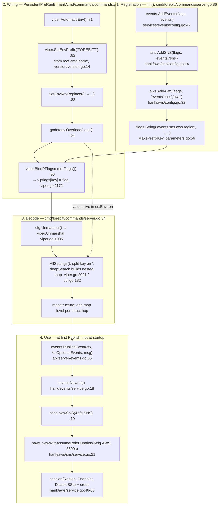

# SUMMARY — How forebitt's `FOREBITT_EVENTS_SNS_*` env vars reach `hsns.NewSNS(&cfg.SNS)`

**Date:** 2026-08-20
**Repository:** `deklareddotcom/forebitt` (local: `/Users/adbhar/Documents/project-sprint-understanding-1/forebitt`), branch `enforced-ptp/dv-12695`
**Dependency under study:** `github.com/deklareddotcom/hank v1.23.1-0.20250813161745-c53aa6f6741a`
**Config stack:** `spf13/cobra` + `spf13/pflag v1.0.5` + `spf13/viper v1.12.0` + `joho/godotenv`

> **Evidence status.** Every line number below was read from source and
> grep-confirmed. **Nothing was executed** — no server started, no message
> published, no LocalStack container inspected. Claims about what *would* happen
> at runtime (real-AWS endpoint resolution, STS failure, topic-ARN rejection) are
> marked INFERRED and are reasoned from the code plus documented AWS behaviour.

---

## 1. Problem statement

Three questions, asked in sequence, about one line of a vendored library:

1. `events.AddEvents(startServerCommand.Flags(), "events")` is called with the string `"events"`. Seven `FOREBITT_EVENTS_SNS_*` variables sit in `.env`. How does one become the other, such that `hsns.NewSNS(&cfg.SNS)` (`hank/events/service.go:19`) receives a populated config?
2. Where are the keys `events.sns.aws.accesskey` etc. actually *stored*, and where does `commands.go` get invoked?
3. Why does `hank/aws/service.go:48` read plain `cfg.Region` — shouldn't it be the full `events.sns.aws.region`?

The audit that fell out of answering them found **two of the seven `.env` variables are silently dead**, plus three further local-setup defects.

---

## 2. First-principles explanation

The whole mechanism rests on one idea:

> **The dotted key is an address, not a name.**

`events.sns.aws.region` is used exactly once — by `viper.AllSettings()` — to decide *where in a nested map* the string `"us-east-2"` gets placed. After that the key no longer exists. What survives is a Go struct with a field called `Region`.

Three transformations, each losing information the next stage doesn't need:

| stage | representation | who consumes it |
|---|---|---|
| registration | flat flag name `events.sns.aws.region` | `pflag.FlagSet`, `viper.pflags` |
| lookup | env name `FOREBITT_EVENTS_SNS_AWS_REGION` | `os.LookupEnv`, computed per call, never stored |
| decode | nested map → struct field `Region` | `mapstructure`, then plain Go |

The prefix is **spent** one segment per struct hop (`Events` → `SNS` → `AWS`), which is precisely why the leaf is just `Region` — and why the *same* `aws.Config` type is filled from `FOREBITT_S3_REGION` at `cmd/forebitt/commands/server.go:85` and from `FOREBITT_EVENTS_SNS_AWS_REGION` at `:86`. If the prefix lived in the field name, one type could not serve both.

---

## 3. High-level architecture



---

## 4. End-to-end runtime flow

```
cmd/forebitt/main.go:8            commands.Commands.Execute()
cmd/forebitt/commands/root.go:9   NewRootCommand(&cobra.Command{Use: version.Name})   // "forebitt"
hank/cmd/commands/commands.go:73  c.PersistentPreRunE = Setup(c.Name())

  [init()]      every flag registered — server.go:58-93, incl. :86 AddEvents
  [cobra]       parses argv
  [Setup]       AutomaticEnv + prefix FOREBITT + replacer + godotenv.Overload + BindPFlags
  [Run]         commands.Simple(startServer)

cmd/forebitt/commands/server.go:32   var cfg server.Config
cmd/forebitt/commands/server.go:34   cfg.Unmarshal()
    → api/server/server.go:158-160   config.Unmarshal(c)
    → hank/cmd/config/parameters.go:18   viper.Unmarshal(v)
    ⇒ cfg.Events.SNS.AWS.Region == "us-east-2"

...later, per publish:
api/server/events.go:65              events.PublishEvent(ctx, *s.Options.Events, message)
services/events/service.go:10        hevent.New(config)
hank/events/service.go:19            hsns.NewSNS(&cfg.SNS)
hank/aws/sns/service.go:21           haws.NewWithAssumeRoleDuration(&cfg.AWS, 3600*time.Second)
hank/aws/service.go:48               Region: aws.String(cfg.Region)     // "us-east-2"
hank/aws/sns/service.go:47-52        client.Publish{TopicArn: e.topic, MessageGroupId: reqId, ...}
```

**Key/env correspondence** (`viper.go:521-527` + `viper.go:545-553`):

| viper key | env var |
|---|---|
| `events.sns.aws.region` | `FOREBITT_EVENTS_SNS_AWS_REGION` |
| `events.sns.aws.sessiontoken` | `FOREBITT_EVENTS_SNS_AWS_SESSIONTOKEN` (flag is camelCase `sessionToken`, lowercased at `viper.go:1172`) |
| `events.topic` | `FOREBITT_EVENTS_TOPIC` |
| `s3.region` | `FOREBITT_S3_REGION` |

There is **no `forebitt.` viper key** — `FOREBITT` is only an env prefix, synthesised at lookup time and discarded. The root key of the tree is `events`.

**Precedence inside `viper.find()`:** `Set()` override → pflag *only if* `flag.HasChanged()` (`viper.go:1247`, i.e. only when typed on argv) → **AutomaticEnv** (`:1276`, where `.env` lands) → `BindEnv` keys → config file → defaults → the flag's `""` default (`:1327`). The flag participates twice, at the top and the bottom; env sits between.

---

## 5. Design options considered

The session was an investigation, not a design exercise, but three genuine forks appeared:

| # | Question | Options |
|---|---|---|
| 1 | How to make the LocalStack endpoint reachable | (a) rename `.env` var to `FOREBITT_EVENTS_SNS_AWS_ENDPOINT`; (b) add an `Endpoint` field to `sns.Config` in hank; (c) leave it and point at real AWS |
| 2 | How to get usable local credentials | (a) empty `ROLEARN` → static dummy creds path (`hank/aws/service.go:66`); (b) keep the dummy role ARN and let LocalStack accept the AssumeRole once the endpoint is fixed |
| 3 | What to do about the unreachable `DisableSSL` | (a) delete the `.env` line; (b) patch hank's `AddAWS` to register a `disablessl` flag |

---

## 6. Trade-offs

| Choice | For | Against |
|---|---|---|
| **1(a)** rename the env var | one-line, local-only, no library change | leaves the confusing shape (why is endpoint under `.aws.` but topic is not?) |
| 1(b) add `Endpoint` to `sns.Config` | matches the mental model people actually have | duplicates a field that already exists one level down; changes a shared library for a local-dev convenience |
| **2(a)** empty `ROLEARN` | credentials resolve without any STS round-trip; fewest moving parts locally | diverges from the deployed shape, where a role *is* assumed — so local no longer exercises the STS path |
| 2(b) keep the dummy role | local mirrors prod's code path | depends on the endpoint fix landing first, and on LocalStack's STS accepting the ARN |
| **3(a)** delete the line | honest — the knob does not exist | none; the `http://` scheme already selects plaintext |
| 3(b) patch hank | makes a real struct field reachable | upstream change for a field nothing currently needs; `DisableSSL` only matters for a scheme-less endpoint |

---

## 7. Final recommendation

Replace the `.env` events block (`.env:96-103`) with:

```dotenv
# Events Config (LocalStack)
FOREBITT_EVENTS_SNS_AWS_ROLEARN=
FOREBITT_EVENTS_SNS_AWS_REGION=us-east-2
FOREBITT_EVENTS_SNS_AWS_ACCESSKEY=dummy-key
FOREBITT_EVENTS_SNS_AWS_SECRETKEY=dummy-secret
FOREBITT_EVENTS_SNS_AWS_ENDPOINT=http://localhost:4566
FOREBITT_EVENTS_TOPIC=arn:aws:sns:us-east-2:000000000000:dummy-topic.fifo
```

and delete the duplicate blank block at `.env:80-85`.

That is options **1(a) + 2(a) + 3(a)** — all local, no change to hank. **Not applied in this session; proposed only.**

The durable operational rule worth carrying forward:

> If a `FOREBITT_*` variable has no corresponding `flags.X(MakePrefixKey(...))` registration somewhere in the `Add*` chain, it does nothing — **no error, no warning, no log line.** Audit from the registration side, never from the `.env` side.

---

## 8. Bugs / root cause

| # | Finding | Status | Root cause |
|---|---|---|---|
| 1 | `FOREBITT_EVENTS_SNS_ENDPOINT` (`.env:101`) is **dead** | VERIFIED | Key would be `events.sns.endpoint`, but `sns.Config` (`hank/aws/sns/config.go:8-10`) has only an `AWS` field — `Endpoint` lives on `aws.Config` (`hank/aws/config.go:14`), i.e. `events.sns.aws.endpoint`. No flag registered at that path either, so `AllKeys()` never contains it. Result: `cfg.AWS.Endpoint == ""` → SDK resolves the default regional endpoint → **real AWS, not LocalStack** [INFERRED] |
| 2 | `FOREBITT_EVENTS_SNS_DISABLESSL` (`.env:102`) is **dead, and unfixable via env** | VERIFIED | `aws.Config.DisableSSL` exists (`hank/aws/config.go:16`) and is read (`hank/aws/service.go:54`), but `AddAWS` (`:32-41`) registers no `disablessl` flag and `:20-29` has no const. `AutomaticEnv` contributes nothing to `AllKeys()` (`viper.go:1940-1950`), so an unregistered key is invisible to `Unmarshal`. Impact: **none** — `http://` already selects plaintext |
| 3 | Dummy `ROLEARN` forces an STS AssumeRole | VERIFIED (code) / INFERRED (failure) | `hank/aws/service.go:61-65` replaces static creds with `stscreds.NewCredentials`. Credentials are **lazy**, so this fails at first `Publish`, not at startup — which is why it is easy to miss |
| 4 | `FOREBITT_EVENTS_TOPIC=dummy-topic.fifo` is a name, not an ARN | VERIFIED (code) / INFERRED (failure) | `hank/aws/sns/service.go:50` passes `cfg.Topic` straight into `TopicArn` untouched |
| 5 | Duplicated `.env` blocks (`:80-85` and `:96-103`) | VERIFIED | godotenv parses into a map so the later block wins, and the earlier values are empty — which viper treats as unset (`viper.go:552`). Behaviour is currently correct but the duplication is a trap: editing the *first* block appears to do nothing |

**Hypothesis raised and disproved.** It was suggested that an empty request id would break the FIFO publish, since `MessageGroupId` comes from `contexts.GetReqIdCtx(ctx)` (`hank/aws/sns/service.go:37, :48`). Not true: `hank/contexts/contexts.go:22-34` falls through to `return uuid.New().String()` at `:33`, so the group id is never empty. The real consideration there is that the group is **per-request**, not per-object — an ordering property, not an absence.

---

## 9. Important files, methods and line numbers

**forebitt**

| Location | What |
|---|---|
| `cmd/forebitt/main.go:8` | `commands.Commands.Execute()` |
| `cmd/forebitt/commands/root.go:9` | root cobra command; `Use: version.Name` |
| `version/version.go:14` | `var Name = "forebitt"` — the source of the `FOREBITT` env prefix |
| `cmd/forebitt/commands/server.go:32,34,38` | `var cfg server.Config`; `cfg.Unmarshal()`; `server.NewServer(&cfg)` |
| `cmd/forebitt/commands/server.go:85` | `haws.AddAWS(flags, "s3")` — same type, different prefix |
| `cmd/forebitt/commands/server.go:86` | `events.AddEvents(flags, "events")` — the line under study |
| `services/events/config.go:47-50` | `AddEvents`: `sns.AddSNS(flags, append(prefix,"sns")...)` + `events.topic` |
| `services/events/service.go:9-20` | `PublishEvent` → `hevent.New(config)` → `Publish` |
| `api/server/server.go:72` | `Events *hevent.Config` field |
| `api/server/server.go:158-160` | `func (c *Config) Unmarshal() error { return config.Unmarshal(c) }` |
| `api/server/events.go:65` | `events.PublishEvent(ctx, *s.Options.Events, message)` |
| `.env:75-78`, `.env:80-85`, `.env:96-103` | S3 block; blank duplicate events block; live events block |

**hank** `v1.23.1-0.20250813161745-c53aa6f6741a`

| Location | What |
|---|---|
| `cmd/commands/commands.go:71-77` | `NewRootCommand` — `TraverseChildren`, `PersistentPreRunE = Setup(c.Name())` |
| `cmd/commands/commands.go:79-99` | `Setup`: `AutomaticEnv :81`, `SetEnvPrefix :82`, `SetEnvKeyReplacer :83`, `godotenv.Overload :94` (**error discarded**), `BindPFlags :96` |
| `cmd/config/parameters.go:18-20` | `Unmarshal` → `viper.Unmarshal` |
| `cmd/config/parameters.go:56-62` | `MakePrefixKey` — `strings.Join(prefix,".") + "." + key` |
| `aws/config.go:8-18` | `aws.Config` struct incl. `Endpoint :14`, `DisableSSL :16` |
| `aws/config.go:20-29` | leaf-name consts — **no `DisableSSL`** |
| `aws/config.go:32-41` | `AddAWS` — the 8 flags actually registered |
| `aws/sns/config.go:8-10` | `sns.Config{ AWS aws.Config }` — one field only |
| `aws/sns/config.go:13-15` | `AddSNS` → `aws.AddAWS(flags, append(prefix,"aws")...)` |
| `aws/service.go:40-67` | `NewWithAssumeRoleDuration`; session at `:46-55` (`Endpoint :52`, `DisableSSL :54`); role branch `:61-65`; static-creds return `:66` |
| `aws/sns/service.go:20-32` | `NewSNS(cfg *Config)` → `:21` `NewWithAssumeRoleDuration(&cfg.AWS, 3600s)` |
| `aws/sns/service.go:34-58` | `Publish`; `MessageGroupId :48`; `TopicArn :50` |
| `events/config.go:7-10` | `events.Config{ SNS sns.Config; Topic string }` |
| `events/service.go:18-28` | `New(cfg Config)` → `:19` `hsns.NewSNS(&cfg.SNS)`; `:26` `topic: cfg.Topic` |
| `contexts/contexts.go:22-34` | `GetReqIdCtx` — `:33` generates a UUID rather than returning empty |

**viper** `v1.12.0`

| Location | What |
|---|---|
| `viper.go:521-527` | `mergeWithEnvPrefix` — `ToUpper(prefix + "_" + key)` |
| `viper.go:545-553` | `getEnv` — applies the replacer, then `os.LookupEnv`; **`:552` treats empty as unset** |
| `viper.go:1085-1087` | `Unmarshal` = `decode(AllSettings(), ...)` |
| `viper.go:1133 / 1156 / 1168 / 1172` | `BindPFlags` → `BindFlagValues` → `BindFlagValue` → `v.pflags[ToLower(key)] = flag` |
| `viper.go:1238 / 1247 / 1276 / 1286 / 1327` | precedence chain inside `find()` |
| `viper.go:1403-1404` | `AutomaticEnv` — sets one boolean, enumerates nothing |
| `viper.go:1940-1950` | `AllKeys` — sources; `v.env` is `BindEnv`-only |
| `viper.go:2021-2038` | `AllSettings` — splits keys and rebuilds the nested map |
| `util.go:182-201` | `deepSearch` — creates the intermediate map levels |

---

## 10. Key diagrams

- Architecture flowchart — §3 above (inline Mermaid).
- Struct-tree diagram showing where each segment is consumed — `2026-08-20_unmarshal_nesting_and_cfg_identity.txt`, §2.
- Key/env transform table — `2026-08-20_viper_env_binding_internals.txt`, §4.

---

## 11. Open questions

1. **Was the LocalStack setup ever working?** `.env:101-102` uses a shape that cannot bind, which suggests the events path was never successfully exercised locally — but that was not confirmed by running anything.
2. **Should `DisableSSL` be registered upstream in hank?** The field is read at two call sites (`aws/service.go:26`, `:54`) yet is unreachable from configuration. Either register the flag or drop the field.
3. **`godotenv.Overload` error is discarded** (`hank/cmd/commands/commands.go:94`). Should a malformed `.env` be fatal? Today it is silent.
4. **Does any deployed environment rely on the `events.sns.endpoint` spelling?** Only forebitt's local `.env` was audited; other services using `AddSNS` were not checked.
5. **Is `dummy-topic.fifo` created in LocalStack at all?** `docker-compose.yml` was not read in this session.

---

## 12. Next steps

1. Apply the corrected `.env` block from §7 and delete the duplicate at `.env:80-85`. *(Not done — proposed only.)*
2. Start the server against LocalStack and trigger one publish to convert every INFERRED claim in §8 into a VERIFIED one.
3. Grep the other services that call `AddSNS` / `AddAWS` for the same one-level-too-high endpoint mistake.
4. Decide on open question 2 and, if registering the flag, add `DisableSSL = "disablessl"` to `hank/aws/config.go:20-29` plus a `flags.Bool(...)` line in `AddAWS`.
5. Consider a startup assertion: iterate `os.Environ()` for the `FOREBITT_` prefix and warn on any variable with no matching key in `viper.AllKeys()`. That single check would have caught findings 1 and 2 immediately.
