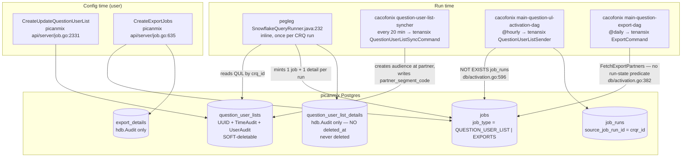

# SUMMARY — picanmix / unhygienix: delete semantics, the QuestionUserList data model, and the activation pipeline

**Session date:** 2026-08-22
**Repos read (source only, nothing executed):**
- **A** = `/Users/adbhar/Documents/project-sprint-understanding-1/` → `picanmix`, `unhygienix`, `cacofonix`, `hank`
- **B** = `/Users/adbhar/Documents/GitHub/` → `pegleg`, `tenansix`, `zabra`
- gorm source read from the module cache: `/Users/adbhar/go/pkg/mod/github.com/jinzhu/gorm@v1.9.16`

**Status of every claim:** read from source and grep-verified with line numbers. **Nothing
was executed, no database was queried, and no finding was confirmed with the owning team.**
Where a conclusion is an inference from absence-of-callers rather than a positive
observation, it is labelled as such.

---

## 1. Problem statement

Four questions, each one uncovering the next:

1. What does `deletePartnerAccount` do in picanmix — soft delete, hard delete, or mark
   inactive? And what does the equivalent do in unhygienix? Why the difference, from first
   principles?
2. `PartnerAccount` has no `DeletedAt` field. So how does the soft delete physically happen?
   Is it `Scopes` vs `Unscoped` that decides?
3. Is `question_user_lists` a kind of export job? It sits between the export job and
   `partner_account_id` — why?
4. If a clean-room question has both a QUL and an export configured, what runs? Who triggers
   each? Where is `partner_segment_code` set, and what is a `job_run`'s status if it was
   never called?

## 2. First-principles explanation

**The organising idea: the delete strategy follows what the row is *for*.**

- **`partner_accounts` (picanmix) is history-bearing.** Its ID is stamped onto retained rows
  (`jobs.partner_account_id`, `question_user_lists.partner_account_id`) that must outlive it,
  because a run summary must still answer "which destination did this push to". A forgotten
  `deleted_at IS NULL` filter here fails **closed** — you see less, not more. ⇒ **soft delete**.
  The codebase says so explicitly: `A/picanmix/db/partner_account.go:897` exists solely to
  read a *deleted* account, commented *"We want to fetch the deleted partner account as well
  here so gorm can't be used."*
- **`clean_room_partners` (unhygienix) is power-bearing.** It grants org X access to clean
  room Y; the row's entire content is the grant. A forgotten filter here fails **open** —
  cross-tenant data visible to a removed org. It also participates in a uniqueness
  constraint, so a lingering soft-deleted row would block re-inviting the same partner.
  ⇒ **hard delete**.

Compressed: **retain what you must be able to explain later; destroy what confers power.**

**Second organising idea: the extra table exists because of one `not null` column.**
`ExportDetail` has `CleanRoomQuestionID` but no run id, so it can *be* the config.
`QuestionUserListDetails.CleanRoomQuestionRunID` is `not null`
(`A/picanmix/models/job.go:111`), so that row cannot exist before a run — and config
precedes any run. Hence `question_user_lists`.

## 3. High-level architecture

## 4. End-to-end runtime flow

CRQ-5 in clean room CR-9 (Adidas), with `QUL-3 → PA-77` (Meta, `USER_LIST` partner) **and** a
standing export job `J-EX → PA-90` (S3, `EXPORTS` partner):

| Wall clock | What fires | Code | Effect |
|---|---|---|---|
| 09:00:00 | user runs CRQ-5 | `B/pegleg/.../jobs/SnowflakeQueryRunner.java` | `runId = RUN-9` |
| 09:04:10 | results + post-run queries land | `SnowflakeQueryRunner.java:206-229` | results table populated |
| 09:04:12 | **QUL branch only** | `SnowflakeQueryRunner.java:232` → `B/pegleg/.../util/Utils.java:26-43` | `POST /picanmix/question_run/job/activate` per QUL |
| 09:04:12 | dedupe + mint | `A/picanmix/api/server/job.go:2245` → `:2258` | `jobs J-12` + `question_user_list_details(J-12, RUN-9, QUL-3)` |
| 09:04:12 | **export branch** | — | **nothing** — pegleg never touches exports |
| 09:20:00 | 20-min syncher | `A/cacofonix/.../question_userlist_syncher.py:95` | creates audience at Meta → writes `question_user_lists.partner_segment_code` |
| 10:00:00 | hourly sweep | `A/picanmix/db/activation.go:574` | J-12 matches → conf `{Adidas, PA-77}` |
| 10:00:10 | sender | `B/tenansix/.../QuestionUserListSender.java:76-81,129` | pushes audience; `job_runs(J-12, source=RUN-9)` QUEUED → RUNNING → COMPLETE |
| 11:00:00 | same hourly DAG | `A/picanmix/db/activation.go:596-599` `NOT EXISTS` fails | J-12 skipped |
| 00:00:00 next day | `@daily` export DAG | `A/picanmix/db/activation.go:382` | conf `{Adidas, PA-90}` → tenansix `ExportCommand` writes the files |

**Both run.** Never in the same act, never on the same clock, and "is there work?" is decided
in SQL inside picanmix for QUL but in Java inside tenansix for exports.

## 5. Design options considered

This was an analysis session, not a design session; the options below are the ones the
*codebase* chose between, reconstructed from evidence.

| Decision point | Options | What the code does |
|---|---|---|
| Deleting a partner account | hard delete / soft delete / status flag | **soft delete** the account **plus** a real status flag (`DEPROVISIONED`) on the clean-room binding — both, at different levels |
| Deleting a clean-room partner | soft / hard | **hard**; `SoftDeleteCleanRoomPartner` exists at `A/unhygienix/db/cleanroom_partner.go:276` but is **dead code** (only tests call it) |
| Where QUL config lives | in `jobs` as a template row / in the detail table / its own table | **own table**, forced by the `not null` run id on the detail row |
| Deciding "is there work" | SQL predicate in picanmix / logic in the worker | **QUL: SQL** (`NOT EXISTS` on `job_runs`); **exports: worker** (`FetchExportPartners` has no run-state predicate at all) |

## 6. Trade-offs

| | Soft delete (picanmix) | Hard delete (unhygienix) |
|---|---|---|
| History preserved | yes — past jobs still resolvable | no |
| Leak risk | every join / `Table()` / raw SQL must repeat `deleted_at IS NULL`; **fails open** when forgotten | none by construction |
| Uniqueness constraints | lingering row can block recreate | recreate always works |
| Audit / billing | retained (`question_user_list_details.price`) | lost |
| Implementation cost | free for the primary model, manual everywhere else | `Unscoped()` on **every** statement — easy to miss (and F3 shows it was missed twice) |

## 7. Final recommendation

The two strategies are each correct for their row class; do **not** unify them. Instead:

1. Fix **F1** (`SoftDeleteJobsByQULID` over-broad match) — highest blast radius, one-predicate fix.
2. Resolve **F2** (unreachable run-level segment-code back-fill) — silently strands one run's audience.
3. Close **F3/F4** in unhygienix — a "HardDelete" that leaves permission rows behind, with no authz gate.
4. When auditing picanmix for stale-row leaks, grep `db.Table(` — that is the fail-open boundary.

## 8. Bugs / root cause

Full detail in [`05-findings-and-bugs.md`](05-findings-and-bugs.md). All **unconfirmed** —
read from source, not reproduced, not raised with owners.

| # | Severity | Where | Finding |
|---|---|---|---|
| F1 | High | `A/picanmix/db/job.go:895-903` | `SoftDeleteJobsByQULID` filters by `clean_room_question_id` only, ignoring `question_user_list_id` — deleting one partner account soft-deletes **other** partners' activation jobs on the same question |
| F2 | High | `A/picanmix/db/activation.go:249-257`, `:220` | The `_Details` segment-code back-fill has no live producer, so a QUL whose question ran before the syncher stranded that run's audience forever |
| F3 | Medium | `A/unhygienix/db/cleanroom_partner.go:400,437` | `HardDeleteCleanRoomPartner` omits `Unscoped()` for `clean_room_users` and `datasets` |
| F4 | Medium | `A/unhygienix/api/server/cleanroom_partner.go:454-492` | No authorization check at all; also dereferences `crp.ID` after hard-deleting it |
| F5 | Medium | `A/picanmix/api/server/job_run.go:171` | `CreateJobRunV2` shadows `jobRun`, returns an empty response on the create path |
| F6 | Low/Med | `A/picanmix/api/server/partner_account.go:710-730` | Four independent transactions, no sweeper |
| F7 | Low | `A/picanmix/db/job.go:788-800`; `api/server/job.go:2523-2534` | `price` is never written — always `0.0`, yet read back and shipped |
| F8 | Low | `A/unhygienix/db/cleanroom_partner.go:422-431,445-455` | Duplicated loop; both copies `return nil` on error |

## 9. Important files, methods and line numbers

**picanmix — delete paths**
- `api/server/partner_account.go:655-735` `DeletePartnerAccount` — soft; `:698` sets `DEPROVISIONED`; `:730` soft-deletes
- `api/server/partner.go:370-394` `DeletePartner` — soft; guard at `:379`
- `db/partner_account.go:452-463` `SoftDeletePartnerAccount`; `:897-908` `FetchDeletedPartnerAccountByID` (raw SQL escape hatch)
- `models/partner.go:67-79` `PartnerAccount` (embeds `TimeAudit` at `:69`); `models/audit.go:21-25` `TimeAudit.DeletedAt`

**gorm v1.9.16 — the deciding lines**
- `callback_delete.go:36` `FieldByName("DeletedAt")`; `:38` `!Unscoped && hasDeletedAtField`; `:40-46` UPDATE branch; `:48-53` DELETE branch
- `model_struct.go:242-244` anonymous-embed flattening
- `scope.go:718-721` read-side `deleted_at IS NULL` injection (primary model only)
- `main.go:519-524` `Table()` sets `Value = nil`; `main.go:363-365` `Scan()` uses `s.Value`, not `dest`

**unhygienix — delete paths**
- `api/server/cleanroom_partner.go:454-492` `DeleteCleanRoomPartner`
- `db/cleanroom_partner.go:276-350` `SoftDeleteCleanRoomPartner` (**dead code**); `:352-463` `HardDeleteCleanRoomPartner`
- `api/server/cleanroom.go:1881` second hard-delete call site; `:1895` soft-deletes the clean room

**QUL data model**
- `models/job.go:15-29` `Job`; `:63-68` `UserListDetail`; `:85-91` `ExportDetail`; `:93-104` `JobRun`; `:106-118` `QuestionUserListDetails`; `:120-131` `NewJobRunForJobID`; `:195-211` `QuestionUserList`
- `proto/domain.proto:45-51` `PicanmixType`; `:409-422` `QuestionUserList` message (`float price = 12`)
- `api/server/job.go:2224-2289` `CreateQuestionUserListJobs` (dedupe at `:2245`); `:2331-2440` `CreateUpdateQuestionUserList`; `:2498-2537` `FetchQuestionUserList`; `:2540-2570` `CreateQuestionUserListsJobs` (gRPC-only, no callers)
- `db/job.go:718-751` `CreateQuestionUserListJobs`; `:788-806` `CreateQuestionUserList`; `:844-856` `SoftDeleteQuestionUserListByID`; `:858-880` `SoftDeleteJobsByQULID`; `:895-903` `FetchQuestionUserListDetailsByID`; `:905-911` `FetchQuestionUserList`

**Activation / export orchestration**
- `db/activation.go:108-126` `SetQuestionUserListDetailsPartnerCodes`; `:184-260` `FetchQuestionJobsForSegmentSync`; `:382-401` `FetchExportPartners`; `:574-645` `FetchQuestionUserListActivationJobs` (`checkIfProvisioned` `:585-591`, `checkIfRan` `:596-599`, segment-code gate `:605`); `:673-692` `SetQuestionUserListPartnerCodes`
- `db/scopes.go:174-184` `QuestionUserListDetailScope`; `:210-214` `CleanRoomQuestionNotDeletedIDScope`
- `api/server/job_run.go:75-137` `CreateJobRunChecks` (`:121-127` EXPORTS TODO, `:129-134` QUL branch); `:142-158` `CreateJobRun`; `:160-178` `CreateJobRunV2`
- `api/server/activation.go:71-99` `FetchPartnerJobsForSegmentSync`; `:406-430` `GetActivationExportJobsToRun`; `:432-449` `SetQuestionUserListDetailsPartnerCodes`

**pegleg / tenansix / zabra / cacofonix**
- `B/pegleg/.../jobs/SnowflakeQueryRunner.java:232`; `B/pegleg/.../util/Utils.java:26-43`
- `B/zabra/zabra-grpc-client/.../PicanmixClient.java:596-617`
- `B/tenansix/.../tenansix/grpc/PicanmixClient.java:74-110` (`newJobRun`/`createJobRun`), `:417-448` (`updateQuestionUserListDetails`, branch at `:439`), `:452-520`, `:594-620`
- `B/tenansix/.../activation/jobs/QuestionUserListSyncher.java:84-118,140-180`; `QuestionUserListSender.java:60-140`
- `A/cacofonix/habuairflow/dags/picanmix/`: `question_userlist_syncher.py:95,109`, `main_question_userlist_activation_dag.py:55`, `question_userlist_activation_dag.py:121`, `main_question_export_dag.py:45,50`, `question_export_dag.py:103`
- `A/cacofonix/habuairflow/lib/habu/http/picanmix.py:61-77`

## 10. Key diagrams

- Architecture Mermaid — section 3 above
- `DeletePartnerAccount` state-at-each-moment table — [`01-soft-vs-hard-delete.md`](01-soft-vs-hard-delete.md)
- `DeleteCleanRoomPartner` state table — [`01-soft-vs-hard-delete.md`](01-soft-vs-hard-delete.md)
- gorm layer trace (handler → ORM → SQL) — [`02-gorm-v1-soft-delete-mechanism.md`](02-gorm-v1-soft-delete-mechanism.md)
- QUL lifecycle table T1–T12 — [`03-question-user-list-vs-export-job-model.md`](03-question-user-list-vs-export-job-model.md)
- Wall-clock dual-pipeline trace + `job_runs` layer trace — [`04-orchestration-segment-code-and-job-runs.md`](04-orchestration-segment-code-and-job-runs.md)

## 11. Open questions

1. **F2** — is the stranded-first-run scenario real in production, or does something
   upstream guarantee the syncher always runs before the first question run? Not verifiable
   from source.
2. **F7** — is `price = 0` compensated for downstream (billing computed elsewhere), or is
   activation pricing simply not live yet?
3. Who owns `SetQuestionUserListDetailsPartnerCodes`? Was it built for a caller that was
   later removed, or for one that lives in a repo not read here?
4. Why does tenansix call `CreateJobRun` (V1) rather than V2? The F5 shadowing bug is a
   plausible cause but was not confirmed with the author.
5. Is `SoftDeleteCleanRoomPartner` (`A/unhygienix/db/cleanroom_partner.go:276`) intended for
   future use, or safe to delete?
6. How many orphan `QUEUED` `job_runs` rows exist in production? That would quantify F5.

## 12. Next steps

1. Raise **F1** and **F2** with the picanmix/activation owners; both are small, contained fixes.
2. Raise **F3** and **F4** with the unhygienix clean-room-partner owner; F4 is a security
   review item, not just a cleanup.
3. Query production for `job_runs` rows stuck in `QUEUED` with `job_type = QUESTION_USER_LIST`
   to size F5.
4. Run `grep -rn "db.Table(" A/picanmix/db/` as a standing audit for the fail-open boundary
   described in [`02-gorm-v1-soft-delete-mechanism.md`](02-gorm-v1-soft-delete-mechanism.md).
