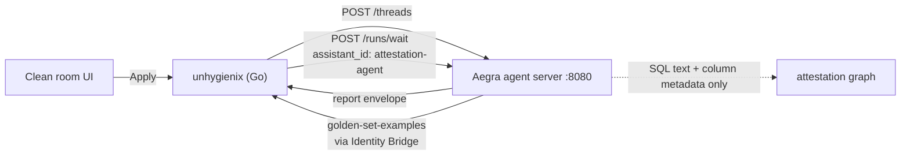
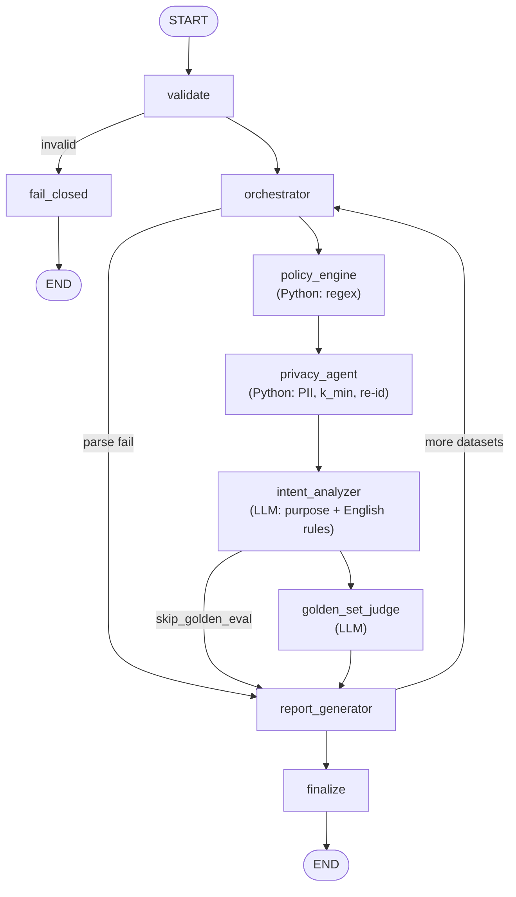

# Agentic Attestation — Session Summary (2026-08-25 → 2026-08-26)

Primary entry point for this session. Read this first; drill into the numbered
documents only when you need the detail.

---

## Problem statement

Aditya (senior Habu/LiveRamp engineer) needed to:

1. Launch LiveRamp's `agentic-core` monorepo locally.
2. Understand the **attestation-agent** introduced in
   [agentic-core PR #1160](https://github.com/LiveRamp/agentic-core/pull/1160)
   (`DV-16464: Agentic Attestation Hackathon`, branch `hackathon_attestation`,
   author Anji Evana).
3. Understand how it relates to the **cleanroom-assistant** agent.
4. Trace a real call end to end.

---

## First-principles explanation

A Habu Clean Room question is SQL (or Python) that one party writes and another
party's data answers. Before it may run, someone must be satisfied it does not
leak individuals. That review was manual.

The attestation agent automates the first pass. It reads **the query text and a
description of the columns** — never any data — and scores the query against
rules the dataset owner switched on.

The single most important correction made this session:

> **The agent never sees data.** Not one row. It sees SQL text plus column
> metadata. A query that would return the name "Aditya" is not caught because
> the agent saw that string — it is caught because the query selects a column
> that a human flagged `isPii: true` at dataset setup.

Second most important correction:

> **The PII and identifier checks are not LLM calls.** They are plain Python
> `if` statements. The LLM is used for exactly two things, both of which are
> about English text, not about privacy primitives.

---

## High-level architecture



Inside the graph:



Identity Bridge is **not** in front of the agent. It sits on the **return** leg,
when the agent calls back into unhygienix for Golden Set examples (the agent
holds a LiveRamp token but needs to reach a Habu service).

---

## End-to-end runtime flow

Repositories, checked out locally during this session:

| Repo | Local path | Branch |
|---|---|---|
| agentic-core | `/Users/adbhar/Documents/Habu_Cloned_Repo/agentic-core` | `hackathon_attestation` |
| unhygienix | `/Users/adbhar/Documents/Habu_Cloned_Repo/unhygienix-attestation` (worktree) | `hackathon_attestation` |

| # | Step | File:line |
|---|---|---|
| 1 | User hits Apply on a clean room question | `unhygienix-attestation/api/server/attestation.go:543` |
| 2 | Question status → `RUNNING` | `attestation.go:1150` |
| 3 | Agent address resolved (`ATTESTATION_AGENT_BASE_URL`, default `http://localhost:8080`) | `attestation.go:1132-1137` |
| 4 | `POST /threads` with an **empty body** — new thread every Apply | `attestation.go:1381-1382` |
| 5 | `POST /threads/{id}/runs/wait`, `assistant_id: "attestation-agent"` | `attestation.go:1418-1424` |
| 6 | 180-second client timeout | `attestation.go:1379` |
| 7 | Parse the report out of the reply | `attestation.go:1454` |
| 8 | If the report is not in the reply, re-read `GET /threads/{id}/state` | `attestation.go:1455-1470` |
| 9 | Auto-approve → status `APPROVED` | `attestation.go:1158` |
| 10 | Otherwise → status `INREVIEW` | `attestation.go:1164` |
| 11 | Human approve/reject writes the final status | `attestation.go:843` |

Inside the agent (`agentic-core/core/agents/attestation-agent/graph.py`):

```
START -> validate -> orchestrator -> policy_engine -> privacy_agent
      -> intent_analyzer -> golden_set_judge -> report_generator
      -> (next dataset | finalize) -> END
```

**Timing.** This runs at question *definition/approval* time. The question has
not executed. There is no result set anywhere. Status ladder:
`INITIATED → RUNNING → INREVIEW → APPROVED → REJECTED` — where `RUNNING` means
the *check* is running, not the question.

*(Open question: whether an unapproved question is hard-blocked from executing
was not verified.)*

---

## What is deterministic vs what is an LLM

| Check | Mechanism | File:line |
|---|---|---|
| SQL touches a column flagged `isPii` | **Python** | `tools/field_policy.py:109-122` |
| Identifier column selected with no aggregation / group by | **Python** | `tools/field_policy.py:124-161` |
| Minimum group size (`k_min`) enforced | **Python** | `tools/field_policy.py:163-183` |
| Raw extraction / `SELECT *` | **Python** | `agents/privacy_agent.py:38-44` |
| Stated purpose matches the query | **LLM** | `agents/intent_analyzer.py:297` |
| Rules written as free English sentences | **LLM** | `agents/intent_analyzer.py:178` |

`agents/privacy_agent.py` is 46 lines and imports no model at all (see its
imports, lines 7-10).

### The two LLM jobs compare against different things

- **Purpose match** (`intent_analyzer.py:297`) — SQL vs *the stated purpose*.
  Permitted list at `intent_analyzer.py:18-25`. Guardrails at lines 329-341:
  do not infer PII from column names; no stated purpose means no mismatch;
  `unknown` is not a failure; do not invent SQL.
- **Custom English rules** (`intent_analyzer.py:178`) — SQL vs *the rule text*.
  Line 220-221 explicitly says to **ignore** purpose and business intent.

**Fail-direction asymmetry when the model is unavailable:**

| Check | Result | Line |
|---|---|---|
| Custom English rules | **Fail closed** | `intent_analyzer.py:199-206` |
| Purpose match | **Fail open (passes)** | `intent_analyzer.py:309-321` |

---

## Worked example — "a query that returns names"

Dataset field on the payload:

```json
{ "name": "FIRST_NAME", "isPii": true }
```

Query: `SELECT FIRST_NAME, COUNT(*) FROM audience GROUP BY FIRST_NAME`

1. `field_policy.py:96` — collect columns the SQL touches → `{first_name}`
2. `field_policy.py:110` — loop fields, skip any where `isPii` is false
3. `FIRST_NAME` is flagged and is in the touched set
4. `field_policy.py:117` — record `"Code accesses PII column 'FIRST_NAME'"`

Flip `isPii` to `false` and the **same SQL passes**. `field_policy.py:106`
skips the field. The column *name* is irrelevant — a column literally called
`email` does not fail when `isPii` is false.

---

## Design decisions understood

### Why `POST /threads` then `POST /runs/wait` instead of one endpoint

One server hosts ~24 agents. Giving each its own URL fails because most agents
are conversations, and a bare request/response has nowhere to keep memory. A
**thread** is simply a name for a conversation that memory hangs off. Which
agent you want becomes a field in the body (`assistant_id`), not a different URL.

`/runs/wait` is the blocking variant (vs streaming or background polling), which
suits Apply — a button someone clicks and waits on.

This agent is stateless, so the thread is pure overhead *for it* — but the
thread id still earns its keep at `attestation.go:1455-1470`, where a reply whose
shape the parser did not expect can be recovered by re-reading the thread.

### Do threads pool memory across agents?

Aegra's thread record has `thread_id`, `status`, `metadata`, `user_id`, and
timestamps — **no agent field**. So different `assistant_id`s *can* post to one
thread. But each graph has its own state shape
(`attestation-agent/state.py:76-108` vs any other agent's), so only `messages`
would meaningfully carry.

Moot here regardless: `attestation.go:1381` creates a **brand new thread on
every Apply** (`threadBody := []byte("{}")`).

The shared-context pattern Aditya was imagining **does** exist at LiveRamp — but
built the other way: `cleanroom-assistant` is *one* agent that routes internally
to flow diagnosis, DAR assist, and intelligence subgraphs. One agent, many
skills — not many agents sharing one thread.

### What `fetchAttestationThreadState` is for

**Not** a slowness or timeout fallback. It sits below every failure path:

| Line | Condition | Fallback? |
|---|---|---|
| 1441 | network error / timeout | none — returns error at 1443 |
| 1450 | HTTP >= 300 | none — returns error at 1451 |
| 1455 | report missing from an otherwise-fine 200 | **yes** — 1456 |

It handles the case where LangGraph packaged the AI message in a wrapped form
the parser did not expect. Re-reading `GET /threads/{id}/state` returns a
different representation of the same conversation.

---

## Trade-offs

| Decision | Gains | Costs |
|---|---|---|
| Deterministic PII/identifier checks | Same answer every time; auditable | Cannot catch novel leaks a rule never anticipated |
| LLM only for English text | Model used where only a model can help | Two different fail directions to reason about |
| Metadata-driven PII (never column names) | No false alarms on a column named `email` | Entirely dependent on correct dataset setup — a missed `isPii` flag silently disables the check |
| New thread per Apply | Total isolation between runs | No memory of a prior Apply on the same question |
| Agent Protocol two-step | One mechanism for all 24 agents; recovery path | Overhead for a stateless agent |

---

## Important repository files

### agentic-core (`/Users/adbhar/Documents/Habu_Cloned_Repo/agentic-core`)

| File | Role |
|---|---|
| `core/agents/attestation-agent/graph.py` | Graph wiring and routing |
| `core/agents/attestation-agent/state.py:76-108` | `/runs/wait` input shape |
| `core/agents/attestation-agent/agent.py:19` | `skip_llm()` — `ATTESTATION_SKIP_LLM` |
| `core/agents/attestation-agent/agent.py:33-36` | Missing credentials degrade to a warning |
| `core/agents/attestation-agent/tools/field_policy.py` | All deterministic privacy checks |
| `core/agents/attestation-agent/agents/privacy_agent.py` | Node wrapping those checks; no model import |
| `core/agents/attestation-agent/agents/intent_analyzer.py` | Both LLM checks |
| `core/agents/attestation-agent/unhygienix_client.py:33-77` | Habu ↔ LiveRamp org id conversion for Identity Bridge |
| `core/agents/attestation-agent/scripts/invoke_attestation_local.py` | Local invoke script |
| `deployments/aegra/local.aegra.json` | Graph registration for local runs |
| `docker-compose.yml:250-251` | Bind mounts that make registration take effect without a rebuild |

### unhygienix (`/Users/adbhar/Documents/Habu_Cloned_Repo/unhygienix-attestation`)

| File | Role |
|---|---|
| `api/server/attestation.go:38-58` | All 16 new HTTP routes |
| `api/server/attestation.go:543` | Apply / Save handler |
| `api/server/attestation.go:1373-1472` | The call to the agent |
| `api/server/attestation.go:1474-1496` | Thread-state fallback |
| `db/attestation.go:353` | `SetCRQAttestationStatus` |
| `models/cleanroom.go:405-406` | `attestation_rule_status`, `is_golden` |
| `docs/attestation-apply-payload.md` | Payload contract |

---

## Related pull requests

| Repo | PR | What | State |
|---|---|---|---|
| agentic-core | #1160 | Adds `attestation-agent` | open — **session focus** |
| agentic-core | #1176 | Companion to unhygienix #3768 | open |
| unhygienix | #3753 | Attestation APIs; calls `attestation-agent` **directly** | open |
| unhygienix | #3768 | Re-routes the same call to `cleanroom-assistant` | open, newer |
| moonraker | #957 | `Agentic_Attestation_Rules` feature flipper | — |
| cleanroom-ui | — | UI | — |

On the #1160 / #3753 pair, `cleanroom-assistant` is **not** in the request path:
`attestation.go:1419` hard-codes `"assistant_id": "attestation-agent"`.

---

## Bugs / root cause

None. This was an understanding-and-onboarding session, not a debugging one.

---

## Open questions

1. Is an unapproved question **hard-blocked** from executing, or is the status
   advisory? Not verified.
2. Which of #3753 (direct) vs #3768 (via cleanroom-assistant) is the intended
   final architecture?
3. Can `cleanroom-assistant` be run locally without a live LiveRamp JWT?
   `UNHYGIENIX_FIXTURES_DIR` looks like the closest thing to an offline mode.
4. `allowed_purposes` is not hydrated from the payload today — the agent falls
   back to a built-in list. Intentional or a gap?

---

## Next steps

1. Start Docker Desktop (was not running throughout this session).
2. `uv run infra` then `ATTESTATION_SKIP_LLM=1 uv run serve attestation-agent`.
3. Run `invoke_attestation_local.py` across all seven scenarios.
4. Trace one request through every graph node with real logs.
5. Answer open question 1 by reading the question-execution path in unhygienix.

See `01-local-launch.md` for the full launch runbook.
