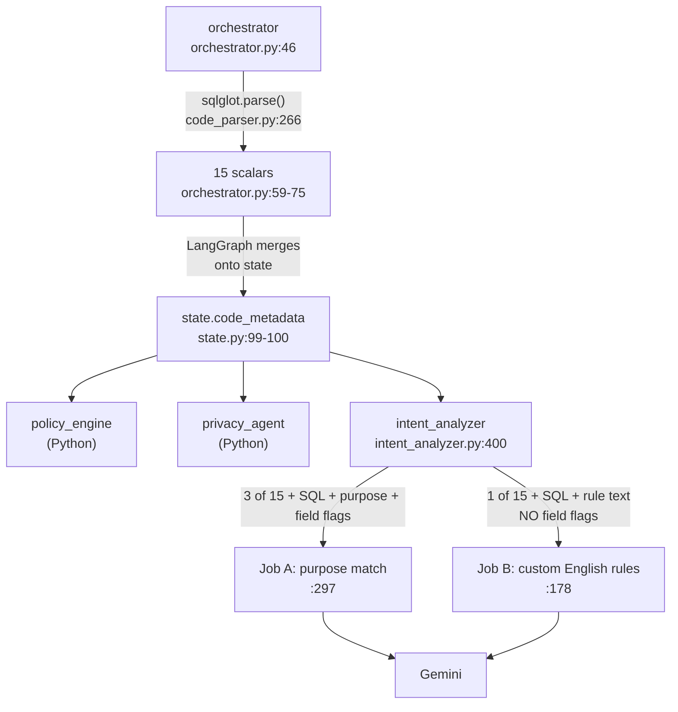

# Attestation agent — LLM inputs, SQL handling, and Agent Protocol design

Session: 2026-08-31. Direct continuation of
[2026-08-26-aditya-understanding-agentic-core-attestation](../../2026-08-26/2026-08-26-aditya-understanding-agentic-core-attestation/),
which covers the local launch runbook, the 16 new unhygienix endpoints, the
request path, and the deterministic-vs-LLM split. **Read that first if you have
not.** This folder answers the follow-up questions that went one level deeper.

---

## Problem statement

Four questions about LiveRamp's `attestation-agent`
([agentic-core PR #1160](https://github.com/LiveRamp/agentic-core/pull/1160)):

1. What exactly is handed to the model on each of the two LLM calls?
2. Does the agent ever run the SQL against a real table?
3. Why `POST /threads` + `POST /runs/wait` instead of a per-agent endpoint?
4. `runRaw` is already read — why call `fetchAttestationThreadState`?

---

## First-principles explanation

The single organising fact, carried over and now **proved rather than asserted**:

> The agent evaluates a query **as text**. It never runs it, never samples a
> column, never counts a row.

Everything it "knows" about privacy comes from two written claims: the query
text, and human-set flags on each column. That is not a limitation to work
around — it is the point. In a Clean Room the reviewing party must not be able to
see the other party's data, so **if attestation ran the query to check it, the
check itself would be the leak.**

---

## High-level architecture

The AST never crosses the first arrow — `parsed_code.to_dict()`
(`orchestrator.py:58`) flattens it and it is never rebuilt.

---

## End-to-end runtime flow

| # | Step | File:line |
|---|---|---|
| 1 | `CodeParser().parse()` — the only place sqlglot runs | `agents/orchestrator.py:46` |
| 2 | Parse failure → `REJECTED`, skip straight to report | `agents/orchestrator.py:47-54` |
| 3 | Flatten to 15 plain values, return them | `agents/orchestrator.py:56-75` |
| 4 | LangGraph merges the dict onto graph state | `state.py:99-100` |
| 5 | Read it back | `agents/intent_analyzer.py:400` |
| 6 | Dispatch both LLM calls together | `agents/intent_analyzer.py:403-420` |
| 7 | Job A system / user prompt | `agents/intent_analyzer.py:322-350` / `:351-364` |
| 8 | Job B system / user prompt | `agents/intent_analyzer.py:218-240` / `:241-250` |

Because of step 2, **both LLM calls only ever see SQL that parsed cleanly.**

---

## What each LLM call receives

| Sent to the model | Job A (purpose) | Job B (custom rules) |
|---|---|---|
| SQL text | yes | yes |
| Stated purpose | yes | **no** — `:220-221` says to ignore it |
| Tables referenced | yes | no |
| `has_aggregation` | yes | no |
| Columns referenced | via metadata | yes |
| **PII / identifier flags** | yes (`format_field_metadata`, `:35-66`) | **no** |

Job A signature `:297-305` takes `fields`. Job B signature `:178-185` does not.

Only **3 of the 15** parsed values reach a prompt: `tables_referenced` (`:359`),
`has_aggregation` (`:360`), `columns_referenced` (`:217`).

Fully assembled example prompts for both jobs: `01-llm-inputs.md`.

---

## Bugs / findings

### FINDING — Job B is given an instruction it cannot follow

`agents/intent_analyzer.py:226`, inside Job B's system prompt:

> Do not infer PII from column names. PII is only what dataset field flags say.

But `evaluate_nl_rules` (`:178-185`) has **no `fields` parameter**, and its user
prompt (`:241-250`) contains only code, column names, and rule text. The model is
told to consult a list it was never given.

**Consequence:** a custom natural-language rule that depends on knowing which
column is PII cannot be scored correctly. The model can only fall back on column
names — exactly what the line forbids.

**Status: verified by reading the signature and the prompt.** Not reproduced at
runtime (Docker was never started). Worth raising with the PR author, Anji Evana.

### Related — Job A fails open on any exception

`:370-382` catches every exception from `model.invoke` and returns
`is_permitted: True`, confidence `0.0`. A Gemini outage silently passes the
purpose check, while Job B fails closed (`:199-206`). The asymmetry is
intentional but easy to miss.

---

## Design questions answered

### Why `/threads` + `/runs/wait` and not a per-agent URL

Hosting economy is real (~24 graphs in `deployments/aegra/local.aegra.json`) but
secondary. The primary reason: **routing and memory are orthogonal.**

- `assistant_id` = **who** answers
- `thread_id` = **which** conversation

A per-agent URL solves *who* and nothing about *which*, so it would still need a
conversation id in the body. Net result: 24 URLs **and** threads — nothing saved.

This also answers "if context is shared because you never leave the agent, why
need threads?" — staying inside one agent stores nothing by itself. **The thread
is the storage.**

Threads are not agent-scoped (Aegra's thread record has no agent field), so
different `assistant_id`s *could* share one — but each graph has its own state
shape, and `attestation.go:1381` sends `threadBody := []byte("{}")`, creating a
**new thread on every Apply**. No sharing occurs.

The shared-context pattern exists at LiveRamp built the other way:
`cleanroom-assistant` is **one** agent routing internally to subgraphs.
One agent, many skills — not many agents sharing a thread.

### Why re-fetch when `runRaw` is in hand

Because `runRaw` may genuinely not contain the report.
`pickReportEnvelope` (`attestation_envelope.go:49-75`) searches **four** places:
`report_envelope` (`:50`), last AI message content (`:56`), `dataset_reports`
(`:62`), `datasets` (`:68`). All four missing → `:40-43` substitutes a stub with
empty datasets → `envelopeHasReportDatasets` (`:809-814`) returns false →
`attestation.go:1456` fetches thread state.

Cause: LangGraph does not always serialize a message identically.
`extractEnvelopeFromMessages` (`:77-99`) handles content as an object (`:85-88`)
or a JSON string (`:89-95`); a "constructor"-wrapped form with content under
`kwargs` matches neither. `GET /threads/{id}/state` returns the accumulated graph
state instead of the run output, so the report surfaces at try 1 or try 3.

**Not a timeout fallback** — it sits below every failure path (network error
returns at `:1443`, HTTP >= 300 at `:1451`).

---

## Trade-offs

| Decision | Gains | Costs |
|---|---|---|
| Never execute the query | The check cannot itself leak data | Total dependence on correct `isPii` / `isUserId` setup; a missed flag silently disables the check |
| Flatten the AST before the LLM node | Simple, serializable state | The model must re-read raw SQL for anything not in the 15 values |
| Job B ignores stated purpose | Rule text is scored on its own terms | Combined with the missing `fields`, Job B is the weakest of the checks |
| Job A fails open | An LLM outage does not block every question | An outage silently passes purpose checks |
| Two-call Agent Protocol | One transport for ~24 agents; recovery path via thread id | Overhead for a stateless agent |

---

## Final recommendation

1. **Raise the Job B gap** with Anji: either pass `fields` into
   `evaluate_nl_rules` and render it into the prompt, or delete the unfollowable
   sentence at `:226`. As written the instruction misleads a reader into thinking
   the check is metadata-driven when it cannot be.
2. **Document the fail-open/fail-closed split** somewhere operators will see it.
   A run made with Gemini down produces a passing purpose check that looks
   identical to a real one apart from `confidence: 0.0`.
3. Treat dataset field configuration as the real security boundary. The agent is
   only as good as the flags.

---

## Important repository files

### agentic-core — `/Users/adbhar/Documents/Habu_Cloned_Repo/agentic-core` (branch `hackathon_attestation`)

| File:line | Role |
|---|---|
| `core/agents/attestation-agent/agents/orchestrator.py:46` | the only sqlglot call |
| `core/agents/attestation-agent/agents/orchestrator.py:56-75` | 15 flattened values |
| `core/agents/attestation-agent/agents/intent_analyzer.py:35-66` | `format_field_metadata` |
| `core/agents/attestation-agent/agents/intent_analyzer.py:178-185` | Job B signature — no `fields` |
| `core/agents/attestation-agent/agents/intent_analyzer.py:226` | the unfollowable instruction |
| `core/agents/attestation-agent/agents/intent_analyzer.py:241-250` | Job B user prompt |
| `core/agents/attestation-agent/agents/intent_analyzer.py:297-305` | Job A signature — has `fields` |
| `core/agents/attestation-agent/agents/intent_analyzer.py:351-364` | Job A user prompt |
| `core/agents/attestation-agent/agents/intent_analyzer.py:370-382` | Job A exception → fail open |
| `core/agents/attestation-agent/agents/intent_analyzer.py:400` | reads `state.code_metadata` |
| `core/agents/attestation-agent/tools/code_parser.py:266` | `sqlglot.parse(..., error_level="ignore")` |
| `core/agents/attestation-agent/state.py:99-100` | where the metadata lives on state |

### unhygienix — `/Users/adbhar/Documents/Habu_Cloned_Repo/unhygienix-attestation` (branch `hackathon_attestation`)

| File:line | Role |
|---|---|
| `api/server/attestation.go:1381` | `threadBody := []byte("{}")` — new thread per Apply |
| `api/server/attestation.go:1455-1470` | the fallback branch |
| `api/server/attestation_envelope.go:49-75` | four-place envelope search |
| `api/server/attestation_envelope.go:77-99` | message content, two shapes |
| `api/server/attestation_envelope.go:809-814` | `envelopeHasReportDatasets` |

---

## Open questions

1. Does the Job B gap change any real verdict, or do custom rules in practice
   never reference PII? **Not tested** — needs a run.
2. Is an unapproved question hard-blocked from executing, or is
   `attestation_rule_status` advisory? Carried over, still unverified.
3. Which architecture is final — unhygienix #3753 (direct to `attestation-agent`)
   or #3768 (via `cleanroom-assistant`)?
4. `allowed_purposes` is not hydrated from the payload; the agent falls back to
   `DEFAULT_PURPOSES` (`intent_analyzer.py:18-25`). Gap or intent?

---

## Next steps

Nothing has been executed in either session — **Docker was never started**, so
every runtime claim here is read from source, not observed.

1. Start Docker Desktop.
2. `uv run infra`, then `ATTESTATION_SKIP_LLM=1 uv run serve attestation-agent`.
3. Run `invoke_attestation_local.py` across all seven scenarios.
4. Re-run **with** Gemini to exercise both LLM jobs and confirm the Job B gap
   against a real custom rule.
5. Answer open question 2 by reading the question-execution path in unhygienix.
